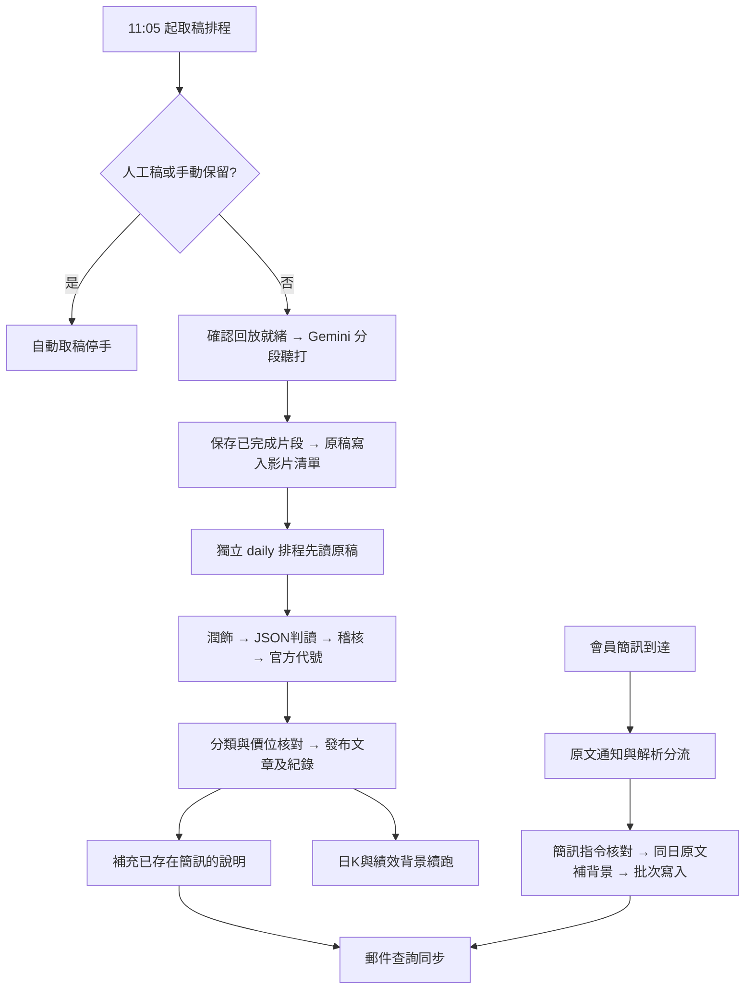

# v46 修改、流程與部署手冊

交付日期：2026/09/20。Apps Script build：`2026-09-19-quality-v46`。
這份文件取代舊 v15～v45 部署清單；保留目前 v44 的文章、會員持股、名稱判定及證據規則。Python 正本只有 `pipeline/pipeline.py`，不得放回根目錄副本。

## 1. 完成範圍與實際查到的問題

|問題|修正後|
|---|---|
|舊表有排版欄、沒有逐字稿來源，總欄數檢查誤以為齊全|A–G 基本欄固定；其餘按欄名補齊，不移動既有資料|
|原稿已寫入，YouTube 清單失敗仍擋住 pipeline|先讀試算表，原始稿超過200字即可交棒|
|自動聽打期間有人貼新稿|三端手動／手動保留優先，舊空來源有稿也受保護；落地前再次核對。自動稿追加列，避免覆蓋人工列|
|潤飾回寫連原稿一起覆蓋|寫前核對原稿，只寫修飾欄；原稿有變就等待新一輪|
|聽打下一棒重做前面片段|分段結果存本地與 Actions cache；剩餘預算不足不開新段|
|簡訊說明一再縮短|刪除30字範例與60／80字截斷；Python與GAS提示一致，有原文時約70–160字，來源不足不灌水|
|簡訊早於逐字稿就永遠只有一句話|逐字稿發布時補入同檔已驗證背景，保留簡訊操作；不多問模型|
|解析完成但郵件仍是舊文字|新增日期版本佇列，五分鐘背景同步已存在的每日整理；保留已寄送狀態、不重寄|
|60分K只累積曾經抓過的日子，中間無資料|富果歷史60分K補89天，Yahoo補59天；缺資料照實標示，不捏造K棒|
|13:00已有一根K就停止盤中更新|14:05前仍可更新同一時間K棒，新的取代暫存，不累加成交量|
|進度離投稿操作太遠／暫停仍亮進行中|卡片移至投稿操作下方；等待、部分完成、郵件同步分開顯示；未完成不得100%|
|技術說明過長、手機導覽覆蓋按鈕|六段短圖解、FAQ與作者固定；手機收起會遮內容的浮動章節導覽|

自動與手動都留有同日多列的可能，這是為避免跨服務覆寫：所有讀取端已統一選列；後台既有整併工具可先乾跑、備份再合併，不必日常手動刪列。

## 2. 各條流程與完成條件

### 自動取稿

1. 台北11:05、11:30、11:55、12:20、12:45、13:10、13:35由 `transcript-gemini` 啟動；台股休市日略過。
2. 第一關先查手動稿／手動保留。既有人工原稿不花 Gemini 額度、不查YouTube。
3. 找到影片仍須等直播結束與回放就緒；11:05是開始探測，不是保證11:05就有逐字稿。
4. 分段聽打；完成片段以影片、分段與提示詞指紋存快取。時間不足先停，下一棒接續。Actions cache不是持久資料庫；平台強制砍掉或快取失敗仍可能重抓。
5. 落地前再查人工狀態。日期與來源均寫入試算表。
6. daily.yml是另一條排程，自11:20開始探測；原稿已就緒就接稽核。兩條佇列分離，不互相等待程式呼叫。
7. 用戶附件最新日誌已顯示13個端對端斷言通過（含實際取稿與人工優先）；這不是未來每天準點成功的保證。本輪沒有再次呼叫真實Gemini。

### 逐字稿工單（前後端同一組步驟）

|步驟|工作與通過條件|
|---|---|
|排程中|已建工單，等待GitHub接手|
|讀取原文|一致選列；原文與工單SHA256吻合|
|潤飾|只標點與分段；原稿更新時不回寫舊稿|
|擷取|全文JSON合併盤點，不依修飾稿新增事實|
|稽核補漏|回查候選、分類與引句；缺口留內部稽核|
|查驗幻覺|名称或確認別名須能回到原文|
|代號比對|官方清單、確認別名與主詞歸屬|
|名稱釐清|只處理仍不明確者|
|合併重複|同股同類合併；持股與新資金觀望可並存|
|價位校對|確認本股原句；漲跌額、股利、均線天數不當價格|
|日期歸屬|歷史事件歸正確日期，舊推薦不復活|
|撰稿|使用已驗證JSON，保留會員持股專區與目前文章結構|
|寫入|保護簡訊／人工新增列；補充簡訊背景、存排版與檢查點|
|刷新網站|同步郵件、代號與追蹤；日K／績效未就緒顯示待續跑|
|完成|只有必要工作確實完成才全綠；保留舊資料或待複核明確警示|

進度百分比表示工作階段，並非剩餘時間。擷取、稽核、日K每步耗時不同，不做假倒數。

### 會員簡訊

1. 既有Cmoney抓取、修訂核對與即時通知繼續使用。即時通知呈現簡訊原文，不等待影片、也不把補充背景冒充原始簡訊。
2. GitHub盤點：日期稽核 → 分類已解析／空白 → 建立佇列 → 官方代號及歷史買價 → AI收錄 → 規則核對 → 條件式買賣去重 → 分批寫入 → 保存解析明細。
3. 有同日原稿：只抽簡訊點名的股票；確認別名如金星科→晶心科可對應；遇另一家公司切開。按股票輪流取摘錄，避免前面股票耗光預算。
4. 依據只讀原始逐字稿，修飾稿不作新增事實依據。完整說明不再被60／80字硬切半句。
5. 原稿後到：逐字稿流程利用已通過證據關卡的同股背景補CMONEY說明及保存明細；再核原文引句與數字，跳過交易指令、成本與目標價句。不能把早盤賣出改成影片的續抱；不足可短。
6. 寫入後在「簡訊內容同步」排該日期。既有 `everyFiveMinJob` 每棒最多同步一天；不存在每日整理時等待，不用簡訊單獨產生半封日報。
7. 同步時版本改變，舊工作不標新版本完成；例外保留「等待續跑」。只重建郵件查詢，不呼叫寄信、不改已寄狀態、不另補日K。
8. 後台「簡訊解析與寫入完成」與「郵件查詢：等待同步／完成」分開顯示。篇數或配額未做完則標待續跑。
9. 舊信無法修改：已寄郵件仍是當時版本。網站郵件查詢更新後，未來尚未寄送的日報才用新內容。

### 行情與市場總覽

|資料|主要來源|備援／更新|
|---|---|---|
|個股即時盤中股價|既有富果報價快取|保留時間戳；失敗保留已取得資料|
|當日60分K|富果 intraday|60秒伺服器快取；開啟個股的瀏覽器每3分鐘更新圖表，背景分頁不輪詢|
|歷史60分K|富果 historical timeframe=60，89天|Yahoo 60m 59天補缺口；官方市場決定.TW／.TWO，不猜尾碼|
|正式日K及績效|既有富果／證交所／櫃買鏈|沿用16:45補齊與檢查點；Yahoo不寫進績效日K|
|週K、月K|同一份正式日K聚合|不另發一次API，不混還原口徑|
|大盤|富果日內加權指數＋5分折線|失敗顯示證交所最近收盤；首次只有一個收盤點時顯示尚無足夠折線，後續累積|
|預估成交量|畫面實際標示「預估成交金額」，單位億元|累計成交金額×270÷已交易分鐘，開盤前30分鐘不估；不是官方預測|
|美元指數、美元／台幣|Yahoo日資料|GitHub每小時更新；不是即時或央行官方收盤匯率|
|WTI、Brent|Yahoo近月期貨日資料|不是原油現貨；標示來源與資料日期|
|產業成交比重|證交所成交金額＋公司產業別|目前集中市場上市普通股，不含ETF／權證；電子母類合併子產業，不重複加總|

富果歷史＞既有小時K＞Yahoo。同一根不把成交量相加；重疊收盤差距超過2%時停用該檔Yahoo拼接，避免還原口徑接出假跳空。Yahoo原股數除1000一次轉張；富果一般上市櫃分K為張；正式日K仍存股數。

缺K提示用有成交的日K交易日交叉核對。缺日或時段不齐會提示，不做前值填滿，也不把沒有資料當成零成交。Yahoo最長只請求59天，並不承諾來源一定每根完整。

## 3. 頻率、耗時與失敗處理

- 富果日內預設50次／分、歷史55次／分，各自跨執行控速，共用快取。這是本站設定，不代表你的方案保證有此配額；可在指令碼屬性設定更低 `FUGLE_INTRADAY_RPM`、`FUGLE_HISTORY_RPM`。
- 歷史分K每檔立即保存；約210秒停止開新請求，排一分鐘後接續，另有七分鐘保險觸發器。游標記最後嘗試代號，故障檔不會讓後面永久挨餓。
- 富果401／403／429停當輪、保留原資料，不改用無驗證TLS或高速輪詢。若帳戶無歷史分K權限，使用Yahoo備援或調整方案；本輪未使用正式富果金鑰測試。
- Yahoo沒有可保證的固定免費RPM。本程式至少間隔5秒、串行、不平行、不換IP；429停整輪。預設每次歷史補抓40檔，最久未更新優先；手動指定6533可先補晶心科。
- 新market workflow與逐字稿、稽核佇列分離，不消耗Gemini。週一至週五09:17～21:17每小時更新市場，19:35補Yahoo歷史分K；Apps Script19:15補富果歷史分K。Github cron與GAS nearMinute都可能延遲。
- 新市場作業使用獨立 requirements-market.txt，不另安裝Gemini SDK。`YAHOO_DATA_ENABLED=false` 可關閉Yahoo抓取，保留富果／證交所路徑。
- yfinance是非官方介面，專案說明以研究／個人使用為範圍；公開或商業轉載需要另確認資料授權。停用開關只控制抓取，既有Yahoo快取若需停止呈現可清空「Yahoo分K」及市場快取相應列。

## 4. Apps Script：這30個檔案全部屬於專案

21個指令碼：

`Adminpipeline.gs`、`Adminservice.gs`、`Aiservice.gs`、`API.gs`、`Articlequality.gs`、`Cachebuilder.gs`、`Cmoney.gs`、`Code.gs`、`Config.gs`、`DB.gs`、`Evidencequality.gs`、`Holidays.gs`、`Logic.gs`、`MailService.gs`、`Marketservice.gs`、`Presentationquality.gs`、`Quoteservice.gs`、`Refreshrunner.gs`、`Setup.gs`、`SheetService.gs`、`Transcriptstore.gs`

9個HTML：

`Admin.html`、`Changelog.html`、`Index.html`、`JavaScript.html`、`Market.html`、`Settings.html`、`Stylesheet.html`、`Tech.html`、`Unsubscribed.html`

**新增 `Marketservice.gs`、`Market.html`；`Holidays.gs` 若上一輪沒部署也要建立。** `.py`、`.yml`、tests、docs、requirements、AGENTS.md都不要貼進Apps Script。保留原專案的appsscript.json設定；此套件沒有要求另建一份manifest。

### 更新順序

1. 備份線上專案。以本機 `apps-script` 內上列檔案逐一整份覆蓋同名檔，新檔使用「＋→指令碼／HTML」。不要把所有檔案拼到Code.gs。
2. 儲存，執行 `checkProjectFiles()`，先處理缺檔／版本不符。預期build為 `2026-09-19-quality-v46`。
3. 執行 `installMarketDataJobs()` 一次：僅建立新行情分頁與19:15歷史分K觸發器，不移除其他排程。**不要執行 installTriggers()。**
4. 確認既有 `everyFiveMinJob` 仍存在；簡訊郵件同步與取稿版面補排使用它，不增加第二條五分鐘觸發器。
5. 執行 `backfillHourlyHistoryNow()` 一次。週末也能補以前的交易日；後續由一次性觸發器接續。查看Apps Script執行紀錄；不要連按多次。
6. 執行 `auditHourlyCoverage()`（預設晶心科6533）看根數、缺日與進度。若富果403，先使用下一節Yahoo指定6533備援，再核對一次。
7. 部署→管理部署作業→原網頁應用程式→編輯→版本「新版本」→部署。沿用原部署保留 /exec 網址，執行身分／存取權保持原設定。
8. 原網址加 `?action=ping`，確認上述build及market-overview-v46／hourly-history-v46功能。重新整理前後台。
9. 若部署網址有更換，依既有規則同步Config與WEBAPP_URL並執行setWebAppUrl()；沿用網址則不用改Secrets。
10. 不必刪日K快取、不必清績效，也不必重新判全歷史觀望。

## 5. GitHub 設定與首次驗收

程式碼推至 `Lee200202/Stock` 的main；Apps Script依你的要求留給你部署。GitHub儲存庫不加入GAS檔案。

1. 保留現有Secrets：SPREADSHEET_ID、GOOGLE_SHEETS_SERVICE_ACCOUNT、Gemini與YouTube相關金鑰。服務帳號仍須具有該試算表編輯權限。
2. Variables可設 `YAHOO_DATA_ENABLED=true`（預設已啟用）。GEMINI_MODEL與備援型號維持已驗證設定，不填臆測模型名稱。
3. Actions→`market-data-cache`→Run workflow，mode=`all`、codes=`6533`。只填代號，不要填6533.TWO；晶心科是上市，會由官方快取選6533.TW。
4. 執行後應看到「證交所大盤與產業成交比重」與「6533備援分K…根」。若Yahoo限流會出warning並留舊資料，不顯示假零值。
5. 試算表會建立「Yahoo分K」「市場總覽快取」；GAS歷史路徑另建「分K歷史」。三者不改動原「小時K」「日K快取」。
6. 首次更新後最多等五分鐘伺服器快取失效，重開晶心科，確認9/4～9/17可看見中間交易日；仍缺的日期以畫面提示為準。首次指定一檔不等於全宇宙已補完。
7. 市場總覽確認五張指標卡、來源日期、橫向產業長條；未到盤中或無指數權限時允許顯示最近收盤。
8. 次交易日驗收11:05取稿啟動、原稿落地、daily接到原稿、稽核及文章寫入。手動保留日應停自動取稿；解除保留才重新探測。
9. 會員簡訊完成後看「簡訊內容同步」：等待→完成。更新的是網站郵件查詢；不會重寄已寄的信。若尚無日報，等待逐字稿先完成是正常狀態。
10. 要補某個已處理日的舊短說明，可只在後台對該日簡訊重新解析；不要選全部歷史。若該日逐字稿也要重判，原後台覆蓋投稿會完成零額外呼叫的背景補充。

## 6. UI／UX驗收

|介面|已檢查與設計|
|---|---|
|前台股票／會員持股表|保留會員持股，長說明自然换行；短價位與「未說明」不拆字|
|每日郵件與查詢|沿用疊列表格；說明橫跨整列；手機不靠橫向卷動閱讀|
|市場總覽|桌面雙欄／手機單欄；來源時間各自標示；長產業名可換行，百分比不溢出|
|後台投稿|進度貼在投稿操作下方，判定歷程移後；不必穿過稽核表才找到進度|
|後台簡訊|解析寫入與郵件同步兩種狀態分開，未完成／配額暫停為警示|
|日曆|資料未到禁點；載入失敗保留原因；aria日期與選取狀態|
|非同步|日切換舊回應不得蓋新資料；工單較舊時間回應不把進度退回|
|動態效果|減少動態偏好關閉動畫；進度不製造假完成率|
|技術說明|六段流程卡，保留FAQ與作者，手機不被浮動目錄蓋住|

瀏覽器fixture使用實際HTML/CSS/JS與假API，不會寄信／写正式表。驗證寬度320、390、1440px，含深浅色、過期日期回應、空資料與錯誤狀態。截图位於本機 `docs/0919-v46/preview`，市場截圖上已標「測試資料」。本輪不是Gmail／Outlook真機驗收。

## 7. 驗證與限制

- 完整離線Python：541項；Node：37支腳本。最終結果檔為 `tests/v46-python.txt`、`tests/v46-node.json`。
- 手機／桌面瀏覽器結果：`preview/browser-checks.json`。
- 唯讀Yahoo實測使用 **yfinance 1.7.0**：晶心科215根，7/22～9/18，9/7、8、9、10、11、14、15、16皆有資料；DXY／USD-TWD／WTI／Brent皆成功返回日資料。見 `readonly-source-check.json`。
- 證交所9/18回報可解析26類產業、合計100%。分母是本版明示的上市普通股成交金額，不宣稱等同Yahoo示意圖的全部市場口徑。
- 尚未代部署Apps Script、未呼叫真實Gemini、未使用正式富果金鑰、未寄信。本地與來源測試不能替代正式排程與帳戶方案驗收。
- 模型存在非確定性。本次保留既有分類／證據關卡並改善銜接與文字保留，沒有宣稱所有影片都會100%同字同類。

## 8. 來源依據

- [富果歷史行情：包含60分、D／W／M與單位說明](https://developer.fugle.tw/docs/data/http-api/historical/candles/)
- [富果日內報價與更新時間欄位](https://developer.fugle.tw/docs/data/http-api/intraday/quote/)
- [yfinance歷史介面：盤中區間及auto_adjust參數](https://ranaroussi.github.io/yfinance/reference/yfinance.price_history.html)
- [yfinance專案與資料使用說明](https://github.com/ranaroussi/yfinance)
- [證交所每日收盤與產業分類選單](https://www.twse.com.tw/zh/trading/historical/mi-index.html)
