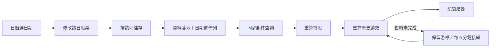
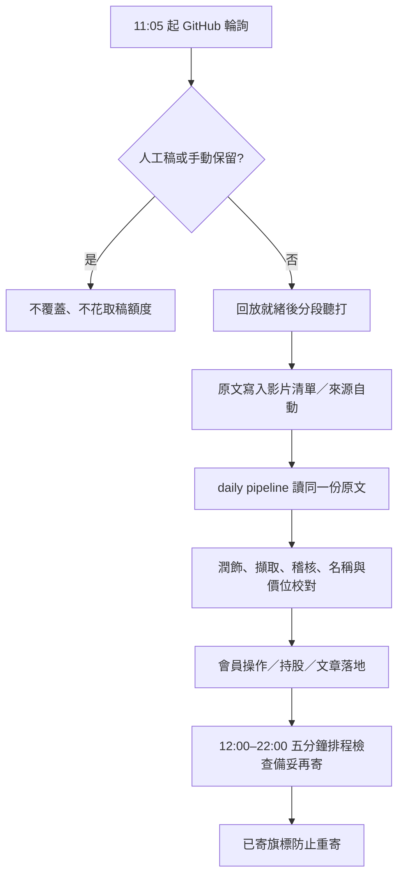

# v47 部署與驗收（2026/09/20）

## 這次結果

- GitHub 在原有 `3cb4eff` 更新之上修改，保留 v45/v46 的手動優先、逐字稿交棒、跨執行片段快取與簡訊說明補充。Python 正本只有 `pipeline/pipeline.py`。
- 本機 GAS build：`2026-09-20-quality-v47`。GAS 尚未由本次工作部署，請依下方步驟發布。
- GitHub 主模型保持 `gemini-3.5-flash-lite`，已設定備援 `GEMINI_FALLBACK_MODEL=gemini-3.1-flash-lite`。9/20 的實際小請求健檢六組皆成功：[主備援健檢](https://github.com/Lee200202/Stock/actions/runs/35498733875)。這不是完整影片聽打品質的保證。
- 儲存庫為 public。不能把私人儲存庫的免費分鐘額度套用到它；仍把市場工作由每日14輪降到3輪，減少空跑與來源負荷。

## 一、後台儲存與進度

選日期會移到當日表格；每列儲存後立即由後端排入同步，新增與刪除也是。進度卡放在當日表格正下方，不再隔著新增表單。原本的手動刷新按鈕保留作重試用途。不同日期會排隊，同一天短時間連續修改合併；背景正在算時又儲存，結束後再同步一次，確保後一次修改也被採用。

原錯位是「index 已加一，但 step 還寫上一個名字」，現在兩欄一起更新；前端也以同一份步驟陣列呈現。錯誤、等待與已完成分開。非同步舊回應不能把較新的進度或已選日期蓋回去。

同步不重寄已寄出的信，只更新網站的郵件查詢。歷史績效缺日K時，顯示等待續跑；既有補日K流程完成後接回，不偽報全部成功。觸發器排不進時，五分鐘維運棒仍可直接執行一個同步步驟。

## 二、市場頁與來源分工

市場總覽放在持股追蹤右側並加圖示。滿版響應式卡片，手機單欄。空資料不用全域 `.empty`，不再變成一字直排。每張資料卡保留來源日期、短走勢圖；技術分析展開後可切日／週／月K。

| 資料 | 來源／節奏 | 實際限制 |
|---|---|---|
| 台股日內加權指數 | Fugle；開著市場頁每3分鐘讀共用快取 | 須帳戶能讀指數端點；失敗保留最近收盤，不標成即時 |
| 預估成交金額 | 日內累計成交金額按已交易分鐘線性外推 | 開盤前30分鐘不估；是金額億元，不是成交股數，也不是官方預估 |
| 台指期 | TAIFEX 一般盤近月收盤 | 顯示契約月份；目前不是即時期貨。換月重新累積，不把跨月價差當行情 |
| 美元指數／USD-TWD／WTI／Brent | Yahoo 日資料，台北17:20、21:20 | 明示非即時；台灣休市仍可更新國際資料，不保證國際市場當日有資料 |
| 台股產業成交比重 | TWSE 普通股成交金額盤後計算 | 不含ETF／權證；電子母類與子類不重複加總；不是盤中比重 |
| 歷史60分K | Fugle歷史、既有快照優先；Yahoo只补缺 | 不填造中斷日期；Yahoo與官方重疊價差過大就不混用 |
| 國際指標及加權指數歷史日K | Yahoo 約一年未還原資料 | 週／月由同一套日K聚合；不寫入正式個股績效日K |

**沒有把低頻資料冒充即時。** 若要國際報價、產業比重與台指期全部每3分鐘即時更新，需要提供具相應權限的資料來源；現版不會用股票金鑰反覆撞不具權限的期權端點。

技術圖：20期布林通道（2倍母體標準差）、MACD 12／26／9（柱狀為2倍DIF減訊號）、大盤最近60根高低區間的23.6／38.2／50／61.8／78.6%回撤。MACD至少34根、布林至少20根；不足時明示。台指期首次只有一根官方日K，歷史指標須待同契約資料累積；不補造歷史。這些是公式觀察，不呼叫AI、不生成買賣預測。

### 負荷與404

所有 Fugle 股票／指數請求共用帳戶節流：預設最多50次／分鐘；歷史另有原55次上限。可用指令碼屬性 `FUGLE_ALL_RPM`、`FUGLE_INTRADAY_RPM`、`FUGLE_HISTORY_RPM` 調得更低，不能透過設定提高預設。超過排隊容許時間保留快取，不讓頁面掛著等。

Yahoo 串行、請求開始至少相隔5秒；429後停止該輪Yahoo補抓。歷史分K每輪最多40檔，先補最久沒更新的。GitHub 19:35補分K，台股休市在安裝套件前略過。台股盤後來源也跳過休市日，手動 all 可在週末初始化。

2155／3182 的404留在分K歷史狀態欄，同日不重試；原資料保留，其他代號繼續，隔日再試。404不是股票不存在的證明。401／403／429則停止該輪，不高速輪詢。進度用 `auditHourlyCoverage('6533')` 核對。

## 三、部署Apps Script

### 檔案

`apps-script` 裡全部 **21個 .gs、9個 .html，共30個**都是正式專案檔案。沿用同名檔案整份覆蓋；不存在才新增。不要貼 Python、Markdown、測試、zip。保留原專案 `appsscript.json`，本次没有提供新的 manifest。

GS：Adminpipeline、Adminservice、Aiservice、API、Articlequality、Cachebuilder、Cmoney、Code、Config、DB、Evidencequality、Holidays、Logic、MailService、Marketservice、Presentationquality、Quoteservice、Refreshrunner、Setup、SheetService、Transcriptstore。

HTML：Admin、Changelog、Index、JavaScript、Market、Settings、Stylesheet、Tech、Unsubscribed。

若已完整部署v46，v47直接改動：`Admin.html`、`Adminservice.gs`、`Evidencequality.gs`、`Index.html`、`Market.html`、`Marketservice.gs`、`Quoteservice.gs`、`Setup.gs`、`Config.gs`、`Tech.html`。不確定版本時以全部30檔為準，避免混版。

### 操作順序

1. 在原 Apps Script 專案先保留目前版本／備份。上述檔案依副檔名建立為指令碼或HTML，貼完存檔。
2. 執行 **`checkProjectFiles()`**。須30檔檢查通過、build等於v47；有缺檔就先補，不先跑重算。
3. 執行 **`checkAutomationReadiness()`**。只讀，不寄信。看 `everyFiveMin`、`webapp`、`dailyK`、`hourlyHistory`、`marketRows`。
4. 若 `everyFiveMin=false`，執行 **`ensureAutomationTick()`** 一次；已有則不用。這只補缺少的五分鐘入口，不刪原有觸發器。不要跑 `installTriggers()` 重建整套。
5. 執行 **`installMarketDataJobs()`** 一次，補建快取分頁並確認19:15歷史分K觸發器。若已存在不重複建。
6. 需要補歷史分K時執行 **`backfillHourlyHistoryNow()`** 一次；可週末執行，未完自動續跑。勿連按。用 **`auditHourlyCoverage('6533')`** 查晶心科缺日情況。
7. 日K維持原16:45補齊流程；除非快取確有損壞，不要為本次介面修改重設日K游標。日K驗收可跑 **`auditDailyKCoverage()`**。
8. 「部署」→「管理部署作業」→編輯原網頁應用程式→版本選「新增版本」→部署。保持原 `/exec` 網址不變；無須新建網址。
9. 開正式 `/exec?action=ping`，build應為 **`2026-09-20-quality-v47`**，features有 `day-edit-auto-sync-v47`、`market-technicals-v47`。若還是v46，表示只存檔未部署或開錯網址。
10. 重開網站／後台，測一筆您原本就要修改的列：儲存後應自動出現同步進度，關頁再回來仍查得到。手機檢查市场空資料文字、表格「未說明」、技術圖週期按鈕。

本次不代替您更新GAS，也不寄測試信給任何訂閱者。

## 四、GitHub與明天9/21驗收

不需要在GAS執行任何「啟動影片爬取」函式。GitHub `transcript-gemini` 已啟用，11:05（UTC03:05）開始；影片尚未回放就緒時每3分鐘輪詢，後續排程接棒。手動來源／手動保留永遠優先，舊有未標來源但有原文也視為手動。

必要 Secrets 名稱已在GitHub確認存在：SPREADSHEET_ID、GOOGLE_SHEETS_SERVICE_ACCOUNT、YOUTUBE_API_KEY、GEMINI_API_KEY／2／3、APPS_SCRIPT_URL、ADMIN_KEY。沒有讀取或輸出其值。排程均為active。備援模型已設定並測試成功。

**明天能否準點不能保證**：GitHub cron可能延遲、影片回放可能尚未開放、服務可能壅塞；目前檢查是入口與健檢通過。GAS需由您完成上面部署、確認五分鐘觸發器已授權，才包含郵件端的驗收。模型健檢是小文字請求，不等同實際影片全程聽打成功。

如11:05後尚無逐字稿：先看 transcript-gemini 是「等影片／等回放／模型忙／有手動稿」哪一種，不要反覆重貼。已有原文但未稽核則看daily-transcript-pipeline；文章已有但未寄則在GAS查 `dailyPushJob` 的系統狀態與執行記錄，不要直接重寄。

市場第一次空白：GitHub Actions → market-data-cache → Run workflow → mode=all，codes填6533可先驗單檔。這支不呼叫AI、不寄信，只補行情快取。完成後等3–5分鐘或重新開市場頁；`marketRows`至少應有taiex、tx、四個國際指標及sectors。

## 五、驗證與來源

本機完整Python 546項通過、Node 38支通過；320／390／1440寬度驗證表格、空資料、圖表週期、手機進度與非同步日期切換。正式GAS／實際收件匣渲染與明天影片仍需部署後驗收，不能用本機mock替代。

- [TAIFEX開放API](https://openapi.taifex.com.tw/)：台指期一般盤收盤，9/20唯讀實測成功。
- [Fugle歷史行情](https://developer.fugle.tw/docs/data/http-api/historical/candles/)：日／週／月與分K來源。
- [Fugle期權API](https://developer.fugle.tw/docs/data-futopt/http-api/getting-started/)：期權為不同API服務，未把股票權限當成期權權限。
- [yfinance歷史資料](https://ranaroussi.github.io/yfinance/reference/yfinance.price_history.html)：備援與國際日資料；非官方即時保證。
