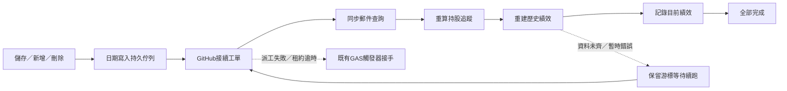

# v50 部署與驗收：市場日內資料、頁內圖表與自動同步

日期：2026/09/21。Apps Script build：`2026-09-21-quality-v50`。

## 1. 這次改好了什麼

- 市場卡片與互動圖表每五分鐘嘗試更新；只在頁面開啟且可見時輪詢。不同訪客共用伺服器快取與更新鎖，不因觀看人數倍增外部請求。
- 預設畫日內折線，不再把過去幾個交易日的收盤串成「今天」走勢。沒有日內點時照實顯示快照與來源時間，不造線。
- 「開啟全版互動圖表」改為同一頁覆蓋面板。關閉回到原位置，可用 Escape 關閉；手機全寬。歷史日／週／月K、成交量、均線、布林通道、KD保留。歷史K線的額外分析可選「不加掛／MACD／黃金比率」，三者互斥。
- 加權指數增加累計成交金額、成交量、高低點與線性預估成交金額／成交量。預估是「已成交數值 × 270 ÷ 已交易分鐘」，使用來源時間；開盤前30分鐘與收盤後不估，並非交易所官方預估。
- 產業成交比重預設前五大；按「展開其餘產業」才展開，不另抓API。分母為上市普通股成交金額，不含ETF、權證；仍是盤後資料，沒有冒充即時。
- 績效曲線最早從2026/07/08開始；API立即過濾舊曲線，重建後清除每日績效分頁較早的衍生紀錄。原始交易與成本依據保留。
- 日K與60分K只補缺口；週／月K由日K聚合。有效既有OHLCV不因補抓被覆寫。明確執行修復工具時才全量重抓。
- 逐日編輯新增／修改／刪除後自動排日期，優先交由GitHub Actions接續郵件查詢、持股與績效；管理者不必再滑到下方按第二個按鈕。進度文字和步驟使用同一個游標。

## 2. 「五分鐘刷新」與「即時資料」的邊界

|內容|主要來源|刷新與退路|
|---|---|---|
|加權指數|Fugle IX0001正式行情、5分K|台股交易時段每五分鐘嘗試；失敗保留最近值與時間。盤後優先當日官方收盤|
|台指期|Fugle期權、最近結算的單一TXF契約|依日／夜盤切換；需要期權權限。未授權時保留期交所一般盤收盤，不能視為即時|
|美元指數／美元台幣／原油|Yahoo 5分資料|可能延遲。401／403／429後共用停抓30分鐘，期間保留舊值；無日內資料時退回日資料|
|產業成交比重|證交所MI_INDEX＋上市公司基本資料|盤後更新；預設前五大，非全市場即時買賣流量|
|歷史日／週／月K|既有日K快取；市場指標另存Yahoo／官方資料|補缺口；週月聚合，不額外取同一份歷史|
|個股60分K|Fugle歷史／既有小時K／Yahoo備援|只補未完成日期，不混加相同時間成交量；即時尚未收完的K仍可更新|

本機9/21探測Yahoo日內端點收到429，因此**目前不能承諾國際指標每五分鐘一定得到新報價**。刷新頻率、來源報價時間是兩件事。網站會显示原始時間與「可能延遲／保留快取」，而非將刷新時間當行情時間。

台指期新契約的歷史只累積該契約，不把不同月份拼成假連續K。Fugle官方文件：[期權契約清單](https://developer.fugle.tw/docs/data-futopt/http-api/intraday/tickers/)、[正式報價](https://developer.fugle.tw/docs/data-futopt/http-api/intraday/quote/)、[日內K線](https://developer.fugle.tw/docs/data-futopt/http-api/intraday/candles/)。Yahoo備援使用[yfinance](https://github.com/ranaroussi/yfinance)，沒有可保證的免費即時服務承諾。

## 3. Apps Script 必須部署哪些檔案

**本機 `apps-script` 內全部32個檔案都要保留：21個GS、11個HTML。** 同名檔整份替換，勿把幾個GS黏成一個。新建HTML時名稱不用再手動加`.html`後綴。既有`appsscript.json`保留，不用另建專案。

|類型|檔名|
|---|---|
|GS|Adminpipeline、Adminservice、Aiservice、API、Articlequality、Cachebuilder、Cmoney、Code、Config、DB、Evidencequality、Holidays、Logic、MailService、Marketservice、Presentationquality、Quoteservice、Refreshrunner、Setup、SheetService、Transcriptstore|
|HTML|Admin、Changelog、Index、JavaScript、Market、**MarketCharts（新增）**、**MarketDetail（新增）**、Settings、Stylesheet、Tech、Unsubscribed|

`MarketDetail.html`是頁內面板，不是另一個網站；仍然必須建立。`MarketCharts.html`是共用計算程式，也必須建立。這次移除了市場舊版重複SVG技術圖程式，**沒有可刪除的GAS檔案**。Python、tests、docs、GitHub workflow不用貼進Apps Script；根目錄`pipeline.py`不應重建。

## 4. 詳細部署順序

1. 備份目前Apps Script原始碼與部署版本。從本機`apps-script`或`release/Stock-v50-GAS.zip`取檔，更新上面32檔，儲存。不要執行會重建全部排程的`installTriggers()`。
2. 執行 **`checkProjectFiles()`**：應核對32檔、build為v50。若報缺檔或marker不符，先把對應整份檔案補齊，再繼續。
3. 執行 **`checkAutomationReadiness()`**：查看`everyFiveMin`、`webapp`、`dailyK`、`hourlyHistory`與`fugle`。它是設定檢查，不代表影片已聽打或郵件已寄送。
4. 若`everyFiveMin=false`，執行 **`ensureAutomationTick()`** 一次。若已true不用重建。若`webapp=false`，確認Config正式`/exec`網址後執行`setWebAppUrl()`。
5. 執行 **`installMarketDataJobs()`** 一次，補建市場與分K分頁及19:15歷史分K排程；已有觸發器不會重複新增。日K的16:45排程照舊；如先前尚未移時，再執行`rescheduleDailyKTrigger()`。
6. 執行 **`checkMarketLiveReadiness()`**，檢查`index`與`futures`是否true。股票金鑰未必有期權權限；401／403先確認帳號方案及授權。若期權使用另一把金鑰，設定指令碼屬性 **`FUGLE_FUTOPT_API_KEY`**；未設定會沿用`FUGLE_API_KEY`。修正後再跑此檢查，它會清除相應的失敗冷卻。不要把金鑰貼進程式或日誌。
7. 確認指令碼屬性`GITHUB_REPO=Lee200202/Stock`、`GITHUB_REF=main`，`GITHUB_TOKEN`對此repo有Actions讀寫權限。這讓後台儲存能自動派`day-sync.yml`。GitHub現有Secrets `APPS_SCRIPT_URL`、`ADMIN_KEY`要對應同一個正式部署。
8. 選 **部署 → 管理部署作業 → 編輯 → 版本選「新版本」→ 部署**。沿用既有部署ID與`/exec`網址，不用另開新部署。開啟`正式網址?action=ping`，確認`build=2026-09-21-quality-v50`，features包含`market-overlay-v50`與`market-five-minute-v50`。
9. GitHub Actions開 **`market-data-cache` → Run workflow → main → mode=all**，先初始化市場與歷史快取。`codes`可填`6533`驗一檔；留空會依目前追蹤代號分批。它不呼叫Gemini、不寄信。
10. 如要补個股60分K，Apps Script執行 **`backfillHourlyHistoryNow()`** 一次，再以`auditHourlyCoverage()`看6533。查其他檔可暫建`function checkOne(){auditHourlyCoverage('股票代號');}`後執行。404保留舊資料且同日不重打；沒有提供資料的股票不造零量K。
11. 若日K缺資料，執行 **`backfillDailyKJob()`** 一次，由續跑機制完成；`backfillDailyKStatus()`查進度。不需要為了更新版面執行`resetDailyKCursor()`或`repairDailyKCache()`；後者是明確重抓修復入口，會增加請求量。
12. 重新載入網站並依第7節驗收。若瀏覽器還顯示舊版，關閉舊頁後再開正式`/exec`。

GAS由管理者部署；本次工具工作**沒有部署GAS、沒有寄測試信、沒有改正式試算表的績效資料**。

## 5. 清理7/8之前的績效、逐日編輯自動化

先部署GAS v50，再至GitHub **`day-edit-sync` → Run workflow → mode=performance**。流程會重算持股→重建7/8起歷史績效→記錄目前績效，不重新聽打、不跑Gemini、不重寄信。API從部署後就不呈現7/8之前的點；本次重建進一步清理每日績效中較早的衍生列，原始紀錄與先前成本不刪除。若實際紀錄更晚，圖仍以更晚的有效資料起算，不補造零績效。

日常只需在逐日編輯選日期、修改、按該列儲存。下一步已自動排入日期佇列，同日重複修改合併；正在處理時又修改會再跑一輪。資料剛存好不等於衍生內容全完成，進度卡會分別呈現：

Actions負責協調與接續，試算表重算仍在GAS每一步內執行，**不會因此繞過GAS單次6分鐘上限**。伺服器保存游標、檢查重送步驟，進度只隨成功步驟前進。已寄出的信不被修改或自動重寄；更新的是網站郵件查詢與下一次產生的內容。

## 6. 來源負荷、取稿與會員簡訊

- 沒有新增每五分鐘GitHub排程。市場GitHub工作只有17:20、19:35、21:20三輪；盤中由GAS共用快取按需取行情。休市日跳過台股分K，國際市場獨立更新。
- Fugle股票／指數／期權共用控速，所有呼叫預設最多50次／分鐘，歷史子桶55次／分鐘但仍受總桶限制，可用既有屬性調低。補抓有期限與游標，不和前台各自無限重打。
- Yahoo批次只併相同缺口的股票，最多2個工作執行緒；`yf.download`內部仍逐代號發HTTP，不能當成一批只有一次請求。批次之間至少2秒，偵測429立即停該輪；GAS國際資料另外使用五分鐘共用快取與30分鐘限流冷卻。
- 證交所股票歷史端點以月為單位，所以補一個日期可能接收同月其餘資料；寫入時保留已有有效K，不會把「只補空白」誤解成可以要求官方回單根。未收盤K可更新，不適用永久不改。
- 自動取稿仍由11:05起的`transcript-gemini`排程開始；影片需進頻道清單且回放可用。手動原文、手動保留、舊版空來源已有原文都先攔截自動取稿；pipeline讀到就緒原文後接原有稽核流程。GitHub排程可能延遲，不能保證11:05整點取到影片。
- 會員簡訊仍只用同日逐字稿中同一檔的已驗證背景補充說明，不增加簡訊未點名股票、不改指令與價位。逐字稿晚到時走背景同步，不重寄舊信。網站與郵件保留會員持股專區。
- 先前已實測[主／備援模型六組小請求](https://github.com/Lee200202/Stock/actions/runs/35498733875)及[市場初始化](https://github.com/Lee200202/Stock/actions/runs/35499093398)。本次沒有再跑完整影片模型或實際寄信；前述測試不能保證每一輪外部服務都成功。

## 7. 驗收清單與測試

1. 市場總覽排在持股追蹤右邊，有icon；桌機全寬、手機無整頁横向溢出。
2. 點任一指標，原頁開面板；預設當日／來源交易時段折線。切歷史週期只在本機聚合，不因按鈕重抓來源。
3. MACD與黃金比率不會同時出現，可都關閉；不足根數顯示說明，沒有假數字。
4. 產業預設5列，展開／收起不用API；空資料訊息正常橫排。
5. 開頁五分鐘後查看來源時間；若來源無新資料，保留原時間而非改為刷新時間。盤後有收盤時間與來源，不叫即時。
6. 修改逐日編輯一列，應自動排工；進度條與當前步驟一致、等待為警示，完成才100%。
7. 績效「全部」最早不早於2026/07/08；執行performance後核對後台工單確實完成。

本機回歸：**554項Python、43支Node測試全部通過**。瀏覽器以正式模板＋測試資料、實際Lightweight Charts，在320／390／1440px驗證表格、郵件、日曆、進度、空資料、五大產業展開、圖表十字線與互斥加掛。這不是部署後真人帳號或Gmail收件匣驗證。

測試證據：`tests/v50-python.txt`、`tests/v50-node.json`、本資料夾`preview/browser-checks.json`與`preview/market-detail-check.json`。GAS正式來源權限仍須依上面第4節第6步在你的帳號執行確認。

## 8. 9/21追加：明天取稿沒有啟動的防護與後台進度

9/21查GitHub實際紀錄，`transcript.yml`與`daily.yml`皆為active，但當天只有workflow_dispatch，沒有schedule執行。這表示當時沒有排程工作被建立；不能只憑cron文字保證明天11:05準時啟動，也無法由此API確認GitHub沒有派工的內部原因。

新增**獨立的GAS備援時鐘**：`everyFiveMinJob`一開始先跑`transcriptAutomationTick_`，平日11:05–15:30核對今天原文、手動保留與GitHub活動工作。沒有稿且非人工保留時補派transcript；原文超過200字、未完成時補派daily接稽核。已有同workflow執行／排隊就不重派；同workflow20分鐘冷卻，一天最多補派8次；管理者取消後備援不立即重開。GitHub本身的後續cron仍可能重試，取消本次執行不等於永久停用排程。

**明天（9/22）啟用前必做：**完成32檔更新後，執行`ensureAutomationTick()`、`checkAutomationReadiness()`，確認`everyFiveMin=true`、`transcriptBackup=true`。後者要求已設定GITHUB_REPO/GITHUB_TOKEN。再部署新版本，ping features須有`transcript-watchdog-v50`。只推GitHub而未更新GAS，這個備援不會存在。不要為了測試呼叫`dailyPushJob()`，它可能真的寄信。

後台取稿卡現在獨立查`transcript.yml`，不再誤用daily工單的run。顯示最近執行時間／狀態、今日原文是否落地，30秒讀一次；GitHub的success只代表該輪結束，沒有原文不能顯示聽打完成。片段進度仍以「查看即時日誌」為準，不用經過時間猜百分比。新增「取消本次取稿」，後端核對run屬於transcript workflow才取消。投稿、取稿、重寫、刷新、全面重整、簡訊進度區固定顯示，沒有工作就待命／0%，日誌入口仍可直接打開。

11:05之後可直接看[取稿工作列表](https://github.com/Lee200202/Stock/actions/workflows/transcript.yml)及後台取稿卡；原文落地後看[稽核工作列表](https://github.com/Lee200202/Stock/actions/workflows/daily.yml)。GAS備援觸發本身與GitHub排隊仍有延遲，沒有任何一端能保證精準到分鐘或外部模型永不失敗。測試已涵蓋「cron沒啟動→補派→原文落地→稽核」、手動優先、執行中不重派、取消不立即重啟與冷卻，但尚未實際部署後跑完整明日影片。
