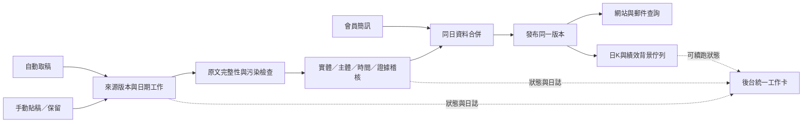
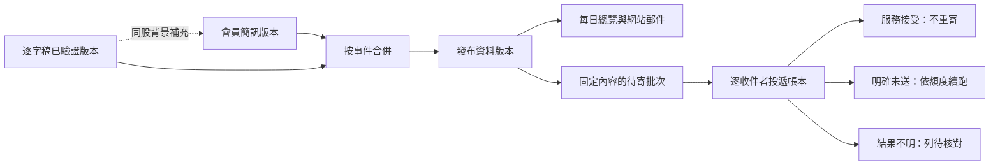

# 9/23 實站驗收與改版規格

本報告整合管理者的 `923有發現幾個全部版面修改方向.txt`、正式網站操作、登入後後台操作、GitHub 公開執行紀錄與本機程式。這是**驗收報告與實作規格，不是已修復公告**。本次沒有修改正式資料、寄信、取消工單或啟動重算。

## 1. 先說結論

目前系統能完成取稿、稽核與發布；9/23 已有成功的 GitHub 執行、當日逐字稿與網站資料。因此不能說整套自動化完全沒有動作。但是，**後台把不同日期／不同工作階段的狀態混在一起、分類與說明互相矛盾、績效資料落後、部分失敗頁面不能自行重試**，讓使用者難以判斷系統究竟完成了什麼。

建議保留已存在的擷取、證據、行情與重算功能，重新建立「同一天、同一版資料、同一個工作」的狀態契約，再重做前後台呈現。先修正資料與工作識別，再美化，否則換一套進度條仍會顯示錯的工作。

### 本次最重要的實測發現

1. **逐字稿受到提示詞污染**：9/23 公開逐字稿第 10 段混入「請聽打這段影片0:00:00到0:30:00的完整逐字稿。可能出現的專有名詞：……」及一長串詞彙。這不是單純排版問題；後續名稱盤點若以它為原文，會把提示詞的股票名當成節目證據。本機 `transcript.py` 確有這兩段請求模板，須檢查串流組裝與模型回聲。
2. **後台工作身分不一致**：投稿頁選 9/23，上方自動流程顯示稽核完成，下方 15 步仍顯示 9/22 時間與「待複核 10 項／完成 15/15／99%」，卻連到今天的 pipeline run。這是同屏資訊矛盾，不能只調整百分比。
3. **勤誠分類矛盾**：今日網站與郵件放在「觀望注意」，說明卻明寫「目前還不能買」。需回原文核對限制是否仍有效，再同步方向與公開說明，不能只把負面文字刪掉。
4. **績效實際只到 9/18**：查閱時 9/21、9/22 未呈現；同時後台維護顯示 9/23 記錄績效已完成。需要查「是否寫入、是否被過濾、是否讀到舊快取」三段，不能直接認定排程沒跑。
5. **台指期切換夜盤殘留日盤讀數**：夜盤無資料时，頂部行情變成空值，但圖中仍留 48,336 的日盤讀數。空資料也必須清空前一次狀態。
6. **會員通知頁曾讀取失敗**：顯示「載入失敗，請重新整理」，沒有就地重試；首頁同時已有當日簡訊，因此不能解釋成今天沒有文章。
7. **鴻海報酬口徑互相矛盾**：個股視窗當前回合 +7.56%，累積報酬拆解最後一項卻為 +5.25%；進場價詳述與「取當日收盤」的通用說明也不一致。應共用同一份計算結果與價格來源標籤。

## 2. 驗收範圍、證據與限制

正式站：<https://script.google.com/macros/s/AKfycbyLQjAd-CnQ6D6_JP3OY1WwXDkafCJthzeP3G4FDkT4t26PY9Gx1rhrXJjiHVZExQhoaw/exec>

- 桌面以 1440×900、手機以 390×844 檢查；已點擊全部 9 個前台分頁與全部 6 個登入後後台分頁。
- 實際操作包含日期選取、個股視窗、市場詳情與日夜盤切換、技術說明六段及情境互動。表單只讀，未測正式寫入、真實訂閱與信件投遞。
- 表格寬度、錯誤訊息與狀態文字均依當時 DOM／截圖確認。圖形的即時性另需來源時間佐證，不能只看曲線會動。
- 本機在本次檢查期間已有其他改版作業：存在 `docs/0923-v54/需求清單與驗收.md`、`AdminLegacy.html`，部分程式已改但版本常數仍為 v53。**本機最新程式不等於正式部署版本**。
- 例如最新本機 `getPerformanceSeries()` 已改用休市日判斷、不再拿日 K 日期集合過濾績效；正式站停在 9/18 的現象仍需部署後重新驗證。不要把這項寫成「本機尚未修改」。
- 另一份既有稽核文件屬其他檢查結果。本報告不把其中「排程延遲數小時」等敘述當成本次已獨立證實的事實。
- 本次沒有重新執行全套程式回歸，因此不引用先前的測試通過數量作為本次驗收成績。

### 自動化目前有沒有真的跑？

GitHub 公開紀錄可核對：

| 台北時間 9/23 | 證據 | 能證明／不能證明 |
|---|---|---|
| 11:05:45 建立，11:05:49–11:07:57 執行 | [取稿 run 35812974018](https://github.com/Lee200202/Stock/actions/runs/35812974018) 成功 | 有喚起且成功結束；退出成功本身不能證明這一輪新產生了稿，也可能是合法略過 |
| 11:46:40 建立，11:48:47–11:49:03 執行 | [取稿 run 35815676912](https://github.com/Lee200202/Stock/actions/runs/35815676912) 成功 | 有後續輪次；仍須看取稿結果理由與來源指紋 |
| 11:50:41 建立，11:50:44–11:55:46 執行 | [每日流程 run 35815937915](https://github.com/Lee200202/Stock/actions/runs/35815937915) 成功 | 「執行每日流程」成功且「沒事可做」略過，並非只有空跑分支成功 |
| 查閱正式站 | 9/23 原文、郵件與簡訊／觀望資料均可見 | 至少有當日資料發布；無法單凭前台證明每筆來自哪一次 attempt |

因此答案是：**今天有運作證據；明天不能保證準點或完全不中斷**。GitHub 官方說明 schedule 可能延遲，高負載時甚至丟棄排程；應以 GAS 喚起＋GitHub 排程備援＋資料持久化佇列共同保證「遲到可接回」，而不是宣稱 11:05 必定開始。[GitHub 排程故障排查](https://docs.github.com/en/actions/how-tos/troubleshoot-workflows)

## 3. 哪些舊問題這次沒有重現

| 項目 | 本次結果 | 接下來怎麼辦 |
|---|---|---|
| 簡訊先到，影片觀望清單消失 | 9/23 首頁同時有力積電簡訊買入、8 檔觀望不碰、6 檔觀望注意 | 加入兩種到達順序的回歸；不要再說目前整張觀望表不見 |
| 聖暉、祥碩錯列不碰 | 查阅時已在觀望注意 | 可能已人工修正；仍要查判定歷程，不能以現畫面證明分類引擎已修好 |
| 加權指數卡片太寬／右端不是收盤 | 本次卡片已等寬，台股右端 13:30 | 保留這次改善；聚焦國際六小時與台指期缺資料 |
| 市場圖表另開分頁 | 本次為同頁覆蓋視窗 | 保留，補鍵盤焦點、關閉還原與狀態清理 |
| 技術說明完全没有圖 | 已有流程、情境按鈕、狀態時間軸、ERD 等 | 問題是重複、缺例子與證據，不是再堆更多同類箭頭卡 |
| 績效出現 7/8 以前資料 | 本次起點已為 7/8 | 保留限制，另外處理後續日期缺口 |
| 產業預設列全部 | 本次前五大＋展開其餘正常 | 補來源日期與更新排程，不必重做展開邏輯 |

## 4. 逐頁實測摘要

| 頁面 | 操作／結果 | 主要改進 |
|---|---|---|
| 每日總覽 | 日期、買入、觀望與持股資訊已載入 | 區分「當日持股聲明」和「目前追蹤持有」；勤誠方向矛盾；首屏太高 |
| 持股追蹤 | 桌面列表、手機列表、鴻海詳情 | 手機表格實測約 1280px，說明在右側不可直接讀；回合報酬與來源敘述不一致 |
| 市場總覽 | 卡片、台指期詳情、日／夜盤 | 國際資料 12:00 起，未滿最近六小時；夜盤殘留日盤讀數 |
| 績效走勢 | 等待後曲線載入 | 到 9/18；首次載入慢與真正缺日期要分开處理 |
| 訂閱通知 | 新增與管理表單 | 未提交；新增 SMS 須保留 daily，管理取消另走明確操作 |
| 郵件查詢 | 日曆選 9/23、讀完整文章 | 4 點盤勢、2 點教學；勤誠矛盾；已寄送僅為系統標記，非收件證明 |
| 會員通知 | 日曆初始化 | 出現讀取失敗且無就地重試；不要顯示成無通知 |
| 逐字稿 | 選 9/23，排版稿成功載入 | 10,757 字；日期和片名相黏；原文混入提示詞，優先修取稿入口 |
| 技術說明 | 六段均切換，互動情境可操作 | 已有互動，需改成例子帶流程、減少重複卡片与固定頁尾干擾 |
| 後台：投稿逐字稿 | 自動 5 步＋人工 15 步 | 同屏混日期、完成 99%、run 連結不一致 |
| 後台：逐日編輯 | 選 9/23，載入 17 列 | 手機前言過長、每列儲存繁瑣；改日期級儲存并自動同步 |
| 後台：資料修正 | 看日期、重寫與重新分類 | 與逐日編輯／維護重疊；文字仍叫人再到另一頁刷新 |
| 後台：維護工具 | 看刷新與全面重整狀態 | 「只刷新／不動資料」卻列多項資料重算修正；語意不實 |
| 後台：會員簡訊 | 看抓取、解析、合併及清單 | 功能过多，提到不存在的「網站內容」分頁；既有內容與抓取證據混淆 |
| 後台：版本沿革 | 載入可讀 | 舊規則與新規則並列，應加已取代標籤與版本篩選 |

## 5. 改善清單：第一批 72 項可落地規格

第二批補充第73–100項在第12節，涵蓋手機退訂、五種郵件樣板、逐收件者寄送、行情與K線資料健康。總計100項。

標示：**實測**＝正式站重現；**程式**＝本機可見結構風險；**需求**＝管理者明確偏好；**設計**＝本次提出。P0 先處理資料與工作狀態，P1 主要體驗，P2 再深化。

### A. 資料正確性與分類

| # | 優先／依據 | 具體修改及驗收 |
|---|---|---|
| 01 | P0 實測 | **提示詞污染隔離**：取稿落地前檢測本次請求模板回聲、詞彙表、角色標籤與切段封套。原始回應保留作稽核；僅移除可確證的封套。若同時疑似漏句，重新取得受影響片段，不能用空字串當成功。pipeline 輸入不得再含那段指令。 |
| 02 | P0 程式 | 檢查串流接續是否重複拼接 prompt／既有文字；記 segmentId、interactionId、最後 eventId、片段雜湊。重播事件須冪等，不能直接串接全部 event。以真實事件形狀的離線 fixture 驗證。 |
| 03 | P0 實測 | 加「分類與證據矛盾」關卡。勤誠原句若仍為「目前還不能買」，不得因同句含 900 買點就列注意；若後段限制解除，須留解除證據。說明和類別由同一結論生成。 |
| 04 | P0 需求 | 行為主體分開：散戶賣、外資賣、ETF 調整不能變成會員賣。`actor` 為 members／analyst-self／institution／retail／unknown，只有符合既有會員操作規則才寫當日買賣。 |
| 05 | P0 需求 | 相鄰股票不能共用正負面句。證據先分段辨識 topic、代詞指向，再比對原文 span；華邦電不能因下一句另一檔看多而轉注意。模糊者留待複核。 |
| 06 | P1 需求 | 反轉語意先解析：「散戶賣、籌碼沉澱、MACD 將翻紅」不是看到「賣」就偏空；「不准賣」也不等於「不准買」。分辨現在、條件、否定範圍。 |
| 07 | P1 需求 | 純舊推薦／獲利故事排除，不在覆蓋核對時復活。另有本次有效看法才收錄。歷史價格不可冒充當日買入。 |
| 08 | P0 實測 | 網站、郵件、tracker 使用同一個已發布版本的分類資料。人工修正後只一份方向來源，不能郵件已變、首頁仍舊。保存 sourceHash、publishedVersion、modifiedBy。 |
| 09 | P1 程式 | 簡訊說明擴充已有 `enrich_sms_notes_from_signals`，不要再新增整輪模型。只接同日同代號已驗證說明，保留簡訊動作與時間，說明區呈「操作通知／影片補充」。沒有合格依據就維持短句並記原因。 |
| 10 | P1 實測 | 公開文字去掉「列為……標的」「故歸類為……」等分類流程。先保留投資觀點，再刪後設子句；不得把「目前不能買」也當分類理由刪掉。 |
| 11 | P1 實測 | 教學至少三個不同主題，只在原文有依據時達成；9/23 只有兩點要查補問是否漏接、去重是否過度。缺口與補問結果須記錄，不能補第三點套話。 |
| 12 | P1 設計 | 用小型固定樣本評量每次規則更新：主體、名稱、價位、分類、日期各算錯誤數。固定輸入重跑分類穩定，不要求自然語言逐字相同，也不宣稱 temperature 低即保證一致。 |

### B. 自動化與後台進度

| # | 優先／依據 | 具體修改及驗收 |
|---|---|---|
| 13 | P0 實測 | 狀態以 `date + sourceVersion + jobId + attempt` 組合查詢；runId 屬這一個 attempt。選 9/23 時不混入 9/22 工單，舊工作另放「過往紀錄」。 |
| 14 | P0 需求 | 自動取稿與手動投稿共用資料處理進度元件。差別只在前置取稿階段；进入 pipeline 後使用同一個 phaseId。不要讓前端從中文訊息猜 STEPS 索引。 |
| 15 | P0 實測 | 執行完成 15/15 應為 100%；「待複核 10 項」是另一顆品質徽章。資料發布、背景績效、品質稽核各有狀態，不能用 99% 同時代表它們。 |
| 16 | P1 需求 | 未開始就显示完整階段與目前狀態：未到時段／等待影片／取稿／稽核／已發布／背景重算。進度條貼在所屬任務卡中，手機全寬，顯示最後心跳。 |
| 17 | P0 設計 | 日誌按 jobId/runId 綁定；站內顯示可分頁尾端日誌與可讀錯誤，GitHub 連結固定到本輪，不取「最新 run」代替。API 錯誤不顯示金鑰或完整認證網址。 |
| 18 | P0 需求 | 取消區分「取消本次工作」與「今天暫停自動處理」。取消 token 在取稿、模型呼叫前後及寫入前檢查；目前網路請求不能瞬間停止要說明。取消後不能被 watchdog 立即再派相同工作。 |
| 19 | P0 程式 | GAS Lock 不能獨自協調 GitHub writer。建立跨程序租約／revision 驗證，過期租約可回收；在實際寫入前再次確認 sourceHash 和取消狀態，阻止舊稿覆蓋新稿。 |
| 20 | P0 程式 | `everyFiveMinJob` 不能無界串行所有昂貴任務。建立剩餘時間預算，先做心跳、派工、發布同步，再做受限行情，重活續跑。hard timeout 不是 try/catch 可捕捉錯誤。 |
| 21 | P1 設計 | 執行成功要有結果契約：published、skipped-manual、waiting-video、waiting-quota、cancelled 等。GitHub 綠燈只表示程序結束正常，後台要說明有沒有新稿／新發布。 |
| 22 | P0 需求 | 手動原文及手動保留永遠優先；剛派工後再貼手動稿，也要在自動落地前重新檢查。不能只在 tick 第一行检查一次。 |
| 23 | P1 實測 | 逐日編輯改為「儲存本日變更並同步」：先批次存檔，再可靠地建立工作。派工失敗顯示「已存、等待同步」并可重試，不回報全部失败讓人重按重寫資料。 |
| 24 | P1 需求 | 日期工作台合併逐日編輯與當日資料修正；維護保留全站背景工作。完整判定歷程不刪，只收進進階抽屜。重新分類全部歷史不得作預設。 |

### C. 績效與資料來源

| # | 優先／依據 | 具體修改及驗收 |
|---|---|---|
| 25 | P0 實測 | 績效缺口逐層查：每日績效是否有日期→API 是否回傳→快取是否過期→前端是否過濾。顯示 lastSnapshotDate、KCoverageDate、lastSuccessfulRebuild。不要先盲目重抓一年 K 線。 |
| 26 | P0 程式 | 本機 v54 已改用休市日表過濾績效，需核對部署與未知年份策略；刪除過時「日K為交易日曆」註解。測試 K 落後但績效列存在時仍可呈現。 |
| 27 | P0 實測 | 鴻海當前 +7.56% 與累計拆解 +5.25% 要共用 snapshot/asOf。若累積只算已結束回合，就明確標「已實現回合累積」，不要混含舊的持有中報酬。 |
| 28 | P0 實測 | 價格來源逐回合明確：觀測日、原句提及日、成交匹配日、採用價、規則版本。明細不是當日收盤時，通用說明不得寫「取當日收盤」。 |
| 29 | P1 設計 | 回述成本晚於首次持有日的情況需標示「事後補述」；如提供回測，與當時已知資訊版本分開。不能偷偷拿未來知識改善過往報酬。此處須先確認既有方法再改計算。 |
| 30 | P1 需求 | 管理者從目前持股點「修改進場依據」直達實際來源列，顯示來源日期與影響回合。修改源資料再重算，不直接覆蓋 tracker 衍生價。 |
| 31 | P1 需求 | 歷史完整 K 線免重抓；新增、缺 OHLCV、缺日期區間才補。當日未收盤與本週／本月未結束 K 仍允許刷新，不能一見非空就永遠不更新。 |
| 32 | P1 設計 | 修復舊錯單位／錯來源資料是明確「修復模式」，與平日補空分開；先乾跑列受影響範圍再執行，保留原值與修復版本，避免有錯也因非空不能修。 |

### D. 市場總覽與行情

| # | 優先／依據 | 具體修改及驗收 |
|---|---|---|
| 33 | P0 實測 | 國際六小時不能只改 x 軸。來源查足夠跨日範圍，再按時間戳切最近六小時；若只有兩小時就顯示覆蓋不足，不能把兩小時拉寬假裝完整。 |
| 34 | P0 實測 | 台指期日／夜盤切換要同步清掉 quote、series、readout、volume、high/low、error；所有回應核對商品＋合約＋session＋period＋requestId。 |
| 35 | P1 需求 | 日盤、夜盤分别缓存、累計量分别歸零；夜盤跨午夜的交易日不靠 calendar date 猜。合約換月切斷不同合約的線並显示月份。 |
| 36 | P1 需求 | 當日圖不把相隔很久的兩筆直接連成連續即時線。區分尚未收集／休息時段／來源失敗；缺口斷線，已收集點可讀，不虛構中間行情。 |
| 37 | P1 實測 | 卡片顯示來源資料時間與延遲／收盤標籤，查詢時間移至次要位置。五分鐘輪詢不是五分鐘即時保證；供應商慢二十分鐘也要誠實標示。 |
| 38 | P1 需求 | 加權卡補累計成交金額、預估全日成交金額、漲跌家數等確實取得的欄位；預估需註明方法與估算時間，無足夠歷史分時輪廓時不可亂線性外推冒充官方值。 |
| 39 | P1 需求 | 產業前五大保留，展開其餘；來源日期置標題旁。9/23 午後仍9/22資料不一定故障，須結合官方發布與既有15:45排程判斷，顯示「前一交易日／下次更新」。 |
| 40 | P1 設計 | 等寬市場卡統一資訊區高度和繪图区高度；名稱換行不推低隔壁折線。台股固定09:00–13:30、期貨依實際時段；到期日須處理例外。 |
| 41 | P1 需求 | 詳情用同頁覆蓋視窗，桌面主圖＋成交量、手機單列。MACD／黃金分割／不顯示用單選（針對市場詳情）；個股原本多副圖不因這項要求被刪。 |
| 42 | P1 設計 | 分時、60分、日、週、月的技術分析只用該周期資料；指標參數和不足根數可見。不把日K算的MACD貼在當日線旁却讓人以為日內訊號。 |
| 43 | P1 程式 | 停留市場頁只讀共用快照；資料更新由背景五分鐘工作做。多個訪客不應每人各抓Yahoo／Fugle／TAIFEX一次。手動更新按鈕也要共用冷卻與鎖。 |
| 44 | P1 設計 | 台灣休市不代表美元／原油休市；按商品交易日曆分别排程。夜盤與國際工作需獨立於台股白天判斷。來源限制與是否允許公開展示另核對契約，不猜免費額度。 |

### E. 全站 UI、手機與閱讀

| # | 優先／依據 | 具體修改及驗收 |
|---|---|---|
| 45 | P1 需求 | 移除 Daily Record、追蹤／走勢／即時／原文等重複眉標。保留唯一清楚標題與無障礙名稱，不因刪視覺標題造成整頁沒有 heading。 |
| 46 | P1 需求 | 桌面全版資料區，說明長文仍限制行長；不要將每段文字拉成1800px。表格可全寬，技術說明採圖文兩欄而不是超長行。 |
| 47 | P1 需求 | 股票名稱約4em基準、代號至少容納00981A；KY長名正常換行，數字不拆。觀望表移除獨立價位欄，合格條件放說明；買賣表仍保留價位。 |
| 48 | P1 實測 | 手機持股改卡片：名稱＋代號／狀態、報酬＋價位、最新說明；日期等展開。不要用1280px表格當390px手機唯一入口。桌面仍可高密度表格。 |
| 49 | P1 需求 | 移除持股提及次數主欄，放詳情；回合號放狀態下一行。最新說明附日期、優先提供60–100字可讀內容，不用省略号藏掉唯一有用資訊。 |
| 50 | P1 實測 | 「平均未實現報酬」不可只剩「酬」獨行；短標籤整組或分成語意兩行。不能對所有長文加 nowrap，否則造成橫向溢出。 |
| 51 | P1 需求 | 統一圓角：按鈕10–12px、輸入10px、卡片16px；警示用文字＋圖示而非只靠紅綠。樣式用共用token，清理散落border-radius:0，不全域!important硬蓋。 |
| 52 | P1 需求 | 內文16px起、行高1.6–1.75、字距0–0.04em；數字字距0、tabular-nums。市場／後台／郵件查詢均跟使用者字級偏好，150%放大仍可操作。 |
| 53 | P1 設計 | 焦點框、44px觸控目標、Esc關閉、modal焦點圈與回到原觸發按鈕。sticky儲存列要計入safe-area，不遮住末列或聊天室。 |
| 54 | P1 實測 | 初始載入用骨架與—，不先顯示0檔／0%再跳真實值。空、失敗、載入中、等待來源四態各有文案與合理動作。 |
| 55 | P1 程式 | 會員通知 `smsLoaded=true` 提前設置，失敗後不能重載；改 idle/loading/ready/error狀態＋重試按鈕。郵件／逐字稿日期切換同樣防過期回應。 |
| 56 | P2 設計 | 動畫只用150–220ms淡入或小位移，不逐格延遲顯示表格數字；支援prefers-reduced-motion。資料更新維持捲動位置，不讓整表閃白。 |

### F. 郵件、訂閱、技術說明與維運

| # | 優先／依據 | 具體修改及驗收 |
|---|---|---|
| 57 | P1 需求 | 每日郵件保留會員持股專區；觀望移除價位欄後仍用inline樣式、各格bgcolor與文字色。網站郵件預覽不等於Gmail／Outlook實測，兩者分开驗收。 |
| 58 | P1 需求 | 訂閱新增採集合合併：既有daily=true，這次選sms=true，結果兩者true；取消只能由管理訂閱明確提交。表單顯示「新增通知不取消原訂閱」。 |
| 59 | P1 實測 | 日期用台北 yyyy/MM/dd HH:mm；清掉原生英文Date字串、ISOZ混排。頁尾不再說每天午後只更新一次，要區分影片、簡訊、行情各自更新。 |
| 60 | P1 需求 | 技術說明改成「問題→情境→圖→處理結果→限制」，每單元前言3–4行。圖需要回答問題，不再只是四張流程卡重複上方動畫。 |
| 61 | P2 設計 | 做8張有意義的互動圖，詳見第8節；保留現有可用步進器，不盲目刪除重寫。情境均註記示範，不能冒充真實模型對話。 |
| 62 | P1 設計 | 商業價值用可驗證指標：人工貼稿次數、來源到發布延遲、人工改類率、缺行情天數。没有量測前不寫「省90%」「準確99%」。 |
| 63 | P1 實測 | 後台「只刷新、不動資料」改符合實際範圍的名稱；若會重分類或刪產業列須明列。刷新快取、重算衍生資料、重新判讀原文分三種，不能混叫刷新。 |
| 64 | P1 需求 | 按鈕統一成儲存並同步／查看日誌／取消本次／重試未完成；備援或全歷史處理移進進階區。每個任務只有一個主要按鈕。 |
| 65 | P1 實測 | 會員簡訊管理分接收箱、待處理、補抓三區；新手先看今天是否到齊，不先看到全歷史重解析。移除不存在「網站內容」分頁的操作指引。 |
| 66 | P1 設計 | 日曆「分頁無資料」與「已查來源確認無文」用不同圖例；載入前disabled、失敗可重試、換月不丟錯誤原因，選取日有明顯焦點。 |
| 67 | P1 程式 | 一個API請求內共用Sheet快照與代號索引，避免每個函式getDataRange重讀；批次setValues／batch_update寫入，完成後精準失效快取。不同request不能靠全域變數保證一致。 |
| 68 | P1 程式 | 個股目前多RPC（報價／持股／紀錄／基本面／K線）；合併必要摘要或共用Promise，但慢基本面延後，不讓一次大bundle拖住首屏。各部分有獨立錯誤與重試。 |
| 69 | P1 設計 | fetchAll／並行只降延遲，不減供應商計費次數；用來源支持的真正batch endpoint、共用快取、差量區間與request coalescing減呼叫。記每來源次數、429、耗時、命中率。 |
| 70 | P1 設計 | 前台每次讀取帶資料版本，後台顯示GAS build／Python commit／publishedVersion；別只改版本字串就當部署一致。檔案檢查須涵蓋新增／移除模組。 |
| 71 | P2 實測 | 版本沿革按問題與日期折疊，舊規則標「已由vXX取代」。使用教學只描述現行規則，歷史事故留版本頁，不讓新人混用。 |
| 72 | P0 設計 | 驗收以資料與畫面結果，不以HTTP200／退出碼0／進度100%作唯一成功條件。每次發布核對日期、來源指紋、筆數／代號集合、文章版本、背景結果；禁止自動重寄已寄信。 |

## 6. 後台應重構成什麼

### 導覽建議

| 新入口 | 合併現有入口 | 主要使用者問題 |
|---|---|---|
| 今日工作台 | 投稿進度、自動取稿、當日簡訊狀態 | 今天到了哪一步？卡在哪裡？ |
| 逐日資料 | 逐日編輯＋日期範圍資料修正 | 某天哪一筆錯了？儲存後同步了嗎？ |
| 收件與來源 | 會員簡訊管理＋原稿版本 | 原始內容有沒有進來？誰先寫入？ |
| 維護與健康 | K線、績效、快取、背景租約 | 哪些資料落後？只補缺口怎麼做？ |
| 判定與工作歷程 | 判定歷程、工作日誌 | 為什麼這一檔被改類？哪一輪做的？ |
| 版本與說明 | 版本沿革 | 現在版本修了什麼？ |

### 一張任務卡的必要內容

```text
2026/09/23 · 自動影片處理           [資料已發布] [待複核 2]
來源：YouTube · 原文版本 8f… · 工作 J… · 第 2 次嘗試
取稿 ✓ ─ 稽核 ✓ ─ 發布 ✓ ─ 背景更新 ◐
資料處理 15/15 完成                   100%
背景：績效等待日K；下次檢查 16:50
最後更新 11:55:46 · 最後心跳 25 秒前
[查看本次日誌] [查看待複核] [取消背景工作]
```

固定資料契約至少包含：`jobId, parentJobId, date, sourceType, sourceHash, phaseId, attempt, state, completedUnits, totalUnits, heartbeatAt, nextRetryAt, runId, publishedVersion, qualityStatus, backgroundStatus`。這是建議契約，實作需沿用舊欄位適配，不能直接讓既有工單失效。



逐日編輯的可靠順序：保存 source revision → 建立可重試同步工作 → 重建當日文章 → 重算持股／受影響績效 → 精準清快取 → 核對新版本讀得到。畫面在存檔成功就告知「已儲存」，同步另列進度；不能因後續503让管理者誤以為資料沒存。

## 7. 市場頁的具體畫法

桌面以等寬兩欄卡片、必要時三欄；手機一欄。頁首只留「市場總覽」與狀態／更新按鈕。每張卡固定四層：

1. 名稱＋合約／時段＋收盤／延遲徽章。
2. 最新值＋漲跌；下方小字為來源資料時間。
3. 同高折線：台股固定交易時段；國際最近六小時。休息與缺口斷線。
4. 成交量或成交金額、預估值等有來源的附加指標。沒有適用欄位不塞「—」佔滿畫面。

點開同頁詳情：標題與關閉 → 報價摘要 → 時段／周期 → 指標單選 → 主圖 → 成交量 → 資料來源與計算方法折疊。選夜盤時整體都是夜盤，不留下日盤標籤或數字。

六小時的時間規則要先寫清楚：預設採**最近六個實際時鐘小時**，交易暫停區段斷線；不是向前補滿六個交易小時。休市時可固定於最近有效交易時點並標「已休市」，不能仍寫「目前即時」。若產品偏好從本段開盤起畫，需用另一個明確模式，避免同一個「六小時」各頁意思不同。

期交所台指期一般日盤08:45–13:45、夜盤15:00–次日05:00；到期契約最後交易日另有13:30例外，應依商品與到期日處理。[期交所臺股期貨契約規格](https://www.taifex.com.tw/cht/2/tX?menuid1=12)

## 8. 技術說明：要加的圖與互動

不建議把整篇改成大量動畫。每張圖要讓讀者看懂一個以前看不懂的問題。

| 單元／圖 | 讀者問題 | 圖與互動 | 輸出重點 |
|---|---|---|---|
| 1 動機：前後比較 | 為什麼不能每天看影片就好？ | 左：影片、簡訊、截圖散落；右：按日期與個股串起來源；按「找一筆成本」比較路徑 | 省的是查找與核對步驟，不宣稱提高投資勝率 |
| 2 一天時間軸 | 11:05以後究竟發生什麼？ | 取稿／稽核／發布／寄信／行情五泳道，可選正常、影片晚到、模型忙碌 | 等待可續跑，發布與背景計算分開 |
| 3 對話式分類 | 有「賣」為何不是賣出？ | 左側原句「散戶賣出」；右側主體→行為→時間→分類，逐段色筆底線 | 同一個動詞需先看是誰做 |
| 4 相鄰股票歸屬 | 為何ETF的900元不是ETF價格？ | 句子中以不同底線標出ETF、勤誠、價位；點數字顯示歸屬證據 | 距離是輔助，代詞與語意才能定案 |
| 5 證據漏斗 | AI怎麼避免亂補？ | 原文→候選→官方代號→原句引用→公開資料，點任何關卡看到被拒例子 | 原文有名稱也不代表所有敘述都正確 |
| 6 持股狀態機 | 十日沒提到如何計價？ | 8/6進場→8/10最後提及→逾十交易日，滑動觀測日期 | 門檻發生日與計價日不同；出場用8/10收盤規則 |
| 7 ERD與資料血緣 | 改一笔为什么要重算多處？ | SourceVersion→Evidence→Record→ArticleVersion；Record→HoldingRound→PerformanceSnapshot；JobRun附加狀態 | 表間是邏輯關聯，不能假裝Google Sheets自帶外鍵交易 |
| 8 事故恢復沙盒 | API失敗會不會全部重來？ | 按「模擬503」「貼入新稿」「取消」；显示檢查點與租約如何接續 | 僅前端示範，不真的呼叫模型、不真的取消工單 |

每節結構：一句明確問題 → 3–4行說明 → 互動圖／對話 → 三項結果 →「想看實作」折疊。數字門檻只在一處權威說明，其他引用，避免多份文字各自過時。

色筆效果用半透明背景或底線標主體、時間、條件，附文字圖例，深色模式保持對比；不可只靠紅綠。動畫可暫停，減少動態偏好直接显示完整狀態。常見問題放內容結尾一次，作者欄最后，不要每切一段都先穿過大段固定頁尾。

## 9. API、排程與效能策略

Apps Script 每次執行有時間上限，常見為6分鐘；不能把「safe_包住」當作可抵抗強制終止。[官方配額](https://developers.google.com/apps-script/guides/services/quotas)

Google建議減少服務呼叫、批次讀寫試算表；本案應先量測最慢入口與重複讀表次數，再決定快取，不是全站一個長TTL。[官方最佳實務](https://developers.google.com/apps-script/guides/support/best-practices)

| 層 | 建議 | 正確性條件 |
|---|---|---|
| 單次GAS請求 | 同一分頁只讀一次，建date/code索引共享 | 寫入後失效，不返回寫前索引 |
| 前端 | 相同代號同周期共用in-flight Promise | 切代號／日期時舊回應不可覆蓋新畫面 |
| 外部行情 | 按來源共享快照、節流、退避 | 429尊重Retry-After；不關SSL驗證 |
| 歷史K | 缺口區間＋未完成尾端刷新 | 完整歷史免抓；修復模式可明確覆寫已知錯值 |
| 模型 | 一次JSON承載分類／摘要／證據，僅補問真缺口 | 來源污染不能因省呼叫而放行；模型記憶不是跨API自動共享 |
| 工作佇列 | 持久化待處理工作，執行器逐筆claim | GitHub concurrency控制並行不等於可靠保存業務佇列 |
| 快取 | key含schema/version/date/sourceHash | 發布成功精準失效；空資料短TTL、錯誤不可當永久空值 |

GitHub concurrency的排隊行为需依目前workflow設定與官方能力確認，不應硬寫「永遠只支持一個pending」。無論其queue模式如何，業務待辦仍應持久化保存。[GitHub concurrency文件](https://docs.github.com/en/actions/concepts/workflows-and-actions/concurrency)

## 10. 實作順序與驗收

### 第一批：資料與狀態

先做01–08、13–22、25–28、34、55。新增原文污染樣本、勤誠限制樣本、舊日期工單＋新run連結樣本、績效過濾樣本。修復後才重跑受影響日期；不可直接全歷史重分類。

### 第二批：操作與版面

做日期級儲存、自動同步、後台導覽合併、手機卡片、市場六小時、夜盤清理、訂閱合併。保持會員持股、人工保護來源、已寄信不重寄。觀望價位欄移除只改呈現，原始證據與內部price欄不刪。

### 第三批：教學與觀測

補技術圖、資料血緣、API量測與運作健康頁。每項改善用before/after同viewport截圖與測試證據交付，不只報「完成」。

### 必測矩陣

- 來源順序：SMS→逐字稿、逐字稿→SMS、原稿修改、手動保留、同日兩來源。
- 工作故障：503、429、404網頁、網路中斷、GAS硬截止前存點、重複派工、取消後watchdog、舊run晚回。
- 語意：散戶賣、ETF買勤誠、聖暉看多、目前還不能買、限制後解除、相鄰華邦電、純舊推薦、M31合法名稱、提示詞詞彙表污染。
- 價格：EPS／成交量／漲跌不作價格；事後成本補述、最後提及日出場、日K缺口與單位。
- 前端：360／390／768／1440px，字級100／125／150%，深淺主題，鍵盤與減少動態效果。
- 非同步：日期A慢、日期B快，最終只能顯示B；夜盤空資料不得留下日盤值；錯誤能重試而非永久loaded。
- 郵件：網站預覽、實際郵件HTML結構、inline深色樣式；真實寄信另經授權選測試收件人，不用正式訂閱者當測試。
- 效能：冷／暖快取分别測至少3次，記median與最慢值；API次數及用量也測，不能只優化畫面載入數字。
- 自動化：記錄當日「預定喚起／實際喚起／首稿／發布／寄信」；沒有訪客開頁也要產生行情快照。

## 11. 部署時要怎麼做

本次交付的是規格文件，**現在不需要為本報告執行任何部署函式**。實作後依序：

1. 先核對最新本機改動、GitHub main、線上GAS build，不把另一個AI正在做的v54覆蓋回v53。
2. GitHub只提交本次已驗證程式與測試；Python正本維持 `pipeline/pipeline.py`，不重建根目錄同名檔。
3. GAS列出實際變更／新增／刪除檔案。同步Setup的檔案marker清單，先跑 `checkProjectFiles()` 再部署新版本，維持正式exec網址。
4. 只執行需要的設定遷移／特定觸發器調整；**不要無條件重跑installTriggers()**，避免覆蓋現有時間與重複觸發器。
5. 先只讀檢查工作心跳、每日績效日期、K覆蓋與文章版本。若只是讀取過濾問題，先部署讀取修復並清對應快取，不重抓K。
6. 缺9/21–22績效時，用具日期範圍的歷史重建；今天的snapshot不能補成過去兩天。7/8以前仍不生成。
7. 取稿污染先修入口與驗證，再重取／修復受影響片段，保存舊原始回應及差異紀錄。確認新sourceHash後重判受影響日期，已寄送狀態保留。
8. 正式站重新走一遍9前台／6後台與手机驗收，核對進度與GitHub該run完全一致；文件才可從「建議」改為「已驗證」。

### 程式查找入口（行號會隨其他AI修改而移動）

| 主題 | 檔案／函式 |
|---|---|
| 取稿prompt與串流 | `transcript.py`：請聽打／VOCABULARY／segment与stream處理 |
| 分類、原句及簡訊擴充 | `pipeline/pipeline.py`：watch_tone、normalize_watch_tones、stage_extract、enrich_sms_notes_from_signals |
| 後台狀態 | `apps-script/Adminservice.gs`：apiAdminCrawlState；`Admin.html`：renderCrawlSteps、renderJob |
| 自動排程 | `apps-script/Setup.gs`：everyFiveMinJob；GitHub transcript/daily/market-data workflows |
| 績效 | `apps-script/Cachebuilder.gs`：getPerformanceSeries、snapshotPerformanceJob、歷史重建 |
| 頁面載入與個股 | `apps-script/JavaScript.html`：loadSms、loadPerf、openStock、loadCandles |
| 市場 | `Marketservice.gs`、`Market.html`、`MarketDetail.html`、`MarketCharts.html` |
| 圖文教學、排版 | `Tech.html`、`Stylesheet.html`、`MailService.gs` |

**最終完成定義：** 管理者能看懂哪一天哪一輪正在做什麼；發布的方向與原句一致；行情的來源時間與時段誠實；手機不必左右找說明；改一筆後自動同步且能查失敗原因。圖表與動畫用來解釋這些事，而不是遮住問題。

## 12. 第二次補充：手機退訂、Gmail、行情與發布可靠性

### 12.1 本次追加核對範圍

本次重新讀取**目前本機程式**，並以現有GAS模板產出五份假資料HTML：訂閱完成、訂閱更新、訂閱管理、盤中即時通知、每日總覽。MailApp使用記憶體stub，**沒有實際寄信，也没有進入使用者Gmail收件匣**。以瀏覽器390px寬度實際檢查訂閱完成、即時通知及每日總覽三份樣板，其餘兩份檢查模板輸出與既有測試。

預覽入口：[五種郵件模板預覽](mail-audit/index.html)；產生器：[generate-preview.cjs](mail-audit/generate-preview.cjs)。全部是假資料，非正式文稿；網頁內寄信／退訂連結已停用。這些檔案**不需要貼進Apps Script**。

| 本次驗證 | 結果 | 限制 |
|---|---|---|
| 三份模板手機390px | 外框沒有水平溢出；每日表格寬約338px | Chromium畫面，不等於Gmail手機引擎 |
| 盤中通知連結點擊區 | 看原文／到網站約43px高，退訂約40px高 | 建議至少44px，尤其退訂 |
| 每日示範標題 | 最後一個「察」字單獨落行 | 需限制標題卡字級與行長，不可用全標題nowrap |
| 五份HTML大小 | 約4.5–9.4KB，僅本次短假資料 | 不能据此判定真实長篇文章不會被截斷 |
| 郵件相關Node測試 | v35、v36、v21、v26、v44共5支腳本通過 | 驗證程式預期，不代表預期本身正確；v35甚至明確接受/dev備援 |
| 國際行情window測試 | v54測試腳本通過 | 最新本機已存在六小時功能，不能再籠統說尚未實作 |
| SMS首頁整合Node測試 | **失敗：watchEmptyText is not defined** | 本機前端有此函式；隔離測試抽取mergeSmsIntoOverview時缺依賴，先修fixture再驗合併，不直接宣稱正式站同樣崩潰 |
| Python針對性測試 | 12＋17＋3＝**32項通過**，涵蓋SMS不擋逐字稿、說明補充、刷新互不封鎖 | unittest測試使用假試算表；其中名稱清單有官方來源讀取日誌，不能說完全斷網驗證；沒有呼叫真實模型／寫正式表 |

原先尝試pytest時系統未安裝該套件，後改用測試原有的unittest成功執行，沒有為此安裝或修改環境。上述只為本次針對性驗證，不是完整回歸全綠。

### 12.2 手機退訂：目前可確認與尚不能確認的原因

**使用者回報**：郵件取消訂閱連結在手機顯示找不到檔案，電腦可用。本次未取得該封信的原始href及手機Gmail跳轉鏈，因此不能把原因確定為單一項。

但程式存在直接相關的問題：

- `publicWebAppUrl_()`優先取正式exec；`unsubscribeUrl_()`在取不到時卻再次使用`ScriptApp.getService().getUrl()`，可以退回dev。已有測試也認可這個行為，須連程式與測試一起改。
- 官方說明 `/dev` 僅供有編輯權限者存取。若電腦登入擁有者而手機不是，就可能呈現「電腦能開、手機不能」，但須先查這封信實際網址才能定案。[Apps Script Web Apps](https://developers.google.com/apps-script/guides/web)
- saved URL目前只驗字尾exec，應同時驗https、script.google.com主機與允許的部署格式；不得信任任意字尾exec網址。
- `Unsubscribed.html` 的「回到網站」仍直接用`getUrl()`，應一律經正式網址函式。
- `target="_blank"`只影響開啟位置，**不能修復錯誤部署、權限或dev網址**。既有測試有target不等於手機退訂已正常。
- 更新程式不會修改已寄信的href。如果舊信帶錯部署或dev，必須另提供可用的正式管理入口；不要粗暴把dev改成exec字尾，兩者識別碼不一定相同。

**建議驗收順序**：先在本機解碼問題信的href（不得把email/token放公共查詢網站）→确认真正指向正式部署→核對該部署版本與公開存取設定→用專用測試訂閱分別在Gmail Android／iOS內建瀏覽器、外部Chrome／Safari、電腦開啟→記錄是否抵達程式結果頁或在Google入口就失敗。帳號／瀏覽器差異是待驗假說，不是結論。

不應以「請改用電腦」作最終解法。短期可以提供「在系統瀏覽器開啟／複製正式管理連結」，但主要退訂流程需手機無管理者帳號也能完成。若公開部署需要改存取權，須由管理者確認；不要為解退訂把後台API一起放成無驗證。

### 12.3 追加28項具體規格

| # | 優先／依據 | 具體修改及驗收 |
|---|---|---|
| 73 | P0 回報＋程式 | **手機退訂問題獨立立案**：記郵件種類、寄送時間、部署版本、href主機與路徑、手機OS／Gmail開啟方式。紀錄必須去除email/token。不能直接歸因Gmail，也不能以桌面能用結案。 |
| 74 | P0 程式 | 禁止任何郵件退回dev／空base／非允許主機。缺正式網址時記設定錯誤並停止產生錯誤退訂按鈕；對訂閱型郵件應進入待修復寄送，不靜默寄出無可用退訂的信。舊信另有修復入口。 |
| 75 | P1 程式 | 退訂結果頁改輕量獨立模板，避免依賴整站Stylesheet與Google Fonts；成功、已取消、無效、失敗各有結果。按鈕≥44px、手機首屏可見、回首頁也用正式URL。 |
| 76 | P0 程式 | `doGet(action=unsubscribe)`目前直接改訂閱；信件掃描／預取可能誤觸，是風險而非本次已發生事故。建議正文連結先到無登入確認頁再POST；若採RFC8058一鍵退訂，使用專用POST與正確標頭，不以GET立即改值冒充標準。這是既有「點一下立刻停止」行為變更，實作時需同步文案與測試。 |
| 77 | P0 程式 | 信尾寫「不想再收到這封信」但目前退訂會停全部類型。明确提供「停止這類通知／管理其他通知／全部停止」，type-scoped token保留另一種訂閱；若仍只提供全部退訂，按鈕必須直寫「停止所有通知」。 |
| 78 | P1 程式 | 訂閱確認信刪「重新填表直接覆蓋」；改為「新增勾選會保留原通知；取消請到管理」。管理信註解說token驗證、實際卻一般管理入口，需統一文案、路由與權限。 |
| 79 | P0 程式 | API.gs現有apiLookupSubscription／apiUpdateSubscription／apiStopAllMail只憑email，檔案註解承認這是既有便捷取捨。不是本輪新回歸，但建議管理變更加一次性驗證碼或範圍受限token；不能靠改UI假裝驗證。已帶有效退訂token者不需登入。 |
| 80 | P1 模板驗收 | **五份郵件同時驗收**：完成、更新、管理、即時、每日。以真實Gmail Android／iOS與網頁、深淺色、窄螢幕、長名稱、六碼代號、長文章測試，交付截圖與跳轉結果；網站預覽不算完成。 |
| 81 | P1 程式 | 修正「Gmail一律丟掉style」的錯誤註解。Gmail支持部分style與media query，但仍以inline承載核心布局，漸進增强；不要寄JavaScript、互動圖表或依賴網站CSS變數。 |
| 82 | P1 模板驗收 | 訂閱完成信縮成「現在開啟哪些→何時收到→怎麼管理」。刪過長通用介紹；每日／即時分別說明觸發條件。`沒有直播的日子不寄信`不可統稱兩種通知，當天仍可能有會員簡訊。 |
| 83 | P1 模板驗收 | 即時通知第一屏以時間、原始操作為主；目前大字「發了一則會員簡訊」沒有實質內容，可改中性短標題，不為擬AI標題延遲發送。未解析時原文先寄；影片背景稍後更新網站／每日信，不悄悄改寫原始簡訊。 |
| 84 | P1 模板驗收 | 每日信用「三個市場主題→操作／持股／觀望→教學」，每檔第一句給結論、後面保留條件與原因。文章品質檢查不以字數當唯一指標；無原文依據不補造。內容標題避免尾字孤行，不硬截已驗證意思。 |
| 85 | P1 程式 | 增加純文字body與簡短preheader；全信HTML位元組大小、長表格與信尾可達性納入檢查。超長信可提供完整網頁入口，但不能只為縮短信件刪掉關鍵條件或會員持股。 |
| 86 | P0 程式 | **每日信逐人送達帳本**：目前第一人sendEmail成功就markPushSent_全日，後續某人失敗即停止，未寄者不會自動補。改messageId/date/type/version＋recipient鍵，只有未送成功者續跑；全日完成是收件名單結果彙總，不是第一封成功。 |
| 87 | P0 程式 | 即時通知同樣保存每位收件者狀態；cmNotifyNew_目前額度不足只取前N位、錯誤只記log、最後文章標已通知N位，缺少此函式內逐人補送帳本。檢查所有caller後修復，避免每次先寄同一批人。 |
| 88 | P1 設計 | `sendEmail`成功≠送到Gmail收件匣；後台分「待送／服務接受／失敗／結果不明」，不要宣稱已讀或確定收件。寄完後存帳本中斷的窄縫仍可能重複，不宣稱exactly-once；不明狀態人工／受限恢復。 |
| 89 | P0 程式 | 五分鐘主排程把寄信排在昂貴任務後面仍可能沒時間。將有待寄工作的派工提早，實際寄送另有有界批次與租約；輸出quotaRemaining、sent/failed/unknown、nextRetry，不能永遠顯示寄送中。 |
| 90 | P1 程式 | 行情工作與寄信要分開驗收。market-data.yml明寫「不跑AI、不寄信」，不能宣称原油抓到就自動寄市場報告。現有通知仍只有daily/sms；如要新增市場報告，先做獨立訂閱偏好、頻率及數據截止，不默默加寄。 |
| 91 | P0 程式 | 台指期已有marketSnapshotJob；它同时被everyFiveMinJob呼叫，也有專用installer入口。盤點真實觸發器，指定單一排程擁有者或共享租約／時間桶去重，不能因有兩個入口就推定線上一定重複，也不能漏查。 |
| 92 | P1 程式 | 國際五分鐘無訪客更新仍需補驗：目前marketSnapshotJob主要抓台指期；GitHub dashboard每日幾次不是所有市場五分鐘。列逐商品背景入口、interval、calendar、lastQuoteAt，無訪客連續觀察兩個以上周期確認快照前進。 |
| 93 | P1 程式 | 最新六小時程式以資料間隔>30分鐘推斷休市；延遲／來源失敗也會超30分鐘。應用交易時段資料判closed，無法確定標「更新中斷／資料延遲」，不能把故障包裝為休市。 |
| 94 | P1 需求＋程式 | **紅綠折線按每一點相對基準值決定**，不是整線跟最後漲跌變色。現Market.html註解寫平盤上下紅綠，實作仍單path依curChange整線選色。改平盤上紅、下綠、等於中性；缺昨收不能冒充平盤。 |
| 95 | P1 設計 | 小卡、全版詳情、游標數字使用相同previousClose／previousSettlement來源與顏色規則。跨平盤線段可算幾何交點分色，但交點不是行情資料，不寫K線／tooltip當成交。缺時段不跨線，夜盤不沿用日盤基準。 |
| 96 | P1 需求 | 後台增加「行情完整性」頁：按代號×周期×日期顯示已齊／待補／未收盤／休市／無成交或停牌／來源不支援／失敗待重試。摘要列缺幾天、影響幾檔、最舊缺口與下次補抓，不只有一條百分比。 |
| 97 | P1 設計 | 缺口按上市日起、商品日曆及交易時段算；60分K列缺哪些slot，日K列日期，週月由同源日K聚合並標不完整。無成交不能自動填零K，來源保留期限外要標不可補而非每日無限重試。 |
| 98 | P1 程式 | 補抓以同來源／同缺口區間併批，共用節流；重試按代號錯誤分類（無此商品、429、暫時網路、權限），404不連續白打。前台僅讀結果，修補可取消、存游標、恢復；AI不負責補造OHLCV。 |
| 99 | P0 設計 | 不確定語意可送AI局部複審：只送相關原句＋候選＋衝突欄，回傳證據span與結論；最多限定次數／時間／token，仍矛盾就留待複核。503／登入失敗／缺行情／寄信quota由規則處理，不交AI決定放行。 |
| 100 | P0 驗收 | SMS与逐字稿做雙來源版本合併：same-day SMS不能代表影片已完成；去重按來源事件／日期／代號／動作，不整天discard。測SMS先到、稿先到、SMS修訂、覆蓋重跑、快取晚回、同股不同動作；首頁、每日文章與來源帳本三方集合一致。 |

### 12.4 郵件訂閱文案與版型提案

**完成／更新信**

```text
訂閱已更新
每日總覽       已訂閱 · 交易日內容備妥後寄送
盤中即時通知   已訂閱 · 有新會員簡訊時寄送
這次新增通知不會取消原本訂閱。
[管理通知項目]
信尾：停止這類通知／管理其他通知
```

**盤中即時通知**

```text
09/23 10:15 · 會員操作通知
原始簡訊（完整保留）
[查看原文] [查看網站整理]
影片補充：尚待當日逐字稿，完成後會更新網站。
```

最後一行只在實際有等待流程時顯示；不要每封固定說稍後一定有影片。即時原文通知不應因等待AI補長而延遲，文章修訂另有版本標示。

**每日總覽**：標題先講本日核心，操作表先給股票／方向，再說原因與條件；觀望不再有整欄未說明，會員持股專區保留。盤勢与教學的內容目標是「現象→原因→條件→追蹤訊號」，來源只給兩者就只寫兩者。不能用華麗AI洞見詞補足四格。

既有inline＋圓角卡片可保留，沒有必要為改版全數推倒。更應改的是文案矛盾、重複區塊、短句孤行、40px退訂點擊區、全信字級與資訊主次。Gmail官方確實支持部分CSS與media queries；跨收件匣仍要保守布局，不可把所有樣式假設都建立在「Gmail會丟style」上。[Gmail CSS支援](https://developers.google.com/workspace/gmail/design/css)

正文退訂和Gmail寄件者旁的一鍵退訂是兩種機制。後者涉及RFC8058／List-Unsubscribe標頭、POST及Gmail資格判斷；單加HTML按鈕不會保證出現。MailApp現有發送路徑沒有實作這套標頭，若需要應評估合適發送端，不要捏造MailApp參數。[Gmail退訂說明](https://support.google.com/mail/answer/14229414?hl=en)、[RFC8058](https://www.rfc-editor.org/rfc/rfc8058.html)

### 12.5 後台新增兩個健康視圖

**郵件投遞健康**：以「日期＋郵件種類＋固定內容版本」為主列，顯示預計收件人數、服務接受數、失敗數、不明數、今日剩餘額度、下一次補送。點開只顯示管理者必要資料；一鍵重試僅針對明確未發送者。已送版本不能因原文晚到而再次發给同人，網站文章更新另存版本。

**行情完整性**：上方四卡「受影響個股／缺日K日期／缺60分slot／不可補範圍」，下面是日期熱圖和可篩選清單。週月K同時顯示底層日K覆蓋；顯示「有240根」不代表中間沒漏。最右欄為「查看缺口／補這一段／原因」。不要新增一個全歷史重抓的大紅按鈕當唯一解法。



### 12.6 AI稽核的邊界與效率

- 可以送：主體不明、相鄰股票歸屬、方向與說明矛盾、同日證據互相抵觸。輸入是少量相關片段，附本次版本；输出是結論、引用位置、依據、尚存問題。
- 不能送AI自行定案：手機Google入口權限、API 404／429／503、交易日缺K、SMTP／MailApp送達、原油是否真的即時。先看可測技術證據；AI可幫整理原因，不得用猜测讓工作綠燈。
- 語意待複審可以背景化：已驗證紀錄先發布、矛盾紀錄隔離并可追蹤。必須遵守現有逐檔覆蓋保留規則，不因多數資料正確就直接刪掉未判明者。
- 同sourceHash＋prompt版本＋schema版本＋模型設定的複審可共用結果；新原文或人工決議更新立即失效。品質缓存不能只以日期為key。
- 實際測量每次請求的Sheet讀取範圍、外部API數、模型token、等待重試時間；batch只是並行時，不應聲稱減少計費次數。

### 12.7 本次尚未證實、不可寫成完成的項目

1. 使用者問題信在手機Gmail的實際跳轉鏈與部署權限。
2. 真實Gmail深色模式、長信裁切、收件匣送達與標頭一鍵退訂。
3. 線上觸發器是否有重複、國際所有商品在無訪客狀態下是否每五分鐘更新。
4. 所有歷史股票的完整K線覆盖與可補來源權限。
5. 最新v54本機改動是否已全部部署，正式站是否已解決舊問題。

下一次驗收應針對上述五項取得證據，不再只反覆截首頁。**本次更新只補規格、測試結果與假資料預覽，沒有變更正式發送或退訂行為。**

## 13. 2026/09/25 續驗：AI 助手、個股搜尋、無影片簡訊與資料效率

本節依 09/25 正式站實際操作、當前本機 GAS 程式與離線測試補記。前面章節記的是當時版本；已被 v54～v64 解決的項目，以本節最新狀態為準。**正式站能顯示資料，不等於寄信已送達，亦不等於所有背景排程都成功。**

| 項目 | 09/25 證據 | 判定 |
| --- | --- | --- |
| 無影片但有會員簡訊 | 首頁最近日期 09/24 顯示「今天沒有直播節目」；最新會員通知 09:33:38，4 筆會員持股；買賣與觀望節目區維持空態 | 網站呈現符合新需求；會員持股專區仍在 |
| 同日每日信 | 郵件查詢日曆 09/24 不可選；09/23 可選；`dailyPushJob` 在已有文章時用 `noVideoToday_` 判「今日無直播」並退出 | 09/24 沒有網站郵件內容；真實收件匣是否收到信尚未檢查 |
| 盤中通知 | 09/24 首頁有簡訊資料；`Cmoney.gs` 通知路徑與 `dailyPushJob` 分開 | **未取得 09/24 收件者投遞帳本**，不能把網頁有內容說成已寄信 |
| 個股查詢 | 正式站輸入 `2330` → 台積電、59 筆「影片中提到的紀錄」，可開詳細面板，日K範圍 2025/09/22～2026/09/24、245 根 | 代號搜尋有效；歷史舊列仍有錯價與黏連數字 |
| 舊資料實例 | 09/16 台積電觀望列顯示「價位 7」，說明是除息 7 元；08/07 說明出現 `182052135`，07/15 出現 `182、202、252、135、21135` | v32 新規則未自動修正舊列。應後台定點清理並保留稽核；絕不可直接拿這些數字計算績效 |
| 版面設定 | 正式站可見：深淺 3、裝置 2、字體 3、欄寬 3、字距 3、行距 3；「手機預覽」時欄寬三鈕停用，說明寫明字距／行距只影響長文 | 已大致達到每軸約三選項。名稱「版面寬度」下放「手機預覽」易誤認為真實手機模式，建議改為「裝置預覽」，並說明只模擬容器寬度 |
| 後台進度 | 今日與投稿預先顯示取稿 5 段及手動工單 15 段；09/22 舊工單明寫「不是上面選的 09/25」且狀態待複核、進度 100%；即時日誌與續跑按鈕可見 | 舊工單與今日選日仍同屏，容易以 100% 誤會今天完成；舊工單預設收起，切日期後突出今日取稿與當日判讀 |
| 休市監控 | 09/25 後台自動化監控 09:15 顯示「目前沒有偵測到流程異常」，取稿欄「等待影片」，時間線仍列 11:30 起影片，日K欄「等待今日補齊」；歷史60分K最近項顯示 `9958｜待補：Fugle HTTP 404` | 09/25 是已列入的休市日；應顯示「休市／今日不派影片、不補當日K」，並把持續404顯示待補風險，不宜總結為全部健康 |

### 13.1 AI 助手防護實測範圍

正式站按「問 AI 助手」後只顯示 Gemini API Key 輸入框，沒有金鑰就不能進入對話。這輪未取得使用者在該頁完成啟用的回覆，因此**沒有真實 Gemini 問答紀錄**；不得宣稱真實模型已抵擋變形 injection。沒有讀取瀏覽器儲存的既有密鑰，也沒有用正式信箱觸發訂閱。

離線執行 `node tests/test_assistant_guard_v54_gas.js` 通過：明顯索取系統提示、角色扮演、忽略前文的字句在模型前被固定回覆擋下；替身模型吐出系統語或疑似金鑰時回覆被換掉；資料列中的「忽略以上」只作資料。原始 `Aiservice.gs` 的 `ASSISTANT_SYSTEM` 亦明講不複述規則，`queryRecords_` 用獨立唯讀查詢提示。這是**程式規則與有限測例**，仍需真實模型對同義改寫、繁簡混寫、分步套話、資料列注入逐項驗收。

發現兩個邊界：`ASSISTANT_SYSTEM` 末尾把 `daily/sms` 誤寫成 `daily/codes`；`askAssistant` 原先在模型回完整訂閱草稿時直接呼叫 `createSubscription`，未驗使用者最後送出。**本機已修**：改正欄位名、完整草稿先顯示 email 與兩種通知，等待下一輪使用者明講「確認訂閱」才由後端送出。離線測試讓惡意替身模型對普通查詢偽造 `ready=true` 與完整草稿，確認寄信呼叫0次；使用者確認才1次，再確認不重寄。本機修正未部署至正式 GAS，尚需使用者貼上更新檔並發布後才生效。既有訂閱合併規則仍要在正式站另驗。

### 13.2 個股查詢與字體驗收

`2330` 查詢顯示名稱、代號、筆數、逐日方向與說明；詳細面板有持有期間、日／週／月／60分 K 與 MACD／KD。**「影片中提到的紀錄」只統計逐字稿列**，若會員簡訊單獨點名，搜尋結果也應明確分開顯示「會員通知提及」及其來源，不然無影片的 09/24 會被理解為該股未被提到。名稱／代號搜尋、錯字候選與空結果各要測：查無此股時說「沒有可查紀錄」與是否為未上市代號，不能隱藏成空白；同音候選需要點選，不默默指到另一家公司。

字體／字距／行距不必機械地全部改成三選項：目前大多已是三選項，兩個裝置預覽也合理。重要的是按鈕被選狀態、焦點、預設值與結果範圍清楚。推薦設定名稱：`深淺色`、`裝置預覽：依螢幕／模擬手機`、`文字大小：標準／較大／最大`、`內容寬度：窄／適中／寬`、`長文字字距`、`長文字行距`。手機真機 390px 與桌面各驗一次：表格不橫溢、短價位與「未說明」不拆字、放大 150% 時標籤與按鈕不互蓋，`prefers-reduced-motion` 下仍能操作。上次假郵件390px通過只證明假 HTML，不能代替此正式站全頁截圖或 Gmail 實收。

### 13.3 無影片＋簡訊的狀態契約

| 當日影片／原稿 | 會員簡訊 | 網站 | 郵件查詢 | 每日總覽信 | 盤中即時通知信 |
| --- | --- | --- | --- | --- | --- |
| 有且已判讀 | 無 | 影片四類與會員持股 | 顯示有效六章文章 | 品質關卡通過後寄 | 不寄 |
| 有且已判讀 | 有 | 兩來源按股票／日期合併，簡訊優先但不吞別檔逐字稿 | 合併後有效文章 | 寄一次，寄送帳本防重 | 依簡訊事件獨立寄 |
| 今日無影片 | 有 | 顯示會員簡訊及其持股／操作，影片觀望區標無節目 | 留空、不補一封「簡訊版日報」 | **不寄** | 照常寄；簡訊修訂獨立處理 |
| 今日無影片 | 無 | 明確空態 | 留空 | 不寄 | 不寄 |
| 尚在等影片／稽核 | 有 | 先顯示已驗證簡訊，影片區標處理中 | 不用簡訊先生成每日文章 | 等狀態落定且有合格影片內容 | 照常寄 |

原 `noVideoToday_` 只在系統狀態明記「今日無直播」時回真；單純影片清單缺原稿則回空字串。一般路徑又要求有文章才寄，所以 09/24 案例安全；但逐日編輯或舊資料若留下文章，且「今日無直播」狀態超時沒寫，仍可能錯寄。**本機已修**：寄信前獨立核對當日有「完成」且超過200字的影片／手動原稿，沒有則保留待寄送，讀表失敗也保留待寄送；後來補上有效手稿可解除無直播。新 `test_no_video_daily_gate_v65_gas.js` 五種情境通過。本機修正仍待 GAS 部署；無影片但簡訊先到時，首頁簡訊不因每日文章空白被清掉。

### 13.4 API 與 K 線效率：保留已齊資料

目前已做的工作須保留：`Cachebuilder.gs` 的 `dailyKBackfillRound_` 先讀舊K、用 `fetchMissingDailyK_` 補缺口；每25檔寫回及代號游標續跑。`market_data.py` 的 `hourly_missing_ranges` 分組缺少的交易日時段，`incremental_daily` 只更新最後一日與新日，`batch_download` 可合批。前端也有日K／小時K CacheService 與個股 bundle。`node tests/test_recent_dailyk_gap_v61.js` 通過，示例只補 5536 的近期缺口、保留既有首尾K。不要退回「每天重抓全年每一檔」；也不要把 Excel／Sheet 已存在一列就當完整，仍須查交易日、時段、OHLCV有效值與該週／月尚未收完。

下一步以固定快取清單計算缺口：`symbol × period × date/slot`，週／月由日K同源聚合；多檔同區間合批，按供應商分離速率桶，對404記可用性／下次重試，429退避，503切來源或續跑，不用模型編K。已齊且校驗過的歷史直接跳過；今天未收完的尾K可刷新；量單位不一致走獨立修復，不污染常規增量。後台展示「完整／缺幾根／來源不可補／正在續跑」與最早最晚有效日期。歷史 `9958` 的 Fugle404 不可因主排程正常就埋在綠色總狀態裡。

### 13.5 本輪實際驗證與交付界線

- `node tests/test_assistant_guard_v54_gas.js`：通過，模型替身，未用真實 Gemini。
- 同一測試新增「偽造訂閱草稿→使用者確認→重複確認」三步，寄信呼叫數分別為 0／1／1，通過。
- `node tests/test_no_video_daily_gate_v65_gas.js`：通過，無稿、明記無直播、有效補稿、短稿、讀表失敗均逐項核對；未真的寄信。
- `node tests/test_roomy_layout_v54.js`：通過，靜態版面規則。
- `node tests/test_recent_dailyk_gap_v61.js`：通過，近期缺口增量測試。
- `python -m unittest tests.test_codex_semantics_v54 tests.test_no_show_day`：20項通過，使用假資料／本機函式；不可推論正式郵件送達。
- 正式站只讀驗收：9/24 簡訊與四筆持股、9/24 郵件日曆空、2330 查詢59筆、版面六組選項、後台七個主分頁與監控；沒有按寄信、寫入、取消工單等正式資料動作。
- 後台、搜尋和助手真實模型的「每種條件都不會中斷」尚未證明。要以當日 GitHub run、GAS 執行紀錄、Sheet 版本與逐收件者帳本串起同一個 jobId，才可驗收端到端。
