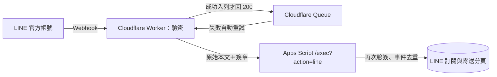

# LINE Webhook：Cloudflare 免費版部署

> **2026/09/29 更新：**本頁是初次架設轉送器的歷史步驟。現行公開 LINE 只展示每日總覽；本人明確輸入隱藏啟用指令時才另開盤中通知。已建好 Worker／Queues／Secret 者照 [v79 更新與驗收](../0929-line-market/部署與驗收.md) 更新即可；可另設 `LINE_CHANNEL_ACCESS_TOKEN` 讓等待動畫在事件入列後提早顯示。

本路徑用 **Workers Free + Queues Free** 取代原文件第 3 節的 Cloud Run／Cloud Tasks／Secret Manager。這不是在 Google Cloud Console 裡選「免費額度」；請離開那個畫面，不啟用新 GCP 服務。既有 Apps Script 網站、試算表、LINE Messaging API Channel 照常使用。



Cloudflare 官方目前列出 Workers Free **每天 100,000 次請求**、Queues Free **每天 10,000 次操作**。一個正常排入並處理的事件大約用掉寫入、讀取、刪除各一次；重試還會增加讀取。免費額度到頂後請求會受限，不能把「免費額度」誤認為無限服務。Queues Free 訊息最多保留 **24 小時**；若網站故障超過這段時間，須查看死信佇列並人工處理。LINE 的月訊息額度另計，與 Cloudflare 無關。請保持 Cloudflare 帳號在 **Free** 方案，不升級付費方案。[Workers 定價](https://developers.cloudflare.com/workers/platform/pricing/)、[Queues 定價](https://developers.cloudflare.com/queues/platform/pricing/)、[Queues 限制](https://developers.cloudflare.com/queues/platform/limits/)

## 你目前在 Google Cloud Console：下一步

1. **先不要**在左側選 Cloud Run、Cloud Tasks、Secret Manager，也不要在「API 和服務」啟用它們。這條免費方案用不到 Google Cloud 頁面；可以直接關掉分頁。既有 `zhangzhen-pipeline` 專案不必刪除。
2. 確認你已部署原網站的 v73 Apps Script，正式 `/exec?action=ping` 回 `2026-09-27-line-v73`，後台能看見 **LINE** 分頁。若尚未部署，先照[原部署文件第 0–2 節](部署與驗證.md)處理；Webhook URL 仍先留空。
3. 螢幕截圖曾露出 Channel secret；先在 LINE 後台更換密鑰，再把**新** Messaging API Channel secret 寫入 GAS 後台。舊 LINE Login Channel secret 不可拿來用。

## 一、開 Cloudflare Free 帳號並準備檔案

1. 打開 [Cloudflare Dashboard](https://dash.cloudflare.com/)，註冊或登入；選 **Free**，不要按升級。這個流程不需要把網站 DNS 搬到 Cloudflare，也不用購買網域。
2. 在電腦安裝 [Node.js LTS](https://nodejs.org/)。開 PowerShell，執行 `node --version`、`npm --version`，都應顯示版本。
3. 從 [GitHub 的 Stock 儲存庫](https://github.com/Lee200202/Stock) 按 **Code → Download ZIP** 並解壓；也可用 `git clone https://github.com/Lee200202/Stock.git`。進入 `Stock/line-webhook/`，確認有 `worker.mjs`、`wrangler.jsonc`、`static/richmenu-query.png`、`static/richmenu-notify.png`。`main.py`、`Dockerfile` 是另一條 Google Cloud 路徑，這次不用執行或刪除。
4. 在這個資料夾執行 `node ../tests/test_line_free_relay.mjs`。看到 `LINE free relay offline tests passed` 才繼續；測試不會碰真實 LINE。

## 二、建立兩個免費佇列並發布 Worker

以下指令一行一行在 **`Stock/line-webhook/`** 的 PowerShell 執行。`npx` 第一次可能詢問是否安裝 Wrangler，允許即可。授權視窗請登入剛才的 Cloudflare 帳號。

```powershell
npx wrangler login
npx wrangler whoami
npx wrangler queues create zhangzhen-line-events
npx wrangler queues create zhangzhen-line-dead
npx wrangler deploy
```

`deploy` 成功會顯示形如 `https://zhangzhen-line-relay.<你的子網域>.workers.dev` 的網址，記成 **Worker URL**。若佇列已存在，`queues create` 回「已存在」即可繼續；不要另建不同名字。`zhangzhen-line-dead` 用來保存多次轉送失敗的事件，無須把它當正式事件來源。若部署畫面要求改付費方案，**先停下**，不要接受升級。

把新密鑰與網站網址安全地存到 Worker：

```powershell
npx wrangler secret put LINE_CHANNEL_SECRET
npx wrangler secret put GAS_WEBAPP_URL
```

第一個提示出現時，貼 **Messaging API Channel 的新 Channel secret**；第二個貼正式網站的完整 `https://script.google.com/macros/s/.../exec`。貼入的內容可能不回顯；按 Enter 即可。**不得貼 `/dev`，不得把密鑰放在 `wrangler.jsonc`、GitHub、聊天或終端機命令參數裡。** Workers secrets 是隱藏值，建立後不會從介面讀回。[Cloudflare Secret 設定](https://developers.cloudflare.com/workers/configuration/secrets/)

在瀏覽器開下列三個網址（將 `<Worker URL>` 換成實際網址）：

| 網址 | 預期結果 |
|---|---|
| `<Worker URL>/healthz` | JSON 的 `ok:true`、`configured:true`、build 為 `2026-09-28-line-free-relay-v1` |
| `<Worker URL>/static/richmenu-query.png` | 看得到「查資料」圖文選單圖片 |
| `<Worker URL>/static/richmenu-notify.png` | 看得到「通知」圖文選單圖片 |

若 `configured:false`，先查兩個 secret 是否設好、是否在正確的 Cloudflare 帳號部署，**不要先開 LINE Webhook**。後續換密鑰時，重新執行 `npx wrangler secret put LINE_CHANNEL_SECRET`，並同步更新 GAS 後台「頻道密鑰」。

## 三、把網址填回網站後台與 LINE

1. 開正式網站，點管理入口並登入 → **LINE → 設定**。`存取權杖（長期）`、`頻道密鑰` 若已在前一步存過就留空；空白代表不變。`轉送服務網址` 貼 **Worker URL**，只到 `.workers.dev` 為止，**不加** `/callback`。`推送模式` 選 **關閉**，網站加入好友入口先不勾，按 **儲存設定**。欄位旁若舉 `a.run.app` 只是範例，`.workers.dev` 也符合現有檢查規則。
2. 後台下方「LINE Developers 的 Webhook URL」應自動顯示 `<Worker URL>/callback`；「轉送服務的 GAS_WEBAPP_URL」應是正式 `/exec`。這兩項有空白或 `/dev`，先修正。
3. 開 [LINE Developers Console](https://developers.line.biz/console/) → 正確的 Provider → **Messaging API Channel**（不要選 LINE Login）→ **Messaging API** 分頁 → `Webhook URL` 旁的 **Edit** → 貼 `<Worker URL>/callback` → **Update**。打開 **Use webhook**，建議同時開 **Webhook redelivery**，按 **Verify**。驗證成功只代表 LINE 能呼叫 Worker；還要做真實好友測試。[LINE Webhook 設定](https://developers.line.biz/en/docs/messaging-api/receiving-messages/)
4. 回網站後台 LINE 頁按 **重新整理**，確認設定與 Webhook 狀態；在 GAS 編輯器執行 `lineSetupCheck()`，應顯示權杖、密鑰、正式網址及 `everyFiveMinJob` 均已就緒。Cloudflare Dashboard → **Workers & Pages → zhangzhen-line-relay → Logs** 可查 Worker；**Queues → zhangzhen-line-events／zhangzhen-line-dead** 可查積壓或死信。

## 四、先測試，最後才啟用正式推送

1. 在網站後台 LINE 分頁按 **驗證卡片格式**，再按 **建立圖文選單**。若後者說讀不到圖片，先重查兩個 `/static/...png` 網址。
2. 用手機加入官方帳號好友；應收到歡迎卡，但**不會自動訂閱**。後台按 **產生綁定碼**，把 `綁定 六位數` 傳給 LINE 官方帳號；後台應顯示測試帳號。
3. 後台改 **只送測試帳號**、儲存。用 LINE 開啟每日總覽、盤中即時通知兩個獨立開關。後台按「送一則每日總覽測試」與「送一則盤中通知測試」，手機實際核對收到的訊息；測試推送會計入 LINE 月額度。查網站後台的 **LINE 待送訊息／寄送帳本**，以及 Cloudflare 的 queue，確認沒有持續失敗。
4. 以上全部通過後才把模式改 **正式推送**，並勾選網站顯示加入好友。若要暫停群發，改回 **關閉**；訂閱查詢與 Webhook 仍可使用。

**要留意的免費版界線：** Workers／Queues 超額或隊列保留 24 小時到期時，通知可能延遲或漏掉；死信佇列不會自動改寫網站資料。網站與 LINE 的去重仍有效，切勿手動重送同一事件來「試看看」。若需要超過 24 小時的保留或付費級可用性，應改用原 Google Cloud 路徑並設定帳務監控。原 Cloud Run 服務若曾啟用，切到 Cloudflare 後先確認 LINE Webhook 已改指新網址，再評估停用舊服務，避免兩邊同時處理同一事件。
