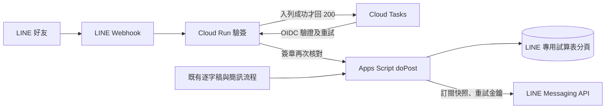

# LINE 訂閱與對話：部署與驗證（v73）

本版新增 LINE 訂閱與資料查詢，Email 訂閱、每日整理、會員持股、會員簡訊原有流程仍在。LINE 的訂閱清單、待送訊息與寄送帳本各自獨立。**GitHub 程式更新不會自動部署 Apps Script、Cloud Run，也不會替你建立 LINE 官方帳號。**正式推送預設關閉，完成下列驗證後才開啟。



## 0. 先備份並確認檔案

1. 匯出目前正式 Apps Script 專案作備份。不要新建另一個 GAS 專案；新專案不會有原來的 Script Properties、觸發器及試算表連結。
2. GitHub 的 `release/zhangzhen-full-v73.zip` 是**完整 GAS 檔案快照**，包含全部 `.gs` 與 `.html`。將 ZIP 與目前編輯器逐檔比對後，再把 ZIP 內檔案貼到原專案；新建 `Line.gs`。`line-webhook/` 是 Cloud Run 服務，不能貼進 GAS。根目錄的 `pipeline.py` 已移除，不要重建。
3. GitHub checkout 平常不含 `apps-script/` 目錄；先將 `release/zhangzhen-full-v73.zip` 解壓到 checkout 下的 `apps-script/`（不要多一層資料夾），再執行 `node tests/test_line_v73_gas.js` 與 `python -m unittest discover -s tests -p test_line_webhook.py -q`。這些是離線測試，不會送真實 LINE 訊息。

## 1. 先部署 Apps Script，推送保持關閉

1. 將 ZIP 中所有檔案更新至**原有** Apps Script 專案並儲存。特別確認 `Line.gs`、`Code.gs`、`Config.gs`、`Setup.gs`、`Cmoney.gs`、`Admin.html`、`Index.html`、`JavaScript.html` 已更新；其餘檔案若與編輯器一致可不重貼。保留原 `SPREADSHEET_ID` 與其他 Script Properties。
2. 執行 `checkProjectFiles()`，須通過並顯示 build `2026-09-27-line-v73`。若缺檔或版本不合，先補齊；不可略過。
3. **不要執行 `setupSpreadsheet()`**：既有 `SPREADSHEET_ID` 時它只返回原 ID，並不負責重新建立整套資料。LINE 的四張新分頁由 `getSheet_()` 首次存取時依 `SHEET_SCHEMA` 補建。先開後台 LINE 頁按「重新整理」，確認可讀狀態與分頁。
4. 執行 `ensureAutomationTick()`，只在缺少 `everyFiveMinJob` 時補一支，不會重裝全部觸發器。`lineSetupCheck()` 應列出五分鐘觸發器狀態。不要為 LINE 再建第二支獨立五分鐘觸發器。
5. 在「部署 → 管理部署作業」編輯原正式網頁應用程式，選**新增版本**並發布；保持原 `/exec` 網址。開 `正式網址?action=ping`，確認 build 為 `2026-09-27-line-v73`。如果網址改過，先在編輯器執行 `setWebAppUrl()`，確認指向新的正式 `/exec`；絕不能用 `/dev`。
6. 後台 LINE 分頁先保持「關閉」，網站加入好友入口也保持關閉。填 LINE Channel access token、Channel secret；權杖儲存時會呼叫 `/v2/bot/info` 取得 bot ID。兩者只寫入 Script Properties，後台不回傳原值。設定加入好友網址與 QR 網址可晚一點做。

## 2. 建立 LINE 官方帳號與 Channel：先拿到兩把憑證

先分清三個畫面：**LINE Official Account Manager** 管官方帳號；**LINE Developers Console** 管 Channel、Webhook 和權杖；網站的**管理後台 → LINE** 只儲存這些設定。這一步不需要上傳任何 GitHub 檔案，也不要把憑證貼到 GitHub、Cloud Shell 指令或對話。

1. 開 [LINE Official Account Manager](https://manager.line.biz/)，登入後選擇要使用的官方帳號；若還沒有，先在該站建立一個。進入帳號的「設定 → Messaging API」，按啟用／使用 Messaging API。若要求選 **Provider**，選你要長期管理此帳號的 Provider；選定後無法隨意改派。此操作才會建立對應的 Messaging API Channel，不能只去 Developers Console 建一個不相連的 Channel。[LINE 官方啟用說明](https://developers.line.biz/en/docs/messaging-api/getting-started/)
2. 開 [LINE Developers Console](https://developers.line.biz/console/)，用同一個 LINE 身分登入。點剛才選的 Provider，再點該官方帳號的 **Messaging API Channel**。在「Basic settings／基本設定」複製 **Channel secret**；在「Messaging API」頁找到 **Channel access token (long-lived)／長期存取權杖**，若尚未發行則按 **Issue／發行**，複製 token。長期權杖重發會使舊權杖失效，因此平常不要為了看一次而反覆重發。[權杖類型與重發規則](https://developers.line.biz/en/docs/basics/channel-access-token/)
3. 回到**你的正式網站 → 後台登入 → LINE 分頁 → 設定**，在「存取權杖（長期）」貼 token、「頻道密鑰」貼 Channel secret；「推送模式」保持**關閉**，「網站『訂閱通知』頁顯示加入 LINE 好友」先**不勾**，按 **儲存設定**。畫面應顯示「已用新權杖查到 LINE 帳號」。欄位隨即清空是正常的：金鑰只寫不讀；上方狀態卡要顯示「已設定」。`lineSetupCheck()` 也應看得到 bot ID。
4. 回 LINE Developers 的 Messaging API 頁，**Webhook URL 暫時留空**，不要填 Apps Script `/exec`。先完成第 3 節的 Cloud Run 服務，稍後才回來填 `<Cloud Run URL>/callback`。
5. 在 LINE Official Account Manager 關閉內建的「加入好友歡迎訊息／Greeting messages」及「自動回應／Auto-reply messages」，避免 Bot 自己送的歡迎卡與查詢回覆重複。若介面名稱不同，可在 Developers 的 Messaging API 頁這兩項旁按 **Edit／編輯** 跳回對應設定。[LINE Bot 回應設定](https://developers.line.biz/en/docs/messaging-api/building-bot/)

## 3. Google Cloud：只部署 `line-webhook/`，不是整個網站

開始前準備三個值，寫在自己的安全筆記中：`PROJECT_ID`（Google Cloud 專案 ID）、`GAS_URL`（正式 Apps Script `/exec` 網址）、`REGION`（下例用 `asia-east1`）。下方 `<...>` 都是要替換的佔位符。Cloud Run、Cloud Tasks 和 Secret Manager 可能產生費用，先在 Google Cloud 帳務頁確認預算與通知。

### 3-1. 在 Google Cloud Console 建 queue、身分與密鑰

1. 開 [Google Cloud Console](https://console.cloud.google.com/)，在最上方專案選擇器選定 `PROJECT_ID`。到「API 和服務 → 程式庫」，搜尋並**啟用** Cloud Run、Cloud Build、Artifact Registry、Cloud Tasks、Secret Manager。缺哪項才啟用哪項。
2. 到「Cloud Tasks → Queues／佇列」，按 **Create queue／建立佇列**，名稱填 `line-webhook`、區域選 `asia-east1`、類型選 HTTP（如有此選項），建立後應顯示執行中。建議在設定中把最大並行派送設為約 3、每秒派送約 1 次、失敗續試時間設至 24 小時；讓 Apps Script 不會同時收到大量事件。佇列僅保存事件，不會自己產生通知。[Cloud Tasks queue 設定](https://cloud.google.com/tasks/docs/creating-queues)
3. 到「IAM 與管理 → 服務帳號」，按 **建立服務帳號** 兩次，分別建立 `line-relay-runtime` 和 `line-task-invoker`。記下兩個 email，格式分別是 `line-relay-runtime@PROJECT_ID.iam.gserviceaccount.com` 和 `line-task-invoker@PROJECT_ID.iam.gserviceaccount.com`。不需下載 JSON key。[建立服務帳號](https://cloud.google.com/iam/docs/service-accounts-create)
4. 到「IAM 與管理 → IAM → 授予存取權」，Principal 填 runtime email，角色選 **Cloud Tasks Enqueuer／Cloud Tasks 佇列工作建立者**，儲存。再到「IAM 與管理 → 服務帳號 → line-task-invoker → 權限 → 授予存取權」，Principal 仍填 runtime email，角色選 **Service Account User／服務帳號使用者**。這讓轉送器能替 task 指定 OIDC 身分。若專案先前未啟用過 Cloud Tasks，服務代理身分的權限可能需要等幾分鐘生效；不必先下載服務帳號金鑰。[Cloud Tasks OIDC 說明](https://cloud.google.com/tasks/docs/creating-http-target-tasks)
5. 到「Security／安全性 → Secret Manager」，按 **Create secret／建立密鑰**。Name 填 `line-channel-secret`，Secret value 貼第 2 節的 **Channel secret**，建立第 1 版。點進密鑰的「權限 → 授予存取權」，Principal 填 runtime email，角色選 **Secret Manager Secret Accessor**，儲存。這裡放的是 Channel secret，**不是** Channel access token。[Secret Manager 建立說明](https://cloud.google.com/secret-manager/docs/creating-and-accessing-secrets)

### 3-2. 用 Cloud Shell 從指定資料夾部署

GitHub 的 [`line-webhook/`](https://github.com/Lee200202/Stock/tree/main/line-webhook) 才是 Cloud Run 原始碼；其中 `Dockerfile`、`main.py`、`requirements.txt`、`static/richmenu-query.png`、`static/richmenu-notify.png` 要在**同一個資料夾樹**。`release/zhangzhen-full-v73.zip` 只給 Apps Script，不拿來部署 Cloud Run。

1. 在 Google Cloud Console 右上方按 **Activate Cloud Shell／啟用 Cloud Shell**（終端機圖示）。若 GitHub clone 需要登入，先在 GitHub [儲存庫](https://github.com/Lee200202/Stock) 按 **Code → Download ZIP**，再用 Cloud Shell 上方 **More／⋮ → Upload** 上傳 ZIP，執行 `unzip Stock-main.zip`。若可直接 clone，則在 Cloud Shell 執行 `git clone https://github.com/Lee200202/Stock.git`。兩種方式擇一。
2. 在 Cloud Shell `cd Stock/line-webhook`；若使用 ZIP 則 `cd Stock-main/line-webhook`。執行 `ls`，必須看見 `Dockerfile`、`main.py`、`requirements.txt`、`static`。**不要在儲存庫根目錄執行部署命令**，否則 Dockerfile 不在來源目錄。
3. 先設定不含密鑰的值，再執行下列命令。把第一行的 `<你的 GCP 專案 ID>`、第三行的 `<正式 GAS /exec URL>` 換成實值；整段不含 Channel secret：

   ```bash
   PROJECT_ID='<你的 GCP 專案 ID>'
   REGION='asia-east1'
   GAS_URL='<正式 GAS /exec URL>'
   RUNTIME_SA="line-relay-runtime@${PROJECT_ID}.iam.gserviceaccount.com"
   TASK_SA="line-task-invoker@${PROJECT_ID}.iam.gserviceaccount.com"
   gcloud config set project "$PROJECT_ID"
   gcloud run deploy line-webhook --source . --region "$REGION" \
     --service-account "$RUNTIME_SA" --allow-unauthenticated \
     --set-secrets 'LINE_CHANNEL_SECRET=line-channel-secret:1' \
     --set-env-vars "GAS_WEBAPP_URL=$GAS_URL,LINE_TASKS_PROJECT=$PROJECT_ID,LINE_TASKS_LOCATION=$REGION,LINE_TASKS_QUEUE=line-webhook,LINE_TASK_SERVICE_ACCOUNT=$TASK_SA"
   ```

   `--source .` 會用這個資料夾的 Dockerfile 建置；第一次可能提示授權 Cloud Build 或建立 Artifact Registry，依畫面完成。[Cloud Run 來源部署](https://cloud.google.com/run/docs/deploying-source-code)
4. 部署成功後在輸出或「Cloud Run → line-webhook」複製 **Service URL**，再於同一個 Cloud Shell 執行：

   ```bash
   RELAY_URL="$(gcloud run services describe line-webhook --region "$REGION" --format='value(status.url)')"
   echo "$RELAY_URL"
   gcloud run services update line-webhook --region "$REGION" \
     --update-env-vars "LINE_RELAY_URL=$RELAY_URL"
   ```

   服務 URL 不加 `/callback`，也不加 `/exec`。這是部署後需要的**第二次修訂**，因為服務要先建立才知道自己的 URL。
5. 在瀏覽器開 `<Service URL>/healthz`，須看到 `"ok":true`、`"configured":true`、build `2026-09-27-line-v73`。再開 `<Service URL>/static/richmenu-query.png` 與 `/static/richmenu-notify.png`，都應顯示圖片。若 `configured:false`，回「Cloud Run → line-webhook → 編輯並部署新修訂版本 → 變數與密鑰」核對第 3、4 步的七個設定，先不要啟用 LINE Webhook。

Cloud Run 必須允許公開 HTTP 進入 `/callback`，因 LINE 平台沒有你的 GCP 身分。`/tasks/forward` 雖同在公開服務，程式會另外檢查 Cloud Tasks 送來的 Google OIDC token、service account email 與 LINE 簽章。不要把 `line-task-invoker` 的金鑰提供給外部。

## 4. 把 Cloud Run 接回 LINE，再用測試帳號驗收

1. 回**正式網站 → 管理後台 → LINE → 設定**。「轉送服務網址」貼 `<Service URL>`（不含 `/callback`），推送模式仍選**關閉**、網站顯示加入好友仍不勾，按 **儲存設定**。下方「LINE Developers 的 Webhook URL」應顯示 `<Service URL>/callback`；「轉送服務的 GAS_WEBAPP_URL」應顯示正式 GAS `/exec`。若這裡是 `/dev` 或空白，先回 GAS 編輯器修正 `WEBAPP_URL`／執行 `setWebAppUrl()`，不要繼續。
2. 回 [LINE Developers Console](https://developers.line.biz/console/) → Provider → 該 Messaging API Channel → **Messaging API**。在「Webhook URL」按 **Edit／編輯**，貼 `<Service URL>/callback`，按 **Update／更新**；開啟 **Use webhook／使用 Webhook** 與 **Webhook redelivery／Webhook 重送**，再按 **Verify／驗證**。驗證成功代表 LINE 能碰到轉送器；不代表已驗證 GAS、訂閱或推送。[LINE Webhook 設定與重送](https://developers.line.biz/en/docs/messaging-api/receiving-messages/)
3. 在 GAS 編輯器的函式選單選 `lineSetupCheck()` → **執行**，看「執行紀錄」：權杖／密鑰已設定、bot ID 已取得、正式 `/exec` 與轉送服務 URL 正確、`everyFiveMinJob` 存在。接著選 `lineValidateTemplates()` → 執行，所有卡片與兩頁選單要顯示 ✓；這不會送訊息。也可以在管理後台 LINE 頁按 **驗證卡片格式**看同樣結果。
4. 在管理後台 LINE 頁按 **建立圖文選單**，確認後等畫面回報完成。這個按鈕會建立新選單與圖片、切換別名和預設，成功後才清理舊選單；圖片來源就是 Cloud Run 的 `static/`。手機 LINE 可看圖文選單，電腦版請輸入文字「查詢」或「管理訂閱」。
5. 用自己的手機 LINE 加該官方帳號為好友。應收到一張**歡迎卡，但不會自動訂閱**。在管理後台按 **產生綁定碼**，畫面會顯示六位數；十分鐘內在 LINE 聊天室傳 `綁定 123456`（換成畫面上的數字）。後台「好友與訂閱」卡應顯示一位測試帳號。
6. 後台「設定 → 推送模式」選 **只送測試帳號**，按 **儲存設定**。在 LINE 依序開啟「每日總覽」「盤中即時通知」，再關閉其中一項，確認另一項仍開著。按後台 **送一則每日總覽測試**、**送一則盤中通知測試**；後台應回報 `LINE 已接受`，手機須實際收到。測試推送會占月訊息額度；若當前資料庫沒有文章或簡訊，按鈕會說明沒有可測的樣本，先不要憑空建資料。
7. 在後台「推送紀錄」輸入日期或文章 ID，按 **查詢**，對照「LINE 待送訊息」「LINE 寄送帳本」分頁。再看 Google Cloud Console「Cloud Tasks → line-webhook → 工作／Logs」是否無持續堆積或失敗；Cloud Run 的「Logs」應有轉送紀錄，後台 Webhook 卡應有最後收到時間。LINE 已接受只表示平台收下，不代表用戶已讀。
8. 測試通過後，後台「設定 → 推送模式」改 **正式推送**並儲存；再勾 **網站『訂閱通知』頁顯示加入 LINE 好友**、儲存。若要先暫停群發，把模式改回**關閉**；Webhook、查詢與取消訂閱仍可運作。不要為 LINE 新建另一支五分鐘觸發器。

正式情境仍須觀察：有影片且文章與品質關卡完成才排每日；無影片但有會員簡訊只排盤中；休市日會員簡訊仍可寄；LINE 的兩個開關與 Email 訂閱各自獨立。LINE 回應與通知期限、卡片格式以本版程式及後台帳本為準。

## 5. 判讀與故障排查

| 現象 | 先查哪裡 | 處理 |
|---|---|---|
| LINE Verify 失敗 | Cloud Run `/healthz`、Webhook URL 是否 `/callback`、Channel secret | `configured:false` 先補 env；401 是簽章不合；503 是 queue 未入列，LINE redelivery 接手 |
| 加好友無回覆 | Cloud Tasks queue、Cloud Run `/tasks/forward` 日誌、LINE 事件帳本 | 若 queue 正在重試，先解 GAS `/exec` 或權限；不要重建帳號 |
| 查詢回應遲到 | queue 等待時間、GAS 執行時間 | Reply token 會過期；使用者重送查詢，後台核對事件結果 |
| 每日不送 | `lineTodayState_()` 的有影片／文章／品質關卡結果、推送模式、訂閱狀態 | 無影片本來不寄；文章未就緒先等，不能繞過品質關卡 |
| 盤中不送 | `cmNotifyNew_`、`LINE 待送訊息`、60 分鐘期限、月額度 | 先核對來源文章 ID；逾時只標示，不補送過期通知 |
| 額度不足 | 後台 LINE 額度與帳本 | 保持待送／如實顯示，不換用 Email 名單，也不重複推送 |

LINE 回 200／409 只代表平台**接受**請求，不等於使用者已閱讀。推送計入 LINE 帳號月用量，Reply 不計入；實際方案與額度以 LINE Developers 當下資料為準。本版未在本文建立雲端資源或送真實模型，部署須由有 GCP、LINE Developers、GAS 權限的人按上述順序執行。

參考：[LINE Webhook 與重送](https://developers.line.biz/en/docs/messaging-api/receiving-messages/)、[LINE Rich menu API](https://developers.line.biz/en/reference/messaging-api/#rich-menu)、[Cloud Tasks 呼叫 Cloud Run](https://cloud.google.com/tasks/docs/creating-http-target-tasks)。
