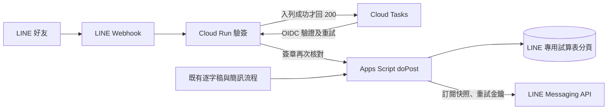

# LINE 訂閱與對話：部署與驗證（v73）

本版新增 LINE 訂閱與資料查詢，Email 訂閱、每日整理、會員持股、會員簡訊原有流程仍在。LINE 的訂閱清單、待送訊息與寄送帳本各自獨立。**GitHub 程式更新不會自動部署 Apps Script、Cloud Run，也不會替你建立 LINE 官方帳號。**正式推送預設關閉，完成下列驗證後才開啟。

## 0. 先備份並確認檔案

1. 匯出目前正式 Apps Script 專案作備份。不要新建另一個 GAS 專案；新專案不會有原來的 Script Properties、觸發器及試算表連結。
2. GitHub 的 `release/zhangzhen-full-v73.zip` 是**完整 GAS 檔案快照**，包含全部 `.gs` 與 `.html`。將 ZIP 與目前編輯器逐檔比對後，再把 ZIP 內檔案貼到原專案；新建 `Line.gs`。`line-webhook/` 是 Cloud Run 服務，不能貼進 GAS。根目錄的 `pipeline.py` 已移除，不要重建。
3. GitHub checkout 平常不含 `apps-script/` 目錄；先將 `release/zhangzhen-full-v73.zip` 解壓到 checkout 下的 `apps-script/`（不要多一層資料夾），再執行 `node tests/test_line_v73_gas.js` 與 `python -m unittest discover -s tests -p test_line_webhook.py -q`。這些是離線測試，不會送真實 LINE 訊息。

## 1. 先部署 Apps Script，推送保持關閉

1. 將 ZIP 中所有檔案更新至**原有** Apps Script 專案並儲存。特別確認 `Line.gs`、`Code.gs`、`Config.gs`、`Setup.gs`、`Cmoney.gs`、`Admin.html`、`Index.html`、`JavaScript.html` 已更新；其餘檔案若與編輯器一致可不重貼。保留原 `SPREADSHEET_ID` 與其他 Script Properties。
2. 執行 `checkProjectFiles()`，須通過並顯示 build `2026-09-27-line-v73`。若缺檔或版本不合，先補齊；不可略過。
3. **不要執行 `setupSpreadsheet()`**：既有 `SPREADSHEET_ID` 時它只返回原 ID，並不負責重新建立整套資料。LINE 的四張新分頁由 `getSheet_()` 首次存取時依 `SHEET_SCHEMA` 補建。先開後台 LINE 頁按「重新整理」，確認可讀狀態與分頁。
4. 執行 `ensureAutomationTick()`，只在缺少 `everyFiveMinJob` 時補一支，不會重裝全部觸發器。`lineSetupCheck()` 應列出五分鐘觸發器狀態。不要為 LINE 再建第二支獨立五分鐘觸發器。
5. 在「部署 → 管理部署作業」編輯原正式網頁應用程式，選**新增版本**並發布；保持原 `/exec` 網址。開 `正式網址?action=ping`，確認 build 為 `2026-09-27-line-v73`。如果網址改過，先在編輯器執行 `setWebAppUrl()`，確認指向新的正式 `/exec`；絕不能用 `/dev`。
6. 後台 LINE 分頁先保持「關閉」，網站加入好友入口也保持關閉。填 LINE Channel access token、Channel secret；權杖儲存時會呼叫 `/v2/bot/info` 取得 bot ID。兩者只寫入 Script Properties，後台不回傳原值。設定加入好友網址與 QR 網址可晚一點做。

## 2. 建立 LINE 官方帳號與 Messaging API Channel

1. 在 LINE Official Account Manager 建立或選用官方帳號，在 LINE Developers 為該帳號啟用 Messaging API。記錄 Channel secret、可用的 Channel access token、Basic ID、加入好友網址。
2. 在 Messaging API 設定中啟用 Webhook 與 Webhook redelivery；Webhook URL **暫不要填 GAS `/exec`**。若官方帳號管理介面已有自動歡迎訊息，關閉或改成不與 Bot 的歡迎卡重複。
3. 將 Channel access token 與 Channel secret 填入上一節的 GAS 後台 LINE 設定。Cloud Run 稍後也要設定**同一把** Channel secret。

## 3. 建立 Cloud Tasks 與 Cloud Run 轉送服務

以下用 Google Cloud Console 操作；`<...>` 是自己的專案值，不可照字面貼入。

1. 在自己的 GCP 專案啟用 Cloud Run、Cloud Build、Artifact Registry、Cloud Tasks、Secret Manager API。選一個固定區域，例如 `asia-east1`，Cloud Run 與 Cloud Tasks queue 用同區。
2. 建一個 Cloud Tasks queue，名稱例如 `line-webhook`；建議最大重試時間至少 24 小時、指數退避，並設合理派送速率，避免 Apps Script 同時收到大量事件。對話 Reply token 有時效，佇列延遲太久時使用者可能需重問；訂閱事件仍會重試。
3. 建兩個服務帳號：`line-relay-runtime`（Cloud Run 執行身分）與 `line-task-invoker`（Cloud Tasks 產生 OIDC token）。授予 runtime 帳號該 queue 的 **Cloud Tasks Enqueuer**，並允許它對 invoker 帳號使用 **Service Account User**。依 Cloud Tasks 的 OIDC 設定確認 Cloud Tasks service agent 可替 invoker 產生 token。這些權限只給指定帳號與 queue，不用專案擁有者權限。
4. Secret Manager 建 `line-channel-secret`，內容為該 Channel secret；授予 runtime 帳號 Secret Manager Secret Accessor。不要把密鑰寫進 GitHub、映像檔或日誌。
5. 以 GitHub 本版的 `line-webhook/` 目錄（內含 Dockerfile、main.py、requirements.txt、static 圖片）部署 Cloud Run 服務，名稱例如 `line-webhook`；runtime 身分選 `line-relay-runtime`。服務需允許未經 Google 身分驗證的 HTTP 請求，因 LINE 平台要直接呼叫 `/callback`；`/tasks/forward` 在程式內另以 Google OIDC 與專屬服務帳號核對。
6. Cloud Run 設定：Secret env `LINE_CHANNEL_SECRET` 指到 Secret Manager；一般 env `GAS_WEBAPP_URL=<正式 /exec>`、`LINE_TASKS_PROJECT=<GCP project ID>`、`LINE_TASKS_LOCATION=<queue 區域>`、`LINE_TASKS_QUEUE=<queue 名稱>`、`LINE_TASK_SERVICE_ACCOUNT=<invoker 服務帳號 email>`。第一次部署取得 Cloud Run URL 後，再設定 `LINE_RELAY_URL=<Cloud Run URL>` 並部署新修訂版。URL 不帶 `/callback` 或結尾斜線。
7. 開 `<Cloud Run URL>/healthz`，應見 `ok:true`、build `2026-09-27-line-v73`、`configured:true`。再開兩張 `/static/richmenu-query.png`、`/static/richmenu-notify.png`，確認是圖片。若 `configured:false`，先核對 env、Secret 與 queue，不要先啟用 LINE Webhook。
8. GAS 後台 LINE 設定填「轉送服務網址」為 `<Cloud Run URL>`。後台顯示的 Webhook URL 應是 `<Cloud Run URL>/callback`。到 LINE Developers 填此 URL，開啟 Webhook，按 Verify。空事件驗證應回 200；若失敗，看 Cloud Run request/log 與 Cloud Tasks queue 指標。

## 4. 測試、圖文選單與正式開啟

1. 在 GAS 編輯器執行 `lineSetupCheck()`：應有權杖、密鑰、bot ID、正式 GAS `/exec`、Cloud Run URL、五分鐘觸發器。若尚無 bot ID，到後台重新儲存 token。
2. 執行 `lineValidateTemplates()` 或按後台「驗證卡片」；所有 Flex 卡與兩頁圖文選單都須通過 LINE 驗證。此步不推送訊息。
3. 執行 `lineSetupRichMenus()` 或後台「建立圖文選單」。先建新選單、上傳圖片、切換別名與預設，成功後才清理舊選單。手機版可見圖文選單；電腦版用文字指令「查詢」「管理訂閱」。
4. 後台「產生綁定碼」，用自己的 LINE 帳號傳「綁定 123456」；把推送模式改成「只送測試帳號」。測試歡迎卡、每日總覽、盤中通知、訂閱兩項獨立開關、取消其中一項不影響另一項。後台測試推送**會計入**月訊息量。
5. 看 LINE 事件帳本、待送訊息、寄送帳本：重送同一事件不得再次套用；已被 LINE 接受的收件者不得再送。查 Cloud Tasks 無持續堆積與失敗，GAS 後台能看到最近 Webhook 時間。做一次臨時 503／GAS 暫停測試，恢復後 queue 要續送；正式通知須先以測試帳號驗證。
6. 驗收情境：有影片且文章完成才有每日 LINE 通知；無影片但有會員簡訊只寄盤中通知；休市日仍可寄會員簡訊；每日與盤中兩個訂閱開關互不覆寫；Email 訂閱狀態不受 LINE 改動。查個股、持股、市場資料都應標示日期與來源，舊資料不能稱即時。
7. 通過後把模式切成「正式推送」，再打開網站的「加入 LINE 好友」入口。使用者加好友先收到歡迎訊息，**不會自動訂閱**；自行選每日、盤中或兩者，才收到確認卡與後續推送。若要停用，先把模式切回「關閉」，Webhook 可以保留以處理查詢與取消訂閱。

## 5. 判讀與故障排查

| 現象 | 先查哪裡 | 處理 |
|---|---|---|
| LINE Verify 失敗 | Cloud Run `/healthz`、Webhook URL 是否 `/callback`、Channel secret | `configured:false` 先補 env；401 是簽章不合；503 是 queue 未入列，LINE redelivery 接手 |
| 加好友無回覆 | Cloud Tasks queue、Cloud Run `/tasks/forward` 日誌、LINE 事件帳本 | 若 queue 正在重試，先解 GAS `/exec` 或權限；不要重建帳號 |
| 查詢回應遲到 | queue 等待時間、GAS 執行時間 | Reply token 會過期；使用者重送查詢，後台核對事件結果 |
| 每日不送 | `lineTodayState_()` 的有影片／文章／品質關卡結果、推送模式、訂閱狀態 | 無影片本來不寄；文章未就緒先等，不能繞過品質關卡 |
| 盤中不送 | `cmNotifyNew_`、`LINE 待送訊息`、60 分鐘期限、月額度 | 先核對來源文章 ID；逾時只標示，不補送過期通知 |
| 額度不足 | 後台 LINE 額度與帳本 | 保持待送／如實顯示，不換用 Email 名單，也不重複推送 |

LINE 回 200／409 只代表平台**接受**請求，不等於使用者已閱讀。推送計入 LINE 帳號月用量，Reply 不計入；實際方案與額度以 LINE Developers 當下資料為準。本版未在本文建立雲端資源或送真實模型，部署須由有 GCP、LINE Developers、GAS 權限的人按上述順序執行。

參考：[LINE Webhook 與重送](https://developers.line.biz/en/docs/messaging-api/receiving-messages/)、[LINE Rich menu API](https://developers.line.biz/en/reference/messaging-api/#rich-menu)、[Cloud Tasks 呼叫 Cloud Run](https://cloud.google.com/tasks/docs/creating-http-target-tasks)。
