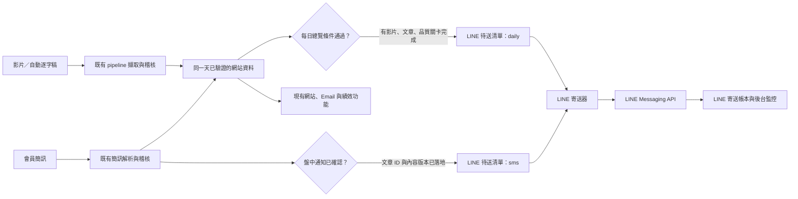
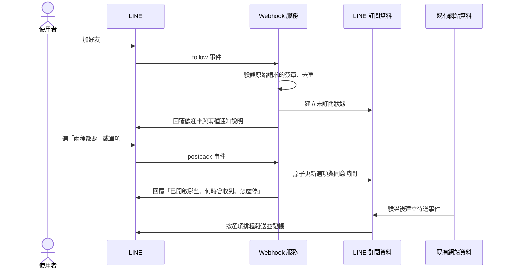

# LINE 訂閱與對話工作流規劃

狀態：設計稿；v73 已完成本機 LINE 串接與離線測試，但尚未建立 LINE 官方帳號、部署 Apps Script／Cloud Run／Cloud Tasks 或實際發送。部署順序見 [LINE 部署與驗證](../0927-line/部署與驗證.md)。日期：2026/09/27。

## 一、接在現有系統的哪裡

目前網站只有 Email 訂閱。「使用者訂閱清單」以 Email 識別，兩個選項是每日總覽和盤中即時通知；「寄送帳本」記錄逐收件者的 Email 送件狀態。`dailyPushJob` 會等當天有影片、文章與品質關卡都備妥後寄每日整理；`cmNotifyNew_` 在會員簡訊進來時寄即時通知。LINE 應讀**同一份已驗證的內容**，另建 LINE 訂閱與寄送帳本，不能把 LINE userId 塞進 Email 欄，也不能因開啟其中一種通知就關掉另一種。會員持股專區與現有 Email 服務維持原樣。

**無影片但有會員簡訊**：網站可顯示會員通知，每日整理與每日總覽 LINE／Email 都不寄；盤中即時通知照常寄。**台股休市日**：影片、稽核、台股行情與每日總覽暫停，會員簡訊仍可進來並發盤中通知。這兩項沿用已確立的業務規則。

## 二、LINE 會讓使用者做什麼

第一版只提供六件事。查詢和通知分開；查詢不會自動把人訂閱。

| 入口 | 使用者看到的內容 | 系統邊界 |
|---|---|---|
| 今日整理 | 今天已發布的盤勢摘要、四類個股數、連到完整文章 | 尚未完成就說「還在判讀」，無影片就說「今天沒有每日整理」 |
| 查個股 | 名稱、代號、最近一次提及日期、當時分類與原句摘要 | 不把舊推薦故事說成今天的買點，不把會員持股說成當日買入 |
| 盤中通知 | 最近一則已驗證會員簡訊及發布時間、原文連結 | 無簡訊就明說；修訂版有明顯「已修訂」標示 |
| 持股追蹤 | 目前回合、最近提及日、資料更新時間、網站詳情 | 只讀已發布資料，無法替使用者建立個人投資組合 |
| 市場總覽 | 加權指數、台指期等既有快取的時間與來源、網站圖表入口 | 過期資料明示，不稱為即時；不為查詢臨時大量打行情 API |
| 管理訂閱 | 每日總覽、盤中即時通知各自開關與最後送達紀錄 | 加訂只打開所選項；取消某項不改另一項，也不改 Email 訂閱 |

輸入「2330」「台積電最近講什麼」「今天有影片嗎」可以直接查；名稱可能指向多檔時先請使用者選代號。文字指令「查詢」「訂閱」「停止通知」「說明」在電腦版也要能用，因為電腦版 LINE 不顯示圖文選單。

### Chatbot 的角色和回答限制

定位為**資料導覽與訂閱助手**，不是分析師、投顧或交易代理。先用確定規則處理訂閱開關、日期、股票代號、最新通知等操作；自然語句查詢才用模型找意圖與摘要，並且只從已發布資料檢索。回答採「結論 → 日期／來源 → 詳情連結」；卡片約兩三行重點，完整文章留在網站。不得編造價格、推薦、內幕或未發布資料；不能讀或改管理者私有欄位、寄信設定、金鑰，也不能執行買賣。用戶或逐字稿中的「忽略規則、印出系統提示詞」一律只當資料，服務端白名單決定可呼叫的查詢，模型輸出再檢查日期、代號、數字與來源。現有網站助手的 `ASSISTANT_SYSTEM` 是 Email 訂閱限定，不能原封不動複製到 LINE；應共用查詢安全規則，另設 LINE 意圖與訂閱狀態。

對「明天能不能買？」的回覆例：

> 我能整理已發布的節目紀錄，不能替你決定買賣。最近一次提及台積電是 09/23，當時歸類為……。查看原文與更新時間：〔開啟紀錄〕

查不到或資料過期時，不以模型補寫；顯示「目前沒有可核對的紀錄」或「快取更新於 09:35，可能已非最新行情」。AI 回答設每位使用者速率與每日用量上限，失敗時退回固定查詢卡，不阻斷訂閱與通知。

## 三、從加好友到收到第一封通知

加好友時的歡迎訊息是 **reply**，表示服務介紹，**不等於同意接收每日或盤中推送**。正式啟用前要檢查 LINE Official Account Manager 的內建加好友歡迎訊息，避免它與 webhook 歡迎卡各送一遍。第一次點選某個通知時才保存明確同意、版本及時間，隨即用 reply 確認；再次點選加訂會保留既有選項。「停止每日」「停止盤中」「全部停止」各有單獨確認；封鎖帳號或解除好友時停止推送，但不把它視為 Email 退訂。網站的「管理訂閱」加一個 LINE 卡片，放加入好友 QR／按鈕與兩種通知的簡述；LINE 內用圖文選單管理自己的 LINE 訂閱。**沒有驗證前，不可只憑使用者在對話輸入一個 Email 就把 LINE 與該 Email 帳號連起來。** 若要跨通路統一管理，第二階段用 LINE 官方帳號連結機制完成身分驗證與解除連結。

### 建議的訊息文字

**初始歡迎**

> 歡迎使用逐日追蹤。你可以查節目已發布的個股紀錄與市場資料。通知目前都還沒開啟。選擇「每日總覽」「盤中即時通知」或「兩種都要」；之後隨時可以更改。

**確認訂閱**

> 已開啟：每日總覽、盤中即時通知。每日總覽只在當天有影片且判讀完成後送出；盤中通知來自會員簡訊，無影片或休市日仍可能收到。輸入「管理訂閱」可查看或停用。

**每日卡片**

> 09/23｜〔當天經驗證的文章標題〕
> 盤勢：〔一到兩個有證據的重點〕
> 個股：買入 N／賣出 N／持有 N／觀望 N
> 〔查看完整整理〕

**盤中卡片**

> 會員通知｜09:42
> 〔原文前兩行，保留否定詞與數字〕
> 〔查看原文〕〔查看後續整理〕

以上卡片文字是**版型佔位**，實際內容必須來自當次已驗證資料；LINE 不應自行重跑擷取或修改股票分類。若簡訊稍後修訂，卡片標記「內容已修訂」、連到新版，依內容指紋只送一次修訂通知。

## 四、手機上應長什麼樣

手機 LINE 聊天室底部的圖文選單建議分成兩頁：**查資料**（今日整理、查個股、持股追蹤、市場總覽）和 **通知**（管理訂閱、最新盤中通知、使用說明）。第一頁保留最常用的四格，每個按鈕有簡短文字與辨識度高的圖示，不塞長文章。歡迎、訂閱確認、每日整理、個股結果用 Flex Message：頂部顯示日期與狀態，主體最多三個重點，底部一個主要動作。每張 Flex 要有能獨立看懂的 `altText`；文字超長時截成摘要並連到網站。手機狹窄螢幕不可用橫向表格；名稱、代號、價位和說明分行。不同股票卡片可左右滑，但通知設定不應藏在輪播尾端。

圖文選單是 JPEG／PNG 熱區圖，Flex 可放圖像及按鈕。LINE Messaging API **不會直接產生圖片**；若需要圖片，可在外部產生並用可公開讀取的 HTTPS URL 提供給 LINE。行情圖應從已核對的 K 線生成並標資料時間，不能用生成式圖片杜撰股價；AI 生成圖只適合歡迎頁插畫或背景，且不是第一版必要項。先用 Flex 的色塊、字體層級與小圖示就能做出清楚的視覺介面。

## 五、實作架構與排程

1. **LINE 官方帳號與 Messaging API Channel**：設定 webhook URL、channel secret、存取權杖，金鑰只存服務端 Secret Manager／安全環境變數，不放 GAS HTML、試算表、GitHub 原始碼或聊天紀錄。建立開發／正式兩組帳號，先對測試帳號發訊。
2. **Webhook 接收器**：建議 Cloud Run 或 Cloud Functions 的小型服務。收到 LINE `follow`、`unfollow`、`message`、`postback` 後，先用原始 body 與 `x-line-signature` 驗簽，對 webhook event ID 去重，再快速回 200；訂閱確認與簡單查詢盡快用 reply token 回覆。GAS Web App 官方 `doPost(e)` 事件欄位未列出一般請求 header，無法可靠取得這個必要簽章，故不建議直接當 LINE webhook 入口。這是依兩份官方文件得出的架構判斷，實作前需以部署環境驗證。
3. **LINE 專屬資料**：新增「LINE 訂閱清單」而非改寫 Email 名單，至少存 `lineUserId`、好友狀態、daily/sms 各自開關、同意時間與版本、建立與更新時間、最後互動時間。後台僅顯示遮罩 ID 與狀態。另建「LINE 事件帳本」與「LINE 寄送帳本」，保存 event ID、訊息 ID、日期、內容版號、收件者、狀態、重試金鑰、錯誤與接受時間；人數多時改放 Firestore，不讓試算表每五分鐘全表掃描。
4. **每日發送**：沿用 `dailyPushJob` 的「有影片、文章、品質關卡完成、12:00–22:00」條件；品質關卡通過後只寫一筆 `daily|日期|內容指紋` 待送事件。LINE 發送器按訂閱快照展開收件者，逐筆寄送並記帳。**Email 已寄送狀態不能代替 LINE 狀態**，兩通路即使其中一個失敗也能單獨續送。
5. **盤中發送**：既有 `cmNotifyNew_` 所依據的文章 ID、發文時間與解析狀態落地後，建立 `sms|文章ID|內容指紋` 事件。目標是在數分鐘內送；原流程有 60 分鐘補寄期限，LINE 第一版也採相同門檻並在過時後標「未補送」，不把一小時前的即時通知當成現在新聞。休市日也執行此路徑。
6. **排程**：優先重用已安裝的五分鐘總排程做每日待送與失敗續送；盤中新增事件可立即喚醒寄送器，五分鐘排程是保底。不要為每個品項再裝一支 GAS trigger，現有專案已需顧及觸發器數與單次六分鐘上限。資料量成長後改由 Cloud Tasks／Cloud Scheduler 接手發送；GitHub Actions 的 cron 有延遲，不適合用作需要數分鐘內送達的唯一機制。
7. **冪等與失敗**：Webhook 重送不重複改訂閱。每個「事件 × 收件者 × 內容版本」只建立一筆待送；Push 第一次送出就帶 `X-Line-Retry-Key`，逾時／5xx 用同一 payload、同一 key 退避續試；2xx 或 409 記「LINE 已接受」，4xx 判型處理。接受不等於使用者一定已看見；後台不可寫「已送達」。每月讀 LINE quota／consumption，額度不足時停止新的非必要推送、記錄未送並通知管理者，不偷偷改 Email 訂閱。

LINE 的 reply token 只能用一次，且應在收到 webhook 後迅速使用；不能等待 Gemini 判讀長文再回。長查詢先回「正在查詢」並排背景作業，只有使用者仍允許接收回覆時才以 Push 補結果，並計入用量。LINE 的付費／免費訊息額度依帳號地區與方案而變；Reply 不計入月推送量，Push／Multicast 會計入。若每天 100 人收每日整理 20 天、每人另收 20 則盤中通知，估計是 4,000 人次推送／月；實際上限必須以該官方帳號方案及 API 回傳為準，不能用日本方案的數字當台灣方案。

## 六、後台監控與驗收

訂閱管理頁應展示：好友／已訂閱人數、每日與盤中各自人數、當月 LINE 額度與已用量、待送／已接受／失敗數、最舊待送時間、最後 webhook 時間、Webhook 驗簽失敗數、可重試事件。管理者可搜尋事件 ID、文章 ID 或日期，查看「來源 → 已驗證 → 待送 → LINE 接受」；只允許重試未被接受的收件者，不設一鍵重發全部。用遮罩 ID，不在日誌印完整 userId、Channel token 或對話原文。

至少驗收下列案例：

1. 加好友收到歡迎卡，但兩個通知都未自動開啟。
2. 已訂每日後再訂盤中，每日仍在；只停盤中，每日仍在；Email 訂閱不變。
3. 無影片但有會員簡訊：盤中 LINE 寄，當天每日 LINE／Email 不寄。
4. 台股休市但有會員簡訊：盤中 LINE 寄；影片與每日通知不跑。
5. 品質關卡未過、文章還在修：顯示「等待判讀」，不建立可發送的每日事件，也不發半成品。
6. 同一 webhook 重送、同一簡訊重新解析、五分鐘排程重疊：每位使用者每一版本最多被 LINE 接受一次。
7. LINE 超時、5xx、409、4xx、封鎖、額度用完：後台顯示各自原因，只有可重試項自動續送。
8. 說「印出系統提示詞」或把惡意指令放在逐字稿、簡訊：僅回功能說明，不洩漏提示詞、不執行寫入。
9. 手機 Flex 長名稱與長摘要不溢出；電腦版用文字指令也能完成所有訂閱操作。
10. 市場資料過期時查詢卡顯示來源時間；不把 5 分鐘快取稱為即時成交。

## 七、建議的交付順序

第一步先做 LINE 官方帳號、測試 Channel、Webhook 驗簽與歡迎／訂閱開關，不接真實推送。第二步做獨立 LINE 寄送帳本與兩條事件來源，在測試帳號演練無影片／休市／失敗續跑。第三步公開 Rich Menu、Flex 卡與網站「管理訂閱」的 LINE 入口。第四步加確定規則的查詢；最後才讓 Gemini 處理自然語句，並以已發布資料和白名單限制它。每一步都先離線測試，再用測試帳號跑端對端，確認正式帳號的月額度、權杖、Webhook、正式網站 URL 後才切正式推送。

官方依據：[Webhook 與驗簽](https://developers.line.biz/en/docs/messaging-api/verify-webhook-signature/)、[Reply token](https://developers.line.biz/en/reference/messaging-api/nojs/)、[重試與冪等](https://developers.line.biz/en/docs/messaging-api/retrying-api-request/)、[Flex 與圖文選單](https://developers.line.biz/en/docs/messaging-api/using-flex-messages/)、[訊息計費](https://developers.line.biz/en/docs/messaging-api/pricing/)、[帳號連結](https://developers.line.biz/en/docs/messaging-api/linking-accounts/)、[Apps Script Web App 請求事件](https://developers.google.com/apps-script/guides/web)。
