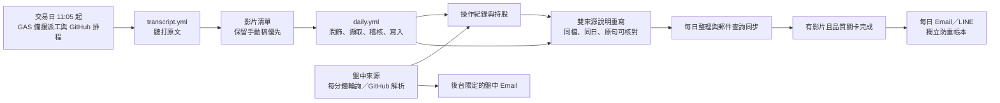

# v77：每日總覽與 LINE／郵件通知部署

本版的公開網站及 LINE 只提供「每日總覽」訂閱與查詢。盤中來源仍由後台收錄、稽核，可供當天文章與個股說明參考；盤中 Email 收件者只能由管理者在後台「會員簡訊」設定，且要先確認本人同意。隱藏入口本身**不等於**符合金融監管要求，內容與發送對象仍須由經營者核對。

## 先確認現在部署的是哪一版

開 [正式網站 ping](https://script.google.com/macros/s/AKfycbyLQjAd-CnQ6D6_JP3OY1WwXDkafCJthzeP3G4FDkT4t26PY9Gx1rhrXJjiHVZExQhoaw/exec?action=ping)。看到 `2026-09-28-daily-only-v77` 才代表 GAS 新版已上線。GitHub 推送和 Pages 發布**不會**自動更新 GAS 編輯器。2026/09/28 稽核時正式站仍是 `2026-09-28-pages-links-v76`，所以在您部署 GAS 前，新後台按鈕仍不能驗收。

## 部署順序

1. **GitHub 程式及 Pages**：本儲存庫的 `pipeline/pipeline.py` 是唯一 Python 正本；根目錄不要建立 `pipeline.py`。`public-site/gas-source/` 是完整 GAS 檔案副本，包含原動畫、表格、超連結及所有 HTML，沒有另造精簡頁。推送 `main` 後，至 GitHub → **Actions** 確認 `public-site-pages` 發布成功，再開 [Pages 網站](https://lee200202.github.io/Stock/) 確認頁面能載入。公開站此時可能仍呼叫 v76 GAS；兩端都部署完才測管理功能。
2. **更新 Pages API Worker**：在 PowerShell 進入儲存庫 `site-api/`，執行 `npx wrangler deploy`。Worker 名稱是 `zhangzhen-site-api`。既有 `GAS_WEBAPP_URL` 設定保持正式 `/exec`；不用重新貼 LINE token 或其他密鑰。部署後開 `https://zhangzhen-site-api.rainforecast2026-6fb.workers.dev/healthz`，檢查 `ok:true`、`ready:true`。這一步把新增的 LINE 測試工具、後台 Email 設定列入轉接允許清單；先前的 `method-not-allowed` 就是少了這些名稱。
3. **更新 LINE 圖文選單圖片服務**：若目前使用 Cloudflare 免費轉送器，在 `line-webhook/` 執行 `npx wrangler deploy`。這會更新 `/static/richmenu-notify.png`，第二頁改成每日整理，不再提供盤中訂閱。不要在這一步重新建立 Queues 或重貼 secret；沿用既有 `LINE_CHANNEL_SECRET` 與 `GAS_WEBAPP_URL`。開 `<既有 LINE Worker 網址>/healthz` 與 `/static/richmenu-notify.png` 確認。
4. **將完整 GAS 檔案貼回原專案**：從 GitHub `public-site/gas-source/` 下載與本 commit 一致的檔案，逐一覆蓋原 Apps Script 專案同名檔：`API.gs`、`Admin.html`、`Cmoney.gs`、`Config.gs`、`Index.html`、`JavaScript.html`、`Line.gs`、`MailService.gs`、`Setup.gs`、`SiteBridge.gs`、`Tech.html`。其他檔維持原樣；**不要**建立第二個 Apps Script 專案或用 ZIP 建新部署。存檔後在編輯器函式選單執行 `checkProjectFiles()`，結果必須全通過、版本為 v77。若尚未有五分鐘觸發器才執行 `ensureAutomationTick()`；不要跑會重裝所有觸發器的函式。
5. **更新既有 Web App 部署**：Apps Script 右上角 **部署 → 管理部署作業** → 選原本正式 Web App → 鉛筆 **編輯** → **版本：新增版本** → **部署**。執行身分仍是「我」、存取維持原本公開設定，網址必須仍是原 `/exec`。再開上方 ping，檢查 build v77 和 `daily-only-v77`、`line-intent-v77`、`sms-two-source-v77`。不要用 `/dev` 測一般訪客。
6. **LINE 後台測試**：正式網站進 **後台 → LINE**，按「驗證卡片格式」；它只向 LINE 驗證格式，不發訊息。再按「建立圖文選單」；確認手機 LINE 看到「今日整理」而不是盤中通知。按「產生綁定碼」，在官方帳號輸入 `綁定 123456` 形式的實際六位碼。後台設定推送模式為「只送測試帳號」，按「送一則每日總覽測試」；這一項會占 LINE 月訊息額度。最後可按「清除測試帳號」。無關文字／貼圖應保持安靜；輸入「我要查詢世芯ky買賣狀況」應顯示世芯-KY 紀錄卡並可點回網站圖表。
7. **盤中 Email 在後台單獨設定**：進 **後台 → 會員簡訊 → 後台專用郵件通知**，輸入已同意收件者的 Email，選開啟，勾選同意確認後按「儲存此信箱」。這個動作不改他原有的每日總覽訂閱。停止時選關閉；公開網站與 LINE 都沒有開啟盤中通知的入口。請用已同意的測試信箱先驗證，並在寄送帳本確認結果。

## 自動化驗收與失敗時怎麼查

| 要看什麼 | 正常情況 | 若沒有進展 |
|---|---|---|
| 取稿 | 交易日 11:05 起 GitHub `transcript-gemini` 或 GAS 五分鐘備援派工，原文落在「影片清單」 | 後台「自動化監控」看 GitHub 連結與原文狀態；`transcript.yml` Actions 日誌查影片／Gemini／試算表錯誤 |
| 稽核 | `daily-transcript-pipeline` 接上原文後完成稽核與寫入 | 查 GitHub `daily.yml`、後台進度與「逐字稿判讀稽核」；人工稿優先，不要把手動稿改成自動 |
| 雙來源補述 | 同一天同一檔有已核對影片引句時，模型整批重寫盤中紀錄說明；方向、明講價位不變 | 日誌查「簡訊雙來源重寫」通過筆數；模型失敗使用保守已驗證補述並留下紀錄，不能宣稱成功重寫 |
| 郵件同步 | `簡訊內容同步` 變「完成」後才允許當日每日信與 LINE 每日卡；已寄的信不重寄 | 後台查「簡訊內容同步」最新狀態；五分鐘排程會重試，仍失敗查 `cmSyncContentTick_` |
| 每日寄送 | 有完成的影片原稿、文章、品質關卡，達最早寄送時間才送；Email／LINE 各自防重 | `dailyPushJob` 的等待原因、LINE 待送帳本、`everyFiveMinJob` 心跳 |
| 休市與無影片 | 停取稿、稽核、日報；有盤中來源仍可依後台名單寄 Email | 不要用手動 `force` 假裝當日有影片；休市查 `whyClosed_` 與年度休市清單 |

本機回歸涵蓋 LINE 意圖、驗簽、待送去重、Pages 轉接允許清單、雙來源數字／價位保護。正式 Gemini、真實 LINE push、Cloudflare 與 GAS 觸發器只能在上面部署後用測試帳號驗收；離線通過不代表雲端已生效。隱藏來源名稱也不能取代主管機關規範檢查。[證券投資信託及顧問法規](https://law.fsc.gov.tw/LawContent.aspx?id=FL030633)
