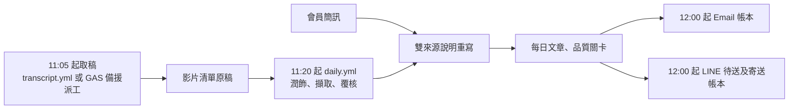

# 2026/09/29 取稿交棒與 LINE 選單驗收

## 今天實際看到的事

| 台北時間 | 證據 | 能確認到哪一步 |
|---|---|---|
| 11:09:41–11:19:39 | [逐字稿 Actions #36515886238](https://github.com/Lee200202/Stock/actions/runs/36515886238)、使用者提供的完整日誌 | 影片長 57:16，分兩段聽打；12,336 字及 SHA256 寫入「影片清單」，結束碼 0。 |
| 約 11:09:46–11:16:20 | 第一段模型請求及回應時間 | 約 6 分 34 秒是 Gemini 處理及傳輸等待；回應中的兩處聽打指令回聲在回應後才被正規式清掉，不是等待原因。第二段約 3 分 18 秒。 |
| 11:24–11:34 | [每日流程 Actions #36516990597](https://github.com/Lee200202/Stock/actions/runs/36516990597) | 工作結論是 success，顯示取稿後已有下游執行；公開 Actions 摘要沒有稽核輸出、寄送帳本，**不能據此宣稱 Email 或 LINE 已送達**。 |
| 22:13 | 正式 `/exec?action=ping` 回 JSON | 正式 GAS 還是 `2026-09-29-layout-runtime-v83`。本文件的 v84 改動未部署。 |

`transcript.py` 的 `strip_transcribe_echo()` 只移除與聽打請求模板完全吻合的片段；若整段清掉後只剩空白，會當失敗重試。今天清理後仍有 12,336 字並已落地。這能排除「回聲清理使本輪中斷」，不能代替逐字稿的抽樣聽核。模型把第二段的請求句混進第一段是品質警訊，建議在後台抽查第一段約 00:25–00:30 的交界與股票名稱，不要用回聲數當成整篇品質合格的證明。

## 排程和寄送怎麼接

時間是**最早嘗試**，不是整點保證。GitHub cron 可能延遲；影片出現、兩段聽打、稽核、簡訊內容同步、品質關卡和訂閱者額度都會影響實際時間。已有原稿時，`daily.yml` 的預檢在 12:00 前也會直接接手；尚無原稿時才暫等 `transcript.yml`，避免兩條流程重複聽打。Email 與 LINE 各自記帳；簡訊與逐字稿說明還沒合併完成時兩邊都等，無影片不寄每日總覽。盤中通知只保留已明確同意的後台收件者，與每日總覽獨立。

## 這次修正

目前程式的 LINE「通知」四格已是「管理訂閱／今日整理／使用說明／開啟網站」，沒有「最新盤中通知」。手機仍顯示舊格，表示轉送服務圖片或 LINE 端選單尚未更新。v84 後台 LINE 卡片會讀 LINE 選單別名並顯示實際版本；重建選單之前會比對轉送服務提供的圖片 SHA256，圖片仍是舊版就停在切換前並顯示原因，不會把錯圖掛上新選單。這個版本核對只證明 LINE 別名；個別好友若綁過專屬選單，仍需手機實測。

## 部署順序（維持原專案、原網址）

1. **GitHub**：本次 commit 推到 `main` 後，到 Actions 確認 `public-site-pages` 成功。它會用 `public-site/gas-source/Admin.html` 重組 Pages 後台；GitHub 推送本身不會更新 GAS，也不會重新上傳 LINE 圖片。
2. **先更新 Cloudflare LINE 轉送服務**：在倉庫的 `line-webhook/` 目錄執行 `npx wrangler deploy`，使用既有的 `zhangzhen-line-relay` Worker 與 Queue，不重建或重貼 secret。開 `<後台 LINE 設定所列的轉送服務網址>/healthz`，再開同一網址的 `/static/richmenu-notify.png`，肉眼核對四格文字。若 Cloudflare 要求改付費方案，停下來核對既有設定。
3. **同步四個 GAS 檔案**：從同一個 GitHub commit 的 `public-site/gas-source/` 複製完整 `Line.gs`、`Admin.html`、`Config.gs`、`Setup.gs` 到**原本** Apps Script 專案同名檔並儲存。其他檔沿用目前最新版，別用舊 ZIP 覆蓋。編輯器執行 `checkProjectFiles()`，應顯示全通過且版本 `2026-09-29-line-menu-audit-v84`。
4. **更新既有 Web App**：Apps Script 右上角「部署」→「管理部署作業」→ 選原正式 Web App → 鉛筆「編輯」→ 版本選「新增版本」→「部署」。維持原本執行身分與公開存取設定，網址不改。開 `/exec?action=ping`，核對 build 是 v84、features 有 `line-menu-audit-v84`。不要把 `/dev` 當正式站。
5. **切換 LINE 圖文選單**：正式站後台 → LINE，先按「重新整理」。新卡片會顯示通知選單是舊版或讀取不到；按「驗證卡片格式」（不發訊息），再按「建立圖文選單」。若提示 `richmenu-notify.png 不是目前版本`，回第 2 步部署 Worker，**不要**勉強上傳。成功後重新整理，卡片應顯示 `zz-notify-v2`；手機開官方帳號，切到「通知」，實際點四格，確認「今日整理」回每日卡、「管理訂閱」回訂閱狀態。建立圖文選單不推送訊息。
6. **只讀驗收排程與寄送**：編輯器執行 `checkAutomationReadiness()`、`lineSetupCheck()`，核對五分鐘觸發器、正式網址、LINE 模式、好友與每日訂閱數、Webhook 時間、通知選單版本。後台「自動化監控」看今日原稿、稽核、文章、簡訊內容同步及寄送帳本；「LINE」看每日待送／完成、已接受人數。信件在「每日推播內容」的寄送狀態與「寄送帳本」核對收件者接受數。若 mode 是「關閉」或沒有訂閱者，沒有 LINE 推播是正常的設定結果。若要發一則測試，先用既有測試帳號綁定並選「只送測試帳號」，會計入 LINE 當月額度。

**不用**因這次改版重裝全部觸發器、重跑日 K、重抓今天的逐字稿或改 GitHub Secret。`checkAutomationReadiness()` 若顯示缺少 `everyFiveMinJob`，才執行 `ensureAutomationTick()`；已有就不重複建。Cloudflare、GAS 與真實 LINE 推播仍需依上面步驟由管理者部署及驗收，離線測試不代表雲端已生效。
