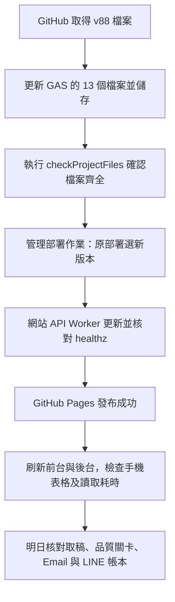

# v88：手機排版、批次讀取、通知驗收與部署

這次修正首頁的程式錯誤、重複 API 讀取、逐檔報價等待和手機郵件欄寬。依管理者最新要求，**取消首屏先顯示已保存資料，也取消讀取失敗時用瀏覽器舊資料或 Worker 過期結果代替成功**。網站仍使用原 Apps Script 畫面、動畫、表格、超連結與操作方式，並沒有另外生成簡化網站。

版本：`2026-09-30-read-batch-layout-v88`。網站 API Worker：`site-api-v88`。

**後續狀態更新：管理者已完成 GAS 部署，正式 ping 及實站驗收已核對為 v88。以下「尚未部署」是首次交付當下的紀錄；最新結果請讀 [v88 部署後實站驗收](v88-部署後實站驗收.md)。**

## 1. 正式站實際看到什麼

2026/09/30 下午使用已登入的 GitHub 網站後台，核對「今日與投稿」、「LINE／為什麼沒收到」、「自動化監控」。只做查詢，沒有代替訂閱者開啟通知，也沒有發送測試信或測試推送。

| 流程 | 正式後台證據 | 判定 |
|---|---|---|
| 影片／原稿 | 原稿 13,707 字，11:11 落地 | 今天確實有自動取稿 |
| 判讀／稽核 | 原稿到發布工單完成，15/15；約 11:14–11:20 完成 | 今天有跑到發布；後續另有逐日編輯同步 |
| 每日總覽 Email | 郵件服務接受 4/4 位，首次 14:04 | 已交寄，**沒有達到 12:00 準時** |
| 會員簡訊 Email | 1 則，郵件服務接受 2/2 位，10:04 | 今天有交寄 |
| LINE 每日總覽 | 待送帳本完成，LINE 接受 2/2 位，14:04 | 已送入 LINE；未證明每位手機都已閱讀 |
| LINE 盤中通知 | 設定 2 位，真正符合明確啟用條件 0 位 | 舊按鈕設定尚未生效，不能把 2 當成可寄人數 |
| LINE 最近回覆 | 後台樣本約 5.2 秒：轉送 3.244 秒、認領 0.822 秒、查詢 0.584 秒、LINE 0.556 秒 | 這只是一筆樣本，不代表尖峰時沒有 15 秒以上延遲 |
| 主排程 | 有最近心跳，每五分鐘排程和簡訊每分鐘排程均安裝 | 已安裝且今天有運作，不能只靠觸發器存在判定成功 |
| 執行耗時 | 下午約 230.8 分；報價更新約 172.1 分 | 主要耗時來自原先逐檔報價，這次改成批次 |
| 日 K | 上一輪 09/29 16:53:24 完成；今天等待 16:45 | 驗收當下尚未到今日補 K 時間 |
| 歷史 60 分 K | 19:15 排程已安裝；9958 留有 Fugle 404 待補 | 有待處理標的，不能宣稱全部 K 線完整 |

GitHub 今日取稿、每日 pipeline、簡訊解析及逐日編輯同步的執行結果均有成功紀錄。這證明**今天這一輪**運作，無法保證隔天影片、模型或行情服務不會延遲。

「服務接受」和「收件人收到／閱讀」是不同事情。Email 還可能進垃圾郵件，LINE 使用者也可能封鎖帳號。不要把交寄成功改寫成全部讀取成功。

### 為什麼每日通知到了 14:04

後台設定仍是最早 12:00，今天帳本確實是 14:04。今天也有版本更新和 12:51 的逐日編輯同步。現有畫面不能單獨證明究竟是哪一個前置條件造成延遲，不能用猜測歸因。

既有寄送機制是每五分鐘檢查「時間已到、當日有影片整理、文章已發布、品質關卡已完成或有明確放行紀錄」。v87 已補品質關卡有限重試及可追查的放行紀錄，這次保留它，沒有繞過原文稽核。明天要以**首次寄送帳本時間、品質關卡狀態、主排程心跳**驗收，不能把「時間設定 12:00」當成準時交寄的證據。

## 2. 這次改了哪些真正的等待來源

### 首頁錯誤與多餘請求

首頁資料已經回來，`onDashboard` 卻讀未定義的 `r.tracker` 和 `r.quotes`，應為 `res`。原傳輸層把畫面回呼例外當成網路失敗，所以反覆重試並顯示「資料讀取失敗」。現在修正變數，且把畫面例外與網路失敗分開。

首頁原本打包了 quotes，但缺少 `renderQuotes` 函式，又另外叫一次報價 API；持股統計也在啟動時再叫一次。現在直接使用同一個 dashboard 回應的資料，不發這兩個重複請求。

### 試算表一次讀足需要的欄位

同一個首頁請求使用同一份 `withSheetSnapshot_`，持股結果在本次請求內只計算一次。「影片清單」只讀日期、處理狀態及失敗原因所在範圍，不為首頁狀態搬回整份原稿、修飾稿和排版 JSON。取消沒有被使用的會員簡訊整張讀取。

這是每次請求內的暫存，不是讓訪客先看上一版首頁。寫入與訂閱異動不進唯讀快照。

### 報價一次多檔，失敗標的限量補取

原五分鐘排程逐檔呼叫行情，會反覆等控速與來源回應。現在每批最多 50 檔使用證交所 MIS 一次查上市、上櫃通道，再依**回傳代號**對應。少回或失敗的部分，每一棒最多四檔使用既有備援，游標輪替，不再天天只重問前四檔。

網站的批次報價入口也使用同一方式。現價必須來自實際成交 `z`，不能拿買價、昨收當最新成交。來源沒有成交、日期或時間不完整時不偽造當下時間；已有報價保留原時間，必要時用已落地日 K 收盤並標示其日期。日 K 成交量仍存股，網站換算張；MIS 即時量為張，不再乘除錯單位。

寫入快取表改成先一次寫新資料再清舊尾列。寫入前不清空舊表，少回標的保留原時間。來源失敗不是全部更新成功。

### 控制重試的總等待

Worker 對可重送方法保留有限重試，一組後端呼叫約以 55 秒為上限。Worker 已完成重試、回報失敗時，瀏覽器不再重送整組；Pages 首頁也不再另外套一組 5 秒／15 秒重試。瀏覽器直接連線中斷仍由傳輸層有限重試，Apps Script 原生頁保留原本的連線處理。

同一 Worker 執行實例同時收到相同公開查詢時，共用正在執行的那一個後端請求。有效期內的短暫結果重用仍存在；**不回傳過期結果、不讀 localStorage 舊總覽、不先畫舊首屏**。後台、寄信、訂閱寫入及帶信箱記錄的個股查詢不合併成公開快取。

### LINE 先回覆，再記一般活動時間

正常查詢使用唯讀快照，減少同一份資料重讀；一般 `lastSeen` 維護移到回覆之後。真正的訂閱／取消同意仍先寫入再回覆確認，不能為了速度顯示尚未儲存的同意。

LINE 既有 Worker 載入動畫與 Queue 架構保留。這次沒有改 LINE Worker、圖卡圖片、富果金鑰或 Cloudflare Queue，也不用重新建立圖文選單。

## 3. 手機郵件與網站排版

取消 18% 股票窄欄和 82% 說明欄。每檔改成兩列：

1. 第一列是股票名稱、代號、方向與已證實價位；短標籤可自然換到下一行。
2. 第二列放完整說明，使用整個表格寬度。

兩列同底色，左邊色條對應類別，股票之間有分隔線。會員目前持有區仍保留，但不重複顯示「持有」狀態。名稱、代號與說明不再被固定窄欄擠成一字一行。關鍵版面使用 inline style，網站讀信頁解除舊窄欄覆寫；長名稱、ETF 代號、大字級都保留。

**已寄出的 Gmail 郵件無法改版**。更新 GAS 後，新寄出的信採新版；網站郵件查詢重新產生 HTML 時也採新版。不能為了讓舊信變漂亮而重寄全體收件者或清除寄送帳本。

## 4. 後台新增加的判斷依據

「今日與投稿」與「自動化監控」共用今日狀態 API，新增加「網站資料讀取」卡片，顯示最近 15 分鐘首頁、個股摘要、批次報價在 GAS 執行的耗時與紀錄時間：低於 8 秒綠色、8–15 秒黃色、15 秒以上紅色。沒有最近查詢就顯示尚無測量，不判定自動化故障。

這個數字不含 Cloudflare 到 Google 網路、Queue 等待或手機時間。Worker 另回 `Server-Timing`，可分辨後端轉送等待。兩個數字不可當作同一個來源。

LINE 管理卡片改成「盤中通知已確認」及「舊設定待確認」，不再只顯示設定人數而讓管理者誤以為全部會寄。

觸發器累計為本站按台北日期估算。Google 配額是另一個 24 小時窗口，個人帳號與 Workspace 額度亦不同；數字超過參考值會明講「超過」，而不是仍顯示「接近」。配額規格以 [Google 官方說明](https://developers.google.com/apps-script/guides/services/quotas)為準。

## 5. 部署先後順序



本次交付會更新 GitHub 與網站 API Worker；**GAS 原部署仍由管理者自行更新**。Worker 與 Pages 能相容現有 GAS，但批次讀表、報價排程、LINE 回覆順序、新監控卡片以及寄信格式，必須更新 GAS 才會生效。

### A. 取得檔案

兩份本機 GAS 檔案已同步：

- `C:\Users\user\Stock\public-site\gas-source`
- `C:\Users\user\Downloads\zhangzhen-stock-site-updated\apps-script`

GitHub 上的正本是 `public-site/gas-source/`。不要貼整個 GitHub Pages 組裝出來的 `index.html` 到 GAS，GAS 仍使用原來的分檔格式。

### B. Apps Script 更新清單

開啟現在正在服務正式網址的 Apps Script 專案，左側「編輯器」，逐一點檔名、全選內容、貼上同名檔案、儲存。不要新增同名函式或留下兩份同名檔。

| 檔案 | 作用 |
|---|---|
| `Setup.gs` | 選欄讀表共用函式、v88 檔案核對 |
| `Config.gs` | GAS_BUILD、功能版本標記；保留你的實際設定 |
| `API.gs` | 首頁一次打包、批次報價入口 |
| `SheetService.gs` | 本次請求內持股結果重用、精簡影片欄位 |
| `Quoteservice.gs` | 批次行情、輪替備援、安全寫入 |
| `Line.gs` | 查詢快照、先回覆後維護、有效訂閱計數 |
| `SiteBridge.gs` | 記錄公開查詢後端耗時 |
| `Adminservice.gs` | 讀取耗時卡片、配額敘述 |
| `MailService.gs` | 手機疊列表格 |
| `JavaScript.html` | 修首頁變數、使用已回傳報價、刪重複請求 |
| `Stylesheet.html` | 新表格樣式與舊欄寬隔離 |
| `Admin.html` | LINE 已確認與待確認人數、持股輸入觸控高度 |
| `Changelog.html` | v88 版本說明 |

先完成全部 13 個檔案才執行檢查，避免 `API.gs` 已更新、`Setup.gs` 還沒有 `readSheetFields_`。大小寫依現有檔名，尤其 `Quoteservice.gs` 與 `Adminservice.gs`。

`Config.gs` 不要把你自己新增的設定覆蓋掉；這一輪關鍵是 `GAS_BUILD` 和 `GAS_FEATURES`。金鑰維持在指令碼屬性，不貼到 GitHub 或聊天。

### C. 執行核對與原部署升版

1. 編輯器上方函式選單選 **checkProjectFiles**，按「執行」，看執行紀錄，必須全部通過。若指出舊版，重新貼那個同名檔案，不刪檢查條件。
2. 選 **whoAmI** →「執行」。編輯器最新版本須為 `2026-09-30-read-batch-layout-v88`。這只證明編輯器，不代表正式網址已更新。
3. 右上角 **部署 → 管理部署作業**。
4. 左邊選正式網址對應的既有部署。不要選另一個「未命名」部署，也不要建立新網址。
5. 右上角點鉛筆「編輯」。版本選 **新增版本**，說明填 `v88 手機排版與批次讀取`。
6. 保持原執行身分「我」、原正式公開存取設定。按 **部署**。
7. 核對網址仍是既有 `/exec`，沒有變成 `/dev`。保留同部署 ID 就不用改 GitHub Secrets 或 Worker 的 `GAS_WEBAPP_URL`。
8. 重新整理網站及後台，確認出現 v88 沿革。不要只看編輯器輸出就認定部署已完成。

可用正式 `/exec?action=ping` 檢查後端 `build`；若取得 HTML 而非 JSON，先等待再試，不能因 Google 暫時回傳錯誤頁就任意更換所有部署設定。

這次沒有新增分頁或觸發器，不需要重跑 `bootstrapAll()`、清空試算表、重建訂閱帳本、全面重抓 K 線或重排所有觸發器。這些操作會增加成本，不能當成例行升版步驟。

### D. Cloudflare：網站 API 與 LINE 轉送是兩個服務

| 服務 | 本次處理 | 部署目錄 |
|---|---|---|
| `zhangzhen-site-api` | 有修改，需更新 | `C:\Users\user\Stock\site-api` |
| `zhangzhen-line-relay` | 未改，不需重部署／建選單 | `line-webhook` |

若日後要自己重部署網站 API，在 PowerShell：

```powershell
Set-Location 'C:\Users\user\Stock\site-api'
npx wrangler deploy
```

沿用現有 `wrangler.jsonc`、`SITE_BRIDGE_TOKEN` 與 `GAS_WEBAPP_URL`；不要把 LINE 的 Channel secret 填成網站橋接密鑰。確認 [網站 API 健檢](https://zhangzhen-site-api.rainforecast2026-6fb.workers.dev/healthz) 顯示 `build: site-api-v88`、`ready: true`。

這次沒有加入 Cloud Run、Cloud Tasks、付費儲存或新 Queue。

### E. GitHub Pages

推送 `main` 後，GitHub → **Actions → public-site-pages**，等本次 commit 顯示綠勾。流程會先核對原介面與 API 白名單，測試後端，再組裝及發布。失敗時保留上一版網站，應查看失敗步驟，不要立刻重建另一個簡化網站。

開啟 [正式首頁](https://lee200202.github.io/Stock/) 與 [後台](https://lee200202.github.io/Stock/admin.html)，重新整理一次。網站後端使用剛部署的 GAS，只有 Pages 升版仍不能得到新的後端讀表效能。

## 6. 部署後實際驗收

### 首頁與手機

- 首頁直接等待本次資料；沒有保存資料提前回放。已有表格、報價、持股統計只從同一份 dashboard 結果畫出。
- 首頁不再顯示未定義 `r` 的錯誤；瀏覽器請求列表不應在 dashboard 成功後立刻再補一組首頁 tracker／quotes。
- 手機 360／375／390px：名稱與代號不逐字垂直堆疊、說明整寬、不左右溢出。桌面 680／1440px 也核對。
- 郵件查詢使用新版疊列表格；新信有同樣版面。已寄出舊信不會自動變更。
- 深色、150% 字級、減少動態效果仍可操作；沒有資料顯示真實空狀態，不杜撰訊號。

### API 與後台

1. 打開首頁、毅嘉個股、另一檔個股。
2. 後台「自動化監控」按「立即檢查」，看「網站資料讀取」三個方法的時間與測量日期。
3. 看觸發器紀錄中 `refreshQuoteCacheJob` 的新耗時是否下降；今天累計不會因升版歸零，要比較升版後新執行。
4. 若某檔沒有成交或來源沒回，確認顯示來源真實日期，沒有拿昨收偽裝即時。資料未完成不能標全部成功。
5. 股價、日 K、報酬不需要因版面調整全面重算；9958 的歷史資料缺口要獨立處理，不能清空所有 K 線。

### LINE：先釐清是否有有效同意

目前兩位盤中通知舊設定待確認。希望啟用的本人對官方帳號輸入 **開啟盤中通知**，收到確認後再輸入 **通知狀態**。後台「LINE → 為什麼沒收到」應顯示有效人數增加。每日總覽仍保留，Email 訂閱不受影響。

不要由管理者直接把舊設定的同意版本改成已確認，也不要為了驗收自動幫所有好友訂閱。LINE 圖文選單仍僅公開每日總覽；盤中通知不是公開圖卡入口。

回覆測量用「今日整理」、「我要查詢世芯KY買賣狀況」、「毅嘉」、「市場總覽」、「管理訂閱」。逐筆看後台近期回覆耗時；若仍超過 15 秒，先判別是 Queue／轉送、GAS 認領、查詢或 LINE 呼叫，不把資料錯誤一概當成使用者輸入錯誤。

### 明天的自動化

| 時間／條件 | 應核對的位置 | 異常時先做什麼 |
|---|---|---|
| 11:05 起 | 今日與投稿取稿工單、GitHub transcript run、心跳 | 看是否有影片、原稿是否已落地、人工保留是否開啟 |
| 原稿落地後 | pipeline 工單與稽核日誌 | 原稿日期與指紋一致、處理是否真的發布完成 |
| 12:00 起且文章已就緒 | 每日推播原因、品質關卡、Email 帳本、LINE 待送 | 看未送原因，不重寄已接受對象、不清帳本 |
| 會員簡訊出現 | 會員簡訊來源、解析工單、Email／LINE 各自帳本 | 用 `diagnoseCmoneyToday` 或後台診斷分辨來源、存檔、解析、同意條件 |
| 16:45 | 日 K 輪次與逐代號游標 | `backfillDailyKStatus()` 看已完成／續跑，不每次從第一檔重抓 |
| 19:15 | 歷史 60 分 K 完整性 | 查看標的缺口與來源 404，不能把安裝排程當成完整資料 |

每五分鐘檢查是「時間到且條件完成後下一次排程寄送」，不具備零秒誤差的保證；未有影片不寄每日信，會員簡訊另依有效訂閱處理，休市日亦可寄簡訊。

## 7. 測試範圍與交付限制

- JavaScript／Worker 共 19 組離線套件通過，涵蓋 LINE 意圖與訂閱、寄送防重、工單重跑、行情來源與單位、批次少回、同時查詢共用、過期資料不回放、畫面例外不重送。
- Python 57 個離線案例通過。Stock 與 Downloads 的 `pipeline/pipeline.py` 已逐位元組一致；只同步舊鏡像的過時等待訊息與註解，未更動 pipeline 判讀規則，沒有建立根目錄 `pipeline.py`。
- 原網站組裝預覽 390／1440px 前台八分頁和 390px 後台登入無頁面例外；完整原介面預覽另檢查六種前台、五種後台寬度，包含互動流程圖、雙擊編輯、未儲存標示、自訂時間選擇器與重算進度；郵件 inline／網站樣式在五種寬度、明亮／深色大字級共 20 種組合檢查自然換行與溢出。
- 手機技術說明長標題可自然換行，持股編輯欄維持至少 44px 高度，避免超出畫面與觸控過小。
- 全站表格、日曆與手機觸控捲動稽核通過，未發現被切掉的文字、不能捲動的超寬表格或整頁橫向溢出。
- API 公開及後台白名單核對通過；所有 GAS 原始檔鏡像一致。
- 測試使用模擬行情和排版樣本，沒有冒充新交易紀錄或寫入正式表格。正式後台查詢只證明目前線上版本的運作。
- 尚未替管理者部署 GAS，也沒有使用真實 Gemini 重新判讀或發送全體測試通知。官方批次行情的新呼叫尚未完成正式 GAS 連線驗證，部署後須核對回傳代號、成交價與日期。新版 GAS 的實際加速幅度必須在更新後以耗時卡片驗收，不能把本機假資料測試當成實際 1 秒回覆保證。

不需要刪除正式資料、訂閱名單或舊工單。新測試、預覽與截圖留本機；GitHub 保留必要網站、Worker、部署文件及既有測試的更新。

## 8. 本次發布結果與仍需核對的資料

- 程式提交：`be9c4ca`；[GitHub Pages 發布紀錄](https://github.com/Lee200202/Stock/actions/runs/36688546737) 已成功。
- 網站 API Worker 已部署 `site-api-v88`，健檢顯示 `ready: true`。
- 發布後實際打開正式首頁，看到 09/30 的分類表格、持股統計與逐檔行情時間，沒有「資料讀取失敗」，也沒有瀏覽器程式錯誤。這仍使用目前線上的 v87 GAS，不能當成新版 GAS 批次讀取的效能證據。
- 正式資料還有需要回原稿核對的案例：所羅門的說明自稱「過去操作的回顧」，卻列在觀望不碰；必須確認原稿另有沒有當下負面操作條件，不能只靠這段公開說明自行刪掉紀錄。部分既有文字出現「避开」等簡體，以及把盤中來源名稱寫進公開說明，應在下一輪內容稽核檢查繁體一致性與公開來源敘述；本次未改寫正式文章或冒充已完成覆核。

