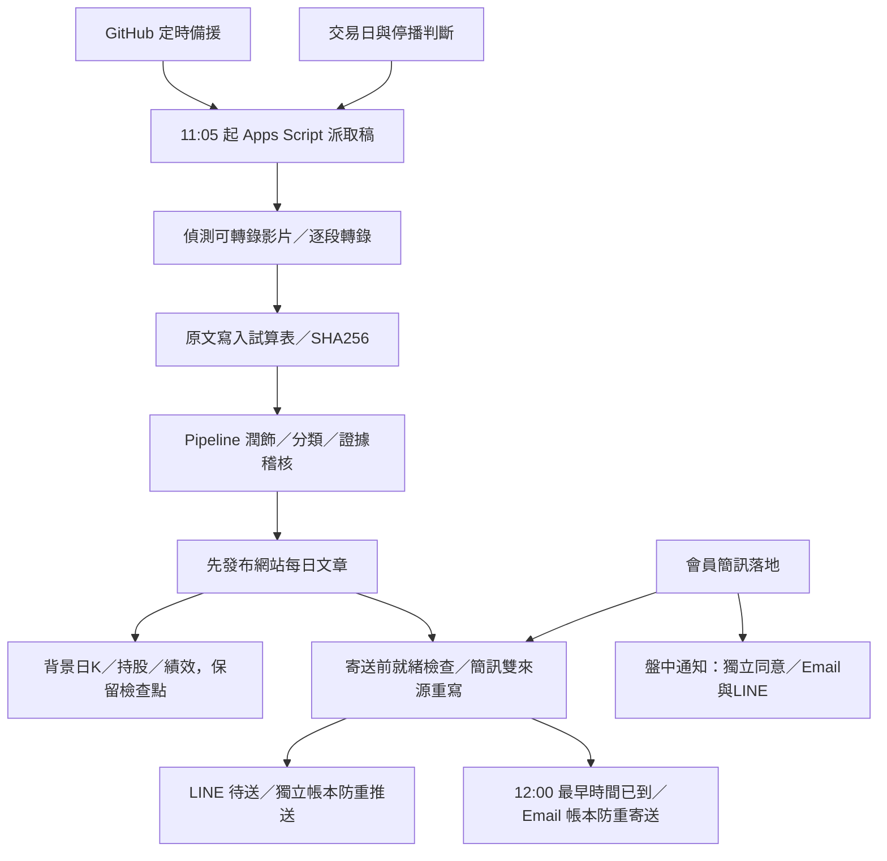

# 2026/10/01 上線前驗收與部署（v91）

本次在台北時間 08:18 起，實際查看 GitHub Pages 前台、已登入後台、正式 API 與 LINE 轉送服務，再對目前程式做離線回歸。正本為 `public-site/gas-source/`，保留 9/30 已完成的 v89、v90 修改，沒有以舊版覆蓋。

**結論：前台與郵件版面可以發布這次修正；今天的整條自動化目前具備運行入口，但尚不能宣稱今天已取稿、稽核與寄送成功。** 驗收發生在 11:05 取稿之前，影片、今日文章與今日寄送帳本都尚未產生。另有日 K／60 分 K 外部來源缺口，不能宣稱所有行情完整。

這次沒有呼叫真實 Gemini、寄測試信、發測試 Push、重算正式持股或重建全部觸發器。Apps Script 的新版本仍須由管理者部署；GitHub 推送不會替 Apps Script 上版。

## 一、正式服務與執行證據

| 項目 | 本次實際看到的結果 | 意義與限制 |
|---|---|---|
| Apps Script ping | HTTP 200、JSON、`2026-09-30-official-dailyk-v90` | 正式部署存在且可回應；尚未裝本次 v91 |
| 網站 API `/healthz` | HTTP 200、`site-api-v90`、ready=true | 轉送服務就緒；不能代替每日工作成功 |
| LINE `/healthz` | HTTP 200、`2026-09-30-line-response-v5`、configured=true、loadingConfigured=true | 驗簽／轉送與等待動畫設定存在 |
| GitHub Pages | 08:10 發布成功，對應 `d41eeef` | 本次修改前正式站已載入最新 9/30 檔案 |
| 今日總排程 | 五分鐘心跳新鮮，08:19 當時距啟動約 3 分鐘 | 今天有被喚起；不能保證後面每一步都成功 |
| 今日影片／文章 | 尚無，未到 11:05 | 此時是等待，不是取稿失敗 |
| Email 可用額度 | 當時剩 94 位收件人；每日訂閱 4 位、盤中 2 位 | 人數目前足夠；額度會隨其他寄送改變 |
| LINE 可用額度 | 10 月已用 0／200；每日 2 位 | 小量每日推送目前足夠；LINE 調用及查詢回覆仍須看服務結果 |
| LINE 盤中訂閱 | 已確認 1 位、待確認 1 位 | 待確認者不會因舊開關為開啟就自動寄出 |
| 昨日每日 Email | 9/30 帳本服務接受 4／4，約 14:04 | 有上一個交易日的成功證據；不是今天已寄出，也不是已讀 |
| 昨日每日 LINE | 9/30 帳本服務接受 2／2，14:04:38 | 文章完成後送出，沒有在 12:00 尚未就緒時發空內容 |
| 昨日盤中 Email | 9/30 帳本服務接受 2／2，約 10:04 | 會員簡訊通道有歷史接受紀錄；不能據此保證每一則 LINE 通知 |
| LINE 最近查詢 | 9/30 最近一筆約 4.4 秒，LINE API 約 682ms | 是歷史紀錄；本次沒有請好友發新的查詢來驗收 |
| 日 K | 最近富果補齊統計 0 成功、241 失敗、1 略過；官方 v90 補齊已加入 | 舊供應商回 0 根不能當行情完成，需分開核對官方補齊 |
| 台指期夜盤 | 08:42 查詢仍顯示 9/30 04:59:58 的來源時間 | 尚不能宣稱是最新夜盤；v91 加醒目較早資料提示 |
| 歷史 60 分 K | 進度仍記 `Fugle HTTP 404 ResourceNotFound` | 尚有外部資料缺口；排程存在不表示資料已補齊 |

後台「日 K 涵蓋範圍」的正式唯讀檢查本次遇到連線失敗，沒有拿到完整逐檔結果。因此不會聲稱全部 K 線完整，也沒有為了測試去清空既有行情或重置游標。

## 二、網站 API 速度與讀取方式

這次同時測試三個獨立唯讀請求，網站 API 均為 HTTP 200、快取未命中：

| 查詢 | 往返耗時 | GAS 處理耗時 |
|---|---:|---:|
| 三檔批次報價（2330、2402、3661） | 3.54 秒 | 約 3.22 秒 |
| 毅嘉個股摘要 | 6.56 秒 | 約 6.24 秒 |
| 每日總覽 | 8.49 秒 | 約 8.05 秒 |

網路轉送不是本次主要耗時，後端讀表與計算仍占大部分。這是一次樣本，不是平均值或服務保證，也不能宣稱 v91 尚未部署的後台讀取優化已在線上加速。

既有讀取設計確認保留：

- 同一個查詢內共用試算表讀取快照，不重複搬相同資料。
- 個股報價批次查詢；圖表使用日／週／小時 K 合併請求，不逐圖各抓一次。
- 網站 API 合併同時到達的相同讀取，設定等待上限；首頁只使用有效資料。
- **沒有恢復瀏覽器已保存總覽的首屏回放，也沒有用過期結果掩蓋讀取失敗。** 最新已發布日期可正常顯示，但會帶日期，不冒充今天的內容。

本次進一步把後台今日狀態的影片讀取改成「日期欄一次讀取＋當日列」，避免每次輪詢搬回全部歷史原文、修飾稿與排版 JSON。日期欄依表頭定位，並用既有逐字稿選列規則，防止同一天的舊完成稿蓋住新投稿進度。

## 三、實際版面與顏色修正

正式站手機 390px 檢查，首頁名稱與代號可同列，說明另行佔滿寬度；郵件查詢的股票表也採疊列，沒有再次變成 18% 左欄、一字一行。保留這個設計，沒有為了改版另外生成簡略內容。

**這次確實找到並修正深色郵件查詢的對比問題：** 盤勢和教學條列繼承寄信的 inline 深色字，網站深色背景上幾乎看不見。網站 `.mc-p`、`.mail-bullet` 改用主題文字色；寄信白底與其 inline style 不變。本機樣本普通文字對比測試，淺色約 15.02:1、深色約 15.43:1，均高於 4.5:1。這是網站樣本對比，不能代替所有收件匣的實機深色模式測試。

顏色與文字共同判別，避免只靠顏色：

- 買入／上漲紅；賣出／下跌綠；觀望注意藍綠；觀望不碰琥珀；會員持股靛藍。
- 後台正常綠、等待／要留意黃、需處理紅；沒有到時間保持等待，不能標成失敗。
- 日 K 多數失敗、歷史 60 分 K 的來源錯誤列入提醒；「觸發器已安裝」與「資料完成」分開。
- Pipeline 完成必須有當天原文、完成狀態及已發布文章；原文存在本身不再讓主卡片顯示整理完成。

另一個誤導操作的名稱已修正：「只刷新畫面／不動資料」實際包含稽核、補登、分類與衍生結果重算，現在改成「核對資料與重算／會更新資料」，直接說明可能改動的範圍。

維護工單的日誌不再被最近一次投稿／其他工作覆蓋。能取得本次執行編號時連到該次；未取得時寫明是工作流程清單，不能把另一張工單稱作本次。欄位讀取失敗保留真正原因，不假裝已完成。

發布後再次確認，舊維護紀錄停在第 7／9 步、78%，其「完成」是當步完成，不代表九步整條完成；狀態文字改寫成「第 7 步完成，後續尚待核對」，不把进度直接補成 100%。

## 四、今日自動化如何接續

1. 交易日 11:05 起由五分鐘總排程派工；GitHub 自身排程作備援。影片尚未完成時探詢，不把沒有可用影片當成功轉錄。
2. 原文寫入後，Pipeline 依來源指紋與已有檢查點接續；不同工作有相互排程與租約，保留人工內容、會員簡訊與已寄旗標。
3. 先發布已驗證文章，再做行情與績效背景工作，不讓幾百檔日 K 拖住文章發布。
4. 會員簡訊併入文章時，重新核對簡訊與影片兩個來源；沒有影片不寄每日總覽，盤中通知可獨立寄送，休市日亦然。
5. 每日 Email 與 LINE 各自經就緒判斷、收件人條件及防重帳本。12:00 是最早寄送時間，不是硬性送達時間。
6. 寄送前品質關卡若連續未完成，現行 v87 有自動放行已由 Pipeline 核對的文章並記錄「未經本輪複審」的規則。本次未改這個既有政策；管理者仍須在後台查看原因，不能把放行說成補做複審成功。

Apps Script 定時觸發器與 GitHub 排程皆可能延遲。GitHub 官方也說明高負載時排程可能延遲甚至略過；本專案因此保留 GAS 派工、備援排程與續跑，但無法承諾準點到秒。[GitHub 排程文件](https://docs.github.com/en/actions/reference/workflows-and-actions/events-that-trigger-workflows#schedule)、[Apps Script 觸發器文件](https://developers.google.com/apps-script/guides/triggers/installable)

觸發器額度也須留意：一般帳號 90 分鐘、Workspace 6 小時，官方額度從首次請求起以 24 小時計算。後台「今日累計」是本專案的日期估算，不能拿它證明 Google 的滾動額度還有多少。今天早上的觸發器能執行，仍須查看 Google 執行紀錄有沒有 quota exceeded。[Apps Script 額度文件](https://developers.google.com/apps-script/guides/services/quotas)

## 五、官方日 K 續跑修正

本次發現補官方行情時，超出本輪截止時間的日期會直接略過，卻沒記「未查」，可能在沒查完時標記當日完成。v91 改成：

1. 查下一日之前預留 45 秒，寫回已取得資料。
2. 未查的日期記在 deferred，系統狀態寫「時間不足，待續跑」。
3. 有未發布、上市／上櫃其中一張沒回、或未查日期，均不寫 OFFICIAL_DK_DONE。
4. 保留已補的資料；後續五分鐘維運中的十五分鐘補齊檢查重新盤點缺口，只補缺的。
5. 補到行情後，由既有成本同步佇列從最早補到日期重算持股與績效；使用共用日 K 寫入租約。

這不會把歷史 60 分 K 的 HTTP 404 視為已修好。若來源持續無資料，需另行判斷來源支援範圍、代號與請求權限，不能拿日 K 合成不存在的 60 分 K。

## 六、部署順序：先 Apps Script，再驗收 Pages

### 1. 更新 Apps Script 的九個檔案

從倉庫 `public-site/gas-source/`，或本機同步好的 `Downloads/zhangzhen-stock-site-updated/apps-script/`，逐一複製完整內容到同名檔：

| 檔案 | 這次用途 |
|---|---|
| Adminservice.gs | 當日影片讀取、狀態證據與日 K 統計 |
| Admin.html | 後台顏色、工單日誌與錯誤說明 |
| Cachebuilder.gs | 官方行情未查完的續跑與完成判斷 |
| Stylesheet.html | 深色郵件查詢文字對比 |
| Market.html | 較早來源報價的醒目提示 |
| Config.gs | GAS_BUILD 與功能標記 |
| Setup.gs | 檔案版本檢查表 |
| Changelog.html | v91 修改紀錄 |
| Tech.html | 行情補齊與通知時間說明 |

保留既有 Script Properties、金鑰、管理密鑰、試算表 ID 與正式網址。Market.html 保留實際來源日期；報價距查詢時間超過十二小時時，用琥珀文字提示較早資料。這是辨識來源新鮮度，不表示來源已修好。

這次沒改 MailService.gs、LINE 程式、Python 提示詞或 Worker；不必重貼其他檔案，也不必重建根目錄 pipeline.py。

### 2. 編輯器檢查

1. 儲存九個檔案。
2. 上方函式選單選 `checkProjectFiles`，按「執行」。應沒有檔案缺漏／舊版本；若仍報舊版，依顯示的同名檔重新貼完整內容。
3. 選 `whoAmI` 執行。編輯器版本應為 **2026-10-01-workflow-evidence-v91**。
4. 此時舊正式 /exec 仍可能是 v90：編輯器檢查通過不等於正式部署已更新。

### 3. 更新既有正式部署

1. 右上「部署」→「管理部署作業」。
2. 選取網址部署 ID 與正式網站一致的那一項，不選別的未命名舊部署。
3. 按鉛筆「編輯」。
4. 「版本」選「新增版本」，說明填 `v91 後台狀態與官方行情續跑`。
5. 保留原來「執行身分：我」「誰可以存取：所有人」及原部署 ID，按「部署」。
6. 沿用原 /exec 網址，不需更換 GitHub Secrets、網站 API 或 LINE Worker 的 GAS_WEBAPP_URL。

### 4. 正式驗證與排程檢查

1. 開啟正式 /exec 網址加 `?action=ping`，應回 JSON，build 為 **2026-10-01-workflow-evidence-v91**，features 包含 workflow-evidence-v91。若仍 v90，回管理部署核對版本。
2. 編輯器選 `checkAutomationReadiness` 執行（唯讀）。查看 everyFiveMin、transcriptBackup、marketSnapshots、dailyK、instantMail 等欄位。`ready` 只代表基本入口存在，不代表今日文章已完成。
3. 選 `lineSetupCheck` 執行（唯讀）。確認正式推送、轉送服務、額度、每日訂閱者及等待中的寄送；盤中待確認者需本人確認。
4. 左邊「觸發條件」確認 everyFiveMinJob 與 cmoneyPollJob 存在；「執行項目」確認近期 Completed 且沒有額度／權限錯誤。缺每五分鐘入口才執行 `ensureAutomationTick`。
5. **不要為這次修正執行全套初始化、重置日 K 游標、刪除全部觸發器、forceSendToday 或重新啟用所有 LINE 盤中訂閱。** 既有心跳正常，這次無新增固定觸發器需求。
6. 本次未改 Worker，所以網站 API 與 LINE Worker 不需重新部署。GitHub Pages 自動發布完成後重新載入網站，深色教學文字應清楚；後台維護工具應顯示新名稱。

### 5. 今天的整條成功標準

| 觀察時間 | 後台／GitHub 應看什麼 | 不能混淆的狀況 |
|---|---|---|
| 11:05 後 | 今日與投稿的取稿工單、transcript.yml 的本次即時日誌 | 影片未完成＝等待，不是沒有任何排程 |
| 原文落地後 | 今日日期、原文長度、當輪 SHA256、daily.yml 判讀／覆核／文章步驟 | 舊日期文章不能當今日已發布 |
| 12:00 後且文章就緒 | Email 帳本的接受數、待送／失敗／結果不明 | 舊已寄旗標但沒有接受帳本要核對 |
| 同時 | LINE 本日 daily 待送→服務接受；目前預期 2 位 | queued=0 也可能根本沒有產生工單，需查看本日 accepted |
| 有會員簡訊時 | 原文存檔、解析狀態、SMS 的 Email／LINE 帳本 | 不把尚未確認的 LINE 訂閱者算成已送 |
| 收盤後 | 官方補齊日期／檔數、日 K 缺口、重算持股與績效 | 尚未查完、來源沒回不可顯示全部完成 |

取稿、稽核、Email 與 LINE 四項都有**今天**的對應證據，才可寫「今日整條自動化已完成」。本次上午先完成上線前驗收，未用昨天的成功紀錄冒充今天成功。

## 七、測試範圍與未完成項目

- 21 組 JavaScript／Worker 離線回歸全數通過，包含 LINE 驗簽、去重、意圖、隱藏通知同意、寄送重試、網站橋接、行情日期與新檔案版本檢查。
- 68 項 Python 測試全數通過；GAS 正本與同步資料夾一致，兩份 `pipeline/pipeline.py` 的 SHA256 一致。
- 官方行情截止前零查詢／查到一半兩種情況均測試：未查日期有列出、不寫完成旗標。
- 當日影片讀取測試：只讀表頭、日期欄及當天列；其他日期的原文不讀。
- 手機／桌面預覽覆蓋 360、375、390 與桌面寬度；郵件 20 種寬度／主題／字級組合檢查名稱換行和橫向溢出；網站文字另加淺深色對比檢查。
- 真實 Gmail 各客戶端、今日 Gemini 模型成功轉錄、今日 Email／LINE 發送、正式 K 覆蓋稽核尚未全數完成。這些項目不能用本機假資料測試取代。

版面已具備維持目前完整功能的條件，優先修正實際錯誤，沒有重做一份簡略網站。今天是否全部寄出，仍以實際工單與兩套寄送帳本為準。

## 八、發布後複查

GitHub v91 首次發布 `646881b` 的 Pages 工作已成功（[執行紀錄](https://github.com/Lee200202/Stock/actions/runs/36798095208)）。實際重新載入正式郵件查詢後，深色教學文字為 rgb(227,234,230)，背景 rgb(22,28,26)，文字已清楚顯示；後台也看到「核對資料與重算／會更新資料」新標示。

08:52 再次查看正式後台：五分鐘心跳距啟動約三分鐘，今日尚未到取稿時間，沒有今日郵件接受紀錄；近期總覽 GAS 處理約 0.1 秒、批次報價約 0.9 秒。這是有效短期快取命中的後端紀錄，不能與前述未命中測試混為同一種速度，也不代表所有查詢都不到一秒。Apps Script 新版仍未由本次工作部署。
