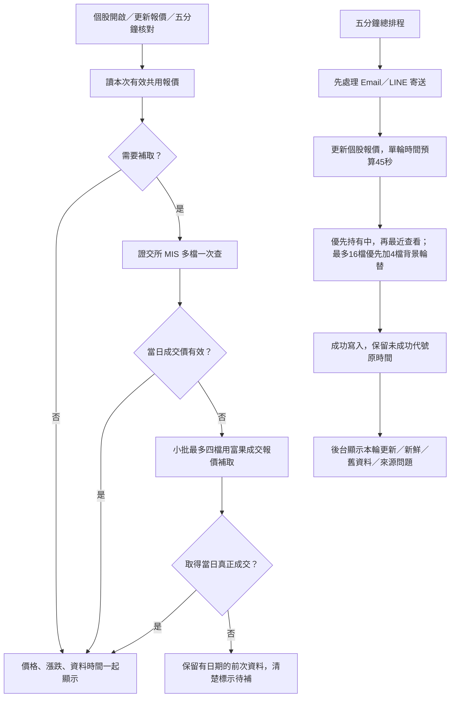

# v93 五分鐘報價修正、正式站證據與部署

版本：`2026-10-01-live-quotes-v93`。驗收日期：2026/10/01，台北時間 09:17–09:41。

這次修正個股報價來源、排程優先順序、畫面更新與監控。文章判讀、持股進出場規則、訂閱同意與每日寄送門檻維持原規則。v92 郵件提醒對比與股票間距修正已在正式站完成，這次接續保留。

## 1. 實際重現的問題

09:17 正式網站 API 回傳毅嘉 58.50、台積電 2480、瑞鼎 237.50，時間都是 09/30 13:39:42。實際打開毅嘉個股面板也顯示昨天的現價與漲跌，確實重現。

09:18:57 向證交所 MIS 一次查上述股票及世芯-KY，回應日期都是 20261001，並有今日成交量、委買與委賣，但最新成交欄 `z`、`pz` 均為 `-`。這是本次取得的回應，不能推定來源所有時間都如此。程式沒有拿委買價冒充成交價是正確的；錯在缺值後沒有有效補取使用者正在看的那一檔。

三個程式原因：

1. v88 把單檔報價也接到只查批次來源的入口。批次成交價空白時，即使富果可以查單檔，網站仍保留昨日數值。
2. 約 242 檔追蹤宇宙每五分鐘最多補四檔；批次全部缺成交價時，輪一遍約需 61 輪、五小時。排程有啟動，並不等於每一檔都更新。
3. 個股面板原本只有三分鐘 K 線輪詢，上方現價與漲跌在開啟後沒有再更新。

## 2. 現在怎麼運行

- 批次仍一次查多檔，單檔／小批查詢的備援最多四檔，避免全頁幾十檔逐一等待。
- 富果採 `lastTrade.price` 或 `closePrice` 的真正成交，與 `previousClose` 重新計算漲跌及漲跌幅。`lastPrice`、`change` 可能包含試撮，因此不直接拿來配成交價。成交時間按官方微秒時間戳轉台北時間；核對時間與成交時間分開。[富果官方欄位說明](https://developer.fugle.tw/docs/data/http-api/intraday/quote/)
- 富果回應前一天或錯代號會被拒絕；只有試撮、委買、委賣也不充當現價。
- 成功的單檔查詢在伺服器共用一分鐘結果，供同檔查詢與持股畫面重用。這是本次有效行情的共用加速，沒有恢復瀏覽器保存的舊首頁。
- 持有中優先；最近半小時查看的代號按最近時間加入。每輪優先最多16檔，另留四檔輪替背景代號，受45秒工作預算限制；遇401／403／429，本輪停止追加富果備援，不連續撞同一個限額。
- 更新後只改個股畫面的本回合未實現報酬，已出場回合與正式每日績效不被盤中預覽改寫。
- 切換股票、關閉面板、請求尚未返回時的重複更新皆有保護。回到頁面且已超過五分鐘會重新核對；手動按鈕使用同一條路。
- 報價工作仍排在寄送之後，移到簡訊補抓、產業補抓與背景 K 線之前。時間不夠及來源缺值不會抹掉原有報價日期。

**五分鐘是重新核對頻率；來源缺成交價、金鑰限額或 Apps Script 配額不足時，不能保證所有242檔都有五分鐘內的價格。** 後台據實顯示缺口。免費方案不會被自動升級；沒有加入需另外付費的全市場快照 API。單檔查詢與持有中優先解決正在看的股票停在昨日的問題。

## 3. 後台新增的卡片

「自動化監控」新增 **個股五分鐘報價**：

| 顯示 | 意義 |
|---|---|
| 已核對 X／Y 檔 | 現有報價按時間判斷可用的檔數，盤中門檻五分鐘 |
| 舊資料 X 檔 | 不能當成今日即時報價的紀錄 |
| 最近排程、本輪更新 X／Y | 本輪實際寫入，不拿啟動心跳代替更新成功 |
| 來源問題 | 例如 HTTP429；不輸出金鑰 |
| 紅色 | 盤中沒有任何有效新鮮報價 |
| 黃色 | 部分更新，仍有舊資料 |
| 綠色 | 現有全部報價通過新鮮度檢查 |

編輯器也可執行 `quoteCacheStatus()`，只讀、不抓行情、不寄信。`refreshQuoteCacheJob()` 才會抓取並寫入，非交易時段直接返回。卡片的已核對不代表每一檔在這五分鐘內都有新成交。

## 4. Apps Script 詳細部署順序

GitHub Pages 隨這次推送自動發布；**Apps Script 不會跟著 GitHub 自動更新**。本輪不需要改 GitHub Secrets、網站 API Worker 或 LINE Worker，也不需要重建圖文選單。

### A. 更新十個檔案

正本：GitHub `public-site/gas-source/`。本機相同內容已同步到 `C:/Users/user/Downloads/zhangzhen-stock-site-updated/apps-script/`。

在 Apps Script 左側「檔案」，逐一點開以下檔案，整份替換內容後儲存。`.gs` 是指令碼；`.html` 在編輯器選 HTML，名稱不再手動加 `.html`。

| 檔案 | 修改用途 |
|---|---|
| Quoteservice.gs | 真正成交報價、缺值補取、持有中優先、狀態查詢 |
| JavaScript.html | 五分鐘與手動更新、非同步保護、畫面報酬同步 |
| Index.html | 更新按鈕及報價狀態欄 |
| Stylesheet.html | 橢圓按鈕、手機換行與字級 |
| Adminservice.gs | 回傳報價監控資料 |
| Admin.html | 新監控卡片 |
| Config.gs | v93版本與功能清單 |
| Setup.gs | 檔案版本檢查與排程順序 |
| Changelog.html | 本次原因與改法 |
| Tech.html | 五分鐘核對及資料限制說明 |

**不要刪除其他檔案；不要用舊備份覆蓋這十份以外的內容。** MailService.gs 的 v92修正保留即可；若先前還沒更新v92，請也換成倉庫最新MailService.gs。

### B. 核對編輯器版本

1. 按工具列儲存。
2. 上方函式下拉選 **checkProjectFiles**，按「執行」，應為0個問題。若報舊版，依指定檔名換整份，不能只刪除檢查標記。
3. 選 **whoAmI** 執行，編輯器版本應為 `2026-10-01-live-quotes-v93`。此時只證明編輯器更新，尚不證明正式站更新。

### C. 更新目前使用的正式部署

1. 右上角「部署」→「管理部署作業」。
2. 選目前網址結尾是 `/exec`、部署ID開頭 `AKfycbyLQjAd` 的那一個。
3. 右上角按鉛筆「編輯」。
4. 「版本」選「新增版本」，說明可填「v93 五分鐘成交報價」。
5. 保持「執行身分：我」「誰可以存取：所有人」，按「部署」。沿用原網址，不另建部署ID。
6. 如要求授權，由專案擁有者完成原有授權。不要把金鑰貼到對話或 GitHub。
7. 開正式網址後加 `?action=ping`，應看到 build=`2026-10-01-live-quotes-v93`，features包含`live-quotes-v93`。仍為v92表示只儲存編輯器、尚未更新正確部署。

### D. 盤中驗收，不必等下一次排程

1. 在編輯器執行 **refreshQuoteCacheJob** 一次，只抓報價、不寄信。必須是交易日09:00–13:40；休市與盤後會跳過。
2. 執行 **quoteCacheStatus**，核對`job.at`、`updated`、`requested`、`fresh`、`old`及`errors`。若金鑰未設定或HTTP401／403／429，先確認既有富果方案和額度，不能把缺值說成已即時。
3. 到網站後台「自動化監控」按「立即檢查」，確認新增卡片及最近時間。
4. 前台「個股查詢」找毅嘉2402、台積電2330、瑞鼎3592，打開面板按「更新報價」。價格、漲跌及時間應一起改變；無資料時清楚顯示前次交易資料。網站 API 同參數短快取可能保留60秒，重新開啟股票摘要可能保留120秒。
5. 面板保持開啟五分鐘，確認重新核對。快速從2402切到2330，不能出現前一檔的價格。核對的成交時間可能沒有改變，代表該檔尚無更晚成交，不代表沒有查詢。
6. 沒有五分鐘主排程才需要重新安裝；本次實站確認既有觸發器已在，不要為驗收重裝全部排程，避免改動其他設定。

### E. 今日取稿、稽核與通知的驗收

09:40正式後台：09:39有主排程心跳，必要觸發器在；今日原文0字、文章尚未產生、會員簡訊0則、每日及盤中郵件均無今日接受紀錄。Email可用94封，每日4位、盤中2位。LINE為正式推送，每日2位，本月0/200，待送0；盤中已確認1位、舊設定待確認1位，仍不自動替待確認者開啟。

昨日09/30：取稿11:11落地13707字，判讀工單完成；每日Email14:04接受4/4位，盤中Email10:04接受2/2位；每日LINE14:04:38接受2/2位。服務接受不是收件者已讀。最近LINE回覆4.4秒是09/30的紀錄，不能當成本輪今日量測。

今日驗收須依序看：

- 11:05後「今日與投稿」取稿進度及GitHub實際run，原文是否落地。
- 稽核工單是否進到「寫入／刷新／完成」，當日文章是否發布；舊日完成工單不能當今日證據。
- 12:00是最早寄送時間。文章、影片與品質條件尚未就緒就等待；無影片不寄每日總覽。
- 「自動化監控」每日Email的當日接受紀錄及收件人數；「LINE」`daily|2026/10/01`的當日接受人數。
- 如有今日會員簡訊，分別看Email與LINE帳本；LINE只送已確認開啟者。這次沒有用測試按鈕寄任何通知。

目前仍有歷史60分K缺口（9958 HTTP404）及上一輪日K多數失敗；既有官方補齊與續跑保留，不宣稱這些資料已全部補齊。觸發器今日估算20.4分鐘，但Google採24小時配額窗口，昨日約265分鐘仍是需核對的風險；請留意Apps Script執行項目中的配額錯誤。

## 5. 測試與交付狀態

- 22組JavaScript／Worker測試通過；包含真正成交與試撮分離、前一天回應拒絕、批次缺值補取、共享結果、限額停止、持有中優先、切股與關閉面板的過期回應、失敗顯示。
- 68項Python離線測試通過。Python正本及同步份相同，本輪沒有呼叫真實Gemini，也沒有重建根目錄pipeline.py。
- 前後端方法對齊：31個公開、61個管理方法。
- 360／390／1440px，淺色預設字與深色大字，六種個股版面通過，名稱、價格、更新按鈕無重疊或橫向溢出；現價與報酬同步驗證使用本機受控回應，不冒充正式富果驗收。
- 新測試、截圖與暫存證據留本機，依既有規則不上傳GitHub；既有追蹤的測試同步更新版本標記期待。
- GitHub推送後還要核對Pages發布成功；正式GAS仍須依上方流程更新到v93，才可宣稱新版備援在正式站生效。
