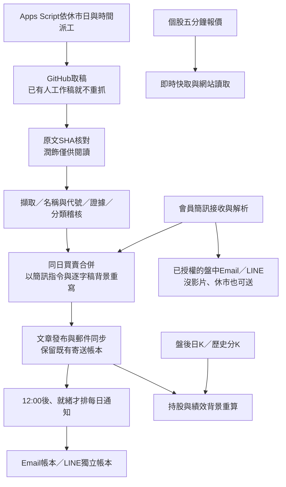

# v94：10/1 分類核對、行情精簡、LINE 字卡與部署

本次修改以 2026/10/01 更新後的 `1001.txt` 為準。**GitHub 與 Cloudflare 的發布不會自動更新 Apps Script。必須依下方順序完成 GAS 檔案更新與既有部署升版，分類、會員簡訊時間及 LINE 五類統計才會在正式後端生效。**

## 1. 今天實際完成到哪裡

| 節點 | 本次讀到的證據 | 能判定什麼 |
|---|---|---|
| 原文 | 14,655 字；文字 SHA256 `f679a2729db9243f437c0eafefd1f7415758896959afc7c9fd234b91cb697189` | 更新後檔案與今日工單使用同一份文字 |
| 潤飾 | 13,719 字；字詞保留 100%，只作閱讀 | 不是用潤飾稿取代原文判讀 |
| 擷取／稽核 | 工單 `AUTO-20261001-36810348261`；原文核對、代號比對、品質關卡、文章寫入與刷新已有完成紀錄 | 流程有跑；不代表每個分類都正確 |
| 網站／每日文章 | 文章約 1,865 字，標記已寄送；當日文章為買入 1、賣出 0、明講持股 5、不碰 6、注意 4；首頁目前持有 12 | 舊結果尚有本次指出的漏項與名稱歧義 |
| Email | 後台當日寄送帳本共 6/6 接受送出：每日總覽 4、盤中通知 2 | 寄送端已接受；未逐一查看收件匣，不保證收件匣投遞 |
| LINE 每日 | `daily|2026/10/01`，12:09:45 建立，2/2 接受送出 | 今日已有每日推播；**不是 12:00 準點** |
| LINE 簡訊 | `sms|185042123`，10:06:04 建立，1/1 接受送出 | 有一位已明確確認盤中訂閱的好友收到發送請求 |
| LINE 待送 | 驗收時 queued=0、sending=0 | 當時沒有卡住的待送；不能代替下一次排程監控 |
| Apps Script | 15:43正式 API 回報 `2026-10-01-live-quotes-v93` | 本輪 v94 GAS 尚未由我部署 |

工單：[今日 GitHub Actions 執行紀錄](https://github.com/Lee200202/Stock/actions/runs/36810348261)。以上後台資料是本輪驗收讀到的狀態；時間過後額度、人數、待送數可能改變。沒有為驗收群發新信或新 LINE 推播，也沒有在本機重新呼叫真實 Gemini 模型。

免費 Apps Script 時間觸發器與 GitHub Actions 有排程延遲，且每日通知必須等待影片、文章與品質關卡。可以設「12:00 後第一個就緒時點發送」，不能保證所有交易日整點 12:00。今天的 12:09:45 是實際紀錄，不改寫成準時成功。

## 2. 我如何判今日分類

先分清「會員實際買賣」「會員目前持有」「當下觀察／禁買」「只有舊交易故事」。價格、題材相似或另一日的代號不能用來補猜本日公司。

| 股票／候選 | 原文與其他來源 | 判斷及本次處理 |
|---|---|---|
| 力積電 6770 | 同日會員簡訊 75.3 元以下買入；影片又有季線與低檔布局背景 | 買入。簡訊指令優先，影片背景應雙來源重寫；不能把同一檔再算一次觀望注意 |
| 台積電 2330、鴻海 2317 | 「台積電抱著，鴻海抱著」等續抱原句 | 保留會員持股；不因講到別的公司舊獲利故事開新持股 |
| 聖暉 5536、鴻準 2354、世芯-KY 3661 | 續抱、不准賣、會員持有等本股原句 | 保留會員持股。公司附近的匿名股、價位不得借給這幾檔 |
| 瑞鼎 3592、祥碩 5269、神準 3558 | 月K／MACD、整理末端、低檔等本股正面條件 | 觀望注意；若只是建議，不當成已成交買入 |
| 台達電 2308 | 要等壓回；「你賣一點，等他跌幾天」 | 需區分建議調節與會員已實際賣出。不能只憑這句建立當日會員賣出；公開說明保留等待壓回條件 |
| 力旺 3529、國巨 2327、晶心科 6533、聯發科 2454、創意 3443 | 禁買、追高受傷、缺口／賣壓等本股風險 | 觀望不碰；既有分類大致有原句依據 |
| **愛普 6531** | **「愛普現在當然不要買。」** | 不能因前面談舊獲利而排除。新增本機禁買核對，補回觀望不碰 |
| **大立光 3008** | 原文誤字「大力光」；**「聯發科 大力光 創意 不要碰。」** | 初次擷取有收錄，覆核卻排除，是漏項。補回觀望不碰，公開使用正確名稱 |
| 牧德 3563 | 高檔利多／新聞追買風險，有當下評價 | 不能只說「教學例子」排除。Prompt 已加強；完整段落由重跑稽核核對，不用相鄰公司的理由硬補 |
| 漢唐 2404 | 舊 1000 元故事，另有「漢唐漲了300，我不敢追了」 | 單純舊推薦不收；後一句屬本股當下追高風險，須核對後列觀望不碰，不能把匿名下一檔的900當漢唐價位 |
| 友達 2409、群創 3481 | 昨日說法與當日比較交錯 | 列覆核：判斷原句是否有延續到今天的風險，不能記成今天實際成交 |
| **「新星科」** | 本日末段「不要再去找新星科了。我200多塊跟你們講的……」；**本輪沒有4916** | **名稱歧義，待確認**。不能因 9/30 念過4916，或因股價200多，就強制變成事欣科。不是證明事欣科不存在，也不能斷言原文完全是模型杜撰 |
| 「財經」「預創」等 | 可能語音誤字，缺唯一公司／代號證據 | 保留候選待確認；不自行新增彩晶、鈺創等交易 |
| 輝達、美超微、Google | 國外公司與市場背景 | 可保留盤勢背景，不進台股操作紀錄，不產生「若是台股再核對」的假缺口 |

因此，**不要把現有「不碰6」視為最終驗收正確數字，也不要把 LINE 數字寫死成今天的1/0/6/4。**重跑後由實際發布資料自動計數。這次已用更新後原文驗證愛普、大立光直接禁買補回，以及「新星科」不被強制補代號；尚未用真實模型重跑完整今日文章。

新增的禁買核對只處理同一短句直接點名公司的禁買，會檢查舊日回顧、否定和後續解除禁買；不借鄰股理由、不猜匿名股。原字與正式名稱讀音必須一致且無同音公司歧義。證據與補回紀錄寫入判定歷程。真實模型重跑後仍要看隔離／待確認，不能一鍵全部放行。

### 今日文章還需要改善的地方

今日公開盤勢第1與第3點重複「拉高下殺、費半季線、OTC等待季線」；盤勢與教學也比充足原文可提供的內容短。既有 Prompt 的6–10點、不同主題、來源核對與補問一次規則保留；重跑時要检查是否確實改善，不能用重複句子湊篇幅。教學的月K條件、法人短線換手、長線續抱、新聞位置、追高風險可分開整理，但每句仍要有本日原文證據。這輪沒有宣稱正式文章已補足。

## 3. 本次真正改了哪些程式

### 市場總覽退場

移除前台分頁及三份專屬 HTML、對應公開 API、LINE 市場查詢與總覽字卡、後台市場／產業狀態、五分鐘市場採樣與產業備援工作。`market_data.py` 只留個股歷史60分鐘K；Actions只留台北19:35的歷史分K備援，不再抓指數、期貨、美元、原油或產業成交比重。

個股五分鐘報價、日K、60分鐘K、持股追蹤、績效、取稿、逐字稿稽核、Email、LINE、會員簡訊輪詢繼續運作。舊「市場總覽快取」歷史分頁不再收集，也不列入新建表格清單；沒有刪除舊試算表資料。`Marketservice.gs` 仍保留必要的個股分K共用讀取函式，不能整檔刪掉。

兩個舊觸發器入口暫留不抓資料的相容函式；`migrateV94()` 會精確移除 `marketSnapshotJob`、`sectorCatchupJob`。不刪其他觸發器，也不重建整套排程。

LINE「查詢」圖文選單原市場格改為「逐字稿」，直接連 GitHub 網站；不再增加重複的今日整理按鈕。「通知」圖文選單沿用既有圖片，沒有重新公開盤中通知。產業類股歷史查詢仍可用，因為它查網站已發布的個股資料，不是市場總覽行情採樣。

### 讀取效率

- 首頁整包讀當日分類、持股追蹤、報價與LINE入口；讀表仍共用本次請求快照。首頁只讀已落地報價，不在首屏等待缺報價股票逐一向外抓取。
- 郵件與LINE指定日文章：先批次讀日期欄找列，再一次讀那一列，不把歷史每篇文章整張搬進記憶體。
- 追蹤宇宙與簡訊發文時間只讀必要欄位。報價來源時間照實顯示，未更新不冒充當天即時資料。
- Cloudflare公開唯讀查詢在有效期內共用，並合併同時進來的相同請求。首頁、報價、郵件與指定日期資料60秒；個股摘要／追蹤120秒；K線300秒。其他方法依既有TTL。
- 跨執行個體的共用讀取保留最初建立時間，命中不延長期限；過期就重新讀，不用舊結果頂替錯誤。**未恢復瀏覽器「先顯示上次保存首屏」方案。**
- 後台、訂閱與帶信箱會記錄查詢的操作不進公開共用快取。Cloudflare各節點快取獨立；不是全球永久同步，也不能保證每位訪客第一次都命中。

正式公開端點量測（當時下游仍為v93，故不是v94 GAS速度保證）：

| 查詢 | 測得時間 | 說明 |
|---|---:|---|
| 修改前首頁 | 9.82秒 | 本次基準樣本，非長期平均 |
| 修改前郵件 | 7.61秒 | 同上 |
| 修改前毅嘉摘要 | 9.45秒 | 同上 |
| 新轉送器首次首頁 | 7.67秒 | 仍需讀GAS，未命中 |
| 新轉送器另一個未命中首頁 | 3.85秒 | GAS自身延遲不固定 |
| 有效期內同查詢 | **0.53秒** | 回應標頭 `X-Cache: edge-hit`；只重用有效期內資料 |

已部署網站API Worker `site-api-v94`。不能把0.53秒說成所有查詢的冷啟動速度；GAS升版後需要再量第一輪讀取與後台查詢。

### 行情代號與日K

新增「行情代號驗證」分頁：代號、名稱、核對結果、依據、核對時間。每日核對一次、股票對照表更新後重核；完整官方上市與上櫃清單不含的追蹤代號，記為「未列現行上市櫃，停止行情請求」。自動報價、日K、分K不再為它重複請求；原始提及與歷史資料保留。舊的短區間補K工單續跑也重新過濾代號。

AI負責辨識原文的名稱與上下文，不負責憑記憶判定某股不存在。單次404只能表示該行情請求失敗。官方清單不完整時不擅自排除，以免來源掛掉就把所有上櫃股停用。3182須看核對結果，不把它稱為「從未存在的股票」。

「富果0成功、241失敗」是整體來源／授權／回應問題的訊號，**不是這241檔都不存在**。本輪沒有更換Fugle金鑰，也未宣稱富果已恢復。既有證交所／櫃買官方收盤行情補近幾個交易日流程保留；它不能代替完整一年歷史。日K原本已存在的日期與進度继續重用，不為改版重抓全部。

### 會員簡訊與 LINE 卡片

後台今日與投稿最上方的交易時間，改依 `CMONEY-文章ID` 連回「會員簡訊」的發文時間；操作表不存在的「時間」欄不再當來源。沒有來源時間就顯示「來源時間待核對」，不製造時間。

買入紅、賣出綠、持股紫、不碰黃、注意藍，整張卡片同底色，名稱／代號／方向分開留距，手機時間另起一列、說明全寬。這些私有明細只放後台。

LINE每日總覽卡分成五類數字：買入／賣出／當日明講持股／觀望不碰／觀望注意，使用各自顏色、以實際已發布紀錄動態算數。讀取不到不是零；顯示待取得。力積電簡訊買入合併後不重算成注意。既有持股趨勢圖、交易時間軸、績效與個股圖形繼續使用，市場總覽圖形則移除。

首頁膠囊改標「目前持有」，因為它讀仍持有的追蹤回合；LINE每日卡標「當日明講持股」，只計該日已發布聲明。10/1驗收時前者12、後者5，是統計範圍不同；不是將數字硬改成一樣。歷史LINE卡也不能拿今天的12回填。

網站郵件的疊列、名稱與代號間距、左側價位與風險提醒樣式保留。實際手機驗收還發現深色模式粗體重點沿用寄信黑字而消失，已修正到主題文字色。郵件本身仍使用inline樣式；網站查詢再套主題色，不把網站深色CSS塞入收件匣。

## 4. 正確的自動化順序



行情工作位於寄送之後，不讓行情來源故障阻擋每日通知。各步驟失敗留自己的狀態，不把整條線標成功。無影片不寄每日總覽；會員簡訊仍可依獨立訂閱發送。每日文章即使允許篇幅提醒發布，名稱／證據疑點仍需要單筆核對。

## 5. 部署順序：逐步操作

### A. GitHub（本輪推送）

正本是 `C:\Users\user\Stock`，推送目標 `Lee200202/Stock` 的 `main`。Pages由現有發布工作流程組裝原站HTML/CSS/JS；這輪不是另外做一套簡化網站。Python正本仍是 `pipeline/pipeline.py`，不得新增根目錄 `pipeline.py`。

使用者工作資料夾 `C:\Users\user\Downloads\zhangzhen-stock-site-updated` 已同步同一份程式；其中 `apps-script` 的檔案用於下面GAS貼入。其原有Worker設定與Secrets保留，沒有把憑證或原始逐字稿推入儲存庫。

### B. Apps Script：先更新檔案

1. 打開原本的Apps Script專案，左邊點「編輯器」。
2. 依下方清單逐一點檔名，用同名本機檔案**整份取代**編輯器內容。不要只改build字串，也不要只更新Setup。
3. `.html` 檔在GAS左側通常顯示不含副檔名的名稱；例如本機 `Stylesheet.html` 對應左側 `Stylesheet`。
4. 若看得到舊 `Market`、`MarketCharts`、`MarketDetail` 三個HTML，可移除；新版Index已不引用。**保留並更新Marketservice.gs**，因為個股分K仍依賴它。
5. 等儲存完成，再執行下方遷移／檢查；不要中途啟動全面重整。

本輪需要更新的GAS檔案：

- `API.gs`
- `Admin.html`
- `Adminpipeline.gs`
- `Adminservice.gs`
- `Cachebuilder.gs`
- `Changelog.html`
- `Code.gs`
- `Config.gs`
- `Index.html`
- `JavaScript.html`
- `Line.gs`
- `MailService.gs`
- `Marketservice.gs`
- `Presentationquality.gs`
- `Quoteservice.gs`
- `Setup.gs`
- `SiteBridge.gs`
- `Stylesheet.html`
- `Tech.html`

來源是上述Downloads資料夾的 `apps-script`，GitHub對應 `public-site/gas-source`。若先前v92/v93仍缺檔，請以完整最新資料夾核對，不要拿舊檔配新版Setup。

### C. 編輯器：遷移與檢查

頂部「執行」旁的函式下拉選單，依序選以下函式、按「執行」、讀執行記錄：

1. **`checkProjectFiles`**：必須沒有舊版／缺檔。若報某檔舊版，整份替換那個檔，勿刪檢查標記。
2. **`migrateV94`**：只移除舊市場／產業觸發器及舊狀態，並核對行情代號。會自動建立新「行情代號驗證」分頁；不是刪除交易資料。
3. **`checkAutomationReadiness`**：確認五分鐘維運、會員簡訊每分鐘輪詢、日K、持股與績效排程等。單純看到觸發器存在不代表今天實際成功，下一節要看帳本與時間。
4. 若缺五分鐘入口才跑 **`ensureAutomationTick`**；若缺個股19:15分K入口才跑 **`installMarketDataJobs`**。後者名稱沿用舊版，但現在只安裝個股分K，不恢復市場總覽。
5. **`auditTrackedSymbolsJob`**：查看核對清單。清單不完整時先檢查／更新官方對照來源，再重核；不要把暫時來源錯誤硬寫成不存在。

不要為了這輪改版按重新安裝所有觸發器，也不要直接重設全部日K游標。保留現有寄送與補K進度。

### D. 更新正式 /exec 部署（必做）

1. 右上角 **「部署」→「管理部署作業」**。
2. 選目前網址包含 `AKfycbyLQjAd-CnQ6D6_JP3OY1WwXDkafCJthzeP3G4FDkT4t26PY9Gx1rhrXJjiHVZExQhoaw` 的既有部署。
3. 點右側 **鉛筆「編輯」**。
4. 「版本」下拉改選 **「新版本」**，描述填 `v94 分類核對／行情精簡／LINE五類統計`。
5. 維持原本執行身分「我」與現有正式網站存取設定；本輪不新增授權範圍。按 **「部署」**。
6. 保留原本 `/exec` 網址。這是在既有部署上換版本，不是新建另一個部署。不要把 `/dev` 或 Google轉址產生的 `macros/echo` 網址填進Worker／GitHub。
7. 執行 `whoAmI()` 確認編輯器build，接著用正式 `/exec?action=ping` 確認**正式版本**回 `2026-10-01-read-registry-v94`。只看whoAmI不能證明網站已升版。

[Google官方：更新既有部署與保留相同網址](https://developers.google.com/apps-script/concepts/deployments)。

### E. Cloudflare（本輪已部署，不必重新建立服務）

| 服務 | 本輪部署內容 | 已部署版本ID |
|---|---|---|
| `zhangzhen-site-api` | `site-api/worker.mjs`；build `site-api-v94` | `df095bc6-a9d6-4a48-86cf-9fa73f9ef9d3` |
| `zhangzhen-line-relay` | 新查詢圖文選單PNG；沿用worker、Queue、Assets與Secrets | `48f714b4-35b1-48f4-8e1f-82cacbd3e830` |

重現部署時，在PowerShell分別執行以下兩組；每組是切到該目錄後部署既有服務：

```powershell
Set-Location 'C:\Users\user\Downloads\zhangzhen-stock-site-updated\site-api'
npx wrangler deploy
```

```powershell
Set-Location 'C:\Users\user\Downloads\zhangzhen-stock-site-updated\line-webhook'
npx wrangler deploy
```

保留各目錄既有 `wrangler.jsonc`，不覆寫服務名稱、Queue或Secret。更新既有GAS部署不改URL，Worker的 `GAS_WEBAPP_URL` 與GitHubSecret也不用換。

- 網站API健檢：`https://zhangzhen-site-api.rainforecast2026-6fb.workers.dev/healthz`，build須 `site-api-v94`、ready須true。
- LINE健檢：`https://zhangzhen-line-relay.rainforecast2026-6fb.workers.dev/healthz`；worker程式未升版，原回覆服務build保持 `2026-09-30-line-response-v5` 是正常的。
- 查詢選單 `richmenu-query.png` SHA256：`8860b421b5e8cc327d68d9e5e717040391ba163cde2db78df7ebdfa3f12389bd`。
- 通知選單 `richmenu-notify.png` SHA256保持：`8fec54c4e64d7968f87f9e8d03402fba54e787dda5e2e658049edc1ed7bbc802`。

公開讀取使用現有Worker Cache API，沒有新增KV、D1、R2或GoogleCloud付費服務。各節點快取行為與容量仍受平台限制；[Cloudflare官方Cache說明](https://developers.cloudflare.com/workers/runtime-apis/cache/)。

### F. LINE圖文選單與字卡

**先完成GAS正式部署，再執行 `lineSetupRichMenus()`。**否則舊GAS仍用舊圖片指紋，會再報「不是目前版本」。

1. 編輯器函式選單選 `lineValidateTemplates`，按執行，確認Flex格式驗證通過；它不群發訊息。
2. 選 `lineSetupRichMenus`，按執行；或到GitHub後台LINE分頁按「建立圖文選單」。
3. 手機LINE切到查詢頁，第四格須為 **逐字稿**，連到GitHub網站。
4. 通知頁不新增市場總覽，也不重新公開盤中訂閱；每日总覽卡五類數字按日期變動。
5. 使用者主動輸入「今日整理」可核對字卡；不要為驗收按「送一則每日總覽測試」對正式名單重寄。
6. 若要盤中通知，必須是原本有權限且主動用明確文字指令確認過的帳號。後台「開關2人」不等於「真正可寄2人」；本輪看到一個舊勾選尚未明確確認的帳號。

本次沒有重建實際LINE圖文選單，因為下游GAS尚未v94；已完成的是Worker圖片發布。這兩件事分開驗收。

## 6. 把今天的錯分類更新到正式資料

改Prompt不會倒改已寄出的信，也不會自動改已存文章。需要用最新版程式重跑10/1，並保留既有簡訊、人工資料與寄送帳本。

1. 先完成上面的GAS更新與既有部署升版，確認正式ping為v94。
2. 打開GitHub網站後台 **「今日與投稿」**，選 **2026/10/01**。
3. 在逐字稿投稿欄貼入本次更新後的 `1001.txt`，不要貼這份部署文件或稽核日誌。
4. 勾 **「覆蓋這一天既有逐字稿資料」**，核對日期後按 **「開始處理」**。系統已有覆蓋日期確認流程；這是重跑判讀，不是再從YouTube聽打一遍。
5. 到自動化監控／工單連結看SHA、名稱隔離、最終分類、文章、刷新進度。重點看愛普、大立光是否回來，以及新星科是否仍留待確認，並逐段核對牧德、漢唐與觀望條件。
6. 確認會員簡訊力積電買入仍在；原文觀望注意不重複，公開說明用兩來源重新撰寫。
7. 在郵件查詢讀10/1新文章，會員持股區仍保留，風險揭露只一份，股票名稱不一字一行。
8. 查看Email與LINE原有寄送帳本仍是已送。不要清除寄送狀態或啟用強制重寄；若要發修訂信另作明確決定。

**「開始重新分類」只重判既有觀望列，不足以補回已被排除的股票或查明新星科。**這次應從原文完整判讀。真实Gemini會消耗既有模型額度；本輪未替您啟動這個正式重跑。

## 7. 日K與報價的驗收

1. 「行情代號驗證」確認3182結果及官方清單完整性。它若不在當前完整清單，後續自動請求不應再出現；歷史原文不删除。
2. 執行 `quoteCacheStatus()`：看目前eligible、fresh、old、缺報價與最新排程時間，分母改以現行可查代號。舊一次工單的requested數字可能仍是242，下一輪更新才換；不能只改分母掩蓋來源失敗。
3. 盤中再打開個股，看價格日期與來源時間；有新行情才更新。收盤後當日收盤價不再每5分鐘變動是正常的，昨日資料應標示舊日期。
4. 執行 `backfillDailyKStatus()` 讀進度。富果整批失敗時檢查來源，不連續重設游標。
5. 盤後官方行情已公布時，可執行 **`fillOfficialDailyKNow()`** 補近幾個交易日，查看哪些日期已公布、哪些仍缺；补到才重算持股與績效。沒有歷史一年行情，不能說全年都補齊。
6. 保留19:15 GAS分K與19:35 Yahoo備援。這些是個股圖表資料，不是已经移除的市場總覽。

## 8. 驗收範圍與仍需看的事情

已完成：全GAS／HTML腳本語法與檔案／版本標記檢查；22組JavaScript回歸；68項Python回歸；直接禁買與歧義名稱測試；官方清單不完整不排除、每日核對與持久紀錄；跨Worker公開新鮮資料命中、過期不冒充成功、後台與帶信箱搜尋不共用；首屏不觸發外部補報價、單日文章只讀單列；GitHub原站組裝；375px手機深／淺色與1440px桌面。

版面量測：名稱與代號約15px實際間隔、買賣卡同色全底、價格左側另起一列、提醒與粗體皆随主題變色，測試頁沒有橫向溢出。閱讀字級／行距與降低動態效果設定继續使用原站規則。

部署後再確認：

- 正式GAS為v94，後臺所有檔案檢查通過；市場分頁／API／采样已停。
- 五分鐘排程的**最新實際完成時間**持續推進，而非只看觸發器圖示存在。
- 下一交易日取稿→原文SHA→分類／稽核→發布→Email／LINE接受送出，逐節都有證據；無影片不寄每日。
- 今天重跑後分類與五類LINE數字一致；没有因重跑向已寄收件者重複發送。
- 第一次冷讀取與後續有效期內命中分别量測。仍慢时看後端Server-Timing與當次讀表，不恢復旧首屏當新資料。
- 自由文字查個股、續问與超出權限回覆；LINE本輪沒有真實新版本對話速度測試，不宣稱全部回複均小於5秒。
- Gmail手機實際收件匣與網站預览不同，仍需下一封正常每日信驗收；本輪沒有為截圖额外群發测試信。

**結論：今天既有自動化與通知有完成證據；v94修改已備妥並有離線／公開端點驗證。正式GAS升版、LINE圖文選單重建、今日分類重跑三件尚需按本文件執行，不能把它們寫成全部已上線。**

## 8. GitHub與公開畫面最終驗證

v94主要提交為 `fd071f9`；GitHub Pages發布作業 [36832179774](https://github.com/Lee200202/Stock/actions/runs/36832179774) 已成功。實際打開公開網站確認只有七個分頁、沒有市場總覽、沒有前端錯誤；個股報價顯示10/1 13:30收盤時間，沒有將昨天資料當盤中現價。首頁標籤後續補正為「目前持有」，LINE每日卡另明示「當日明講持股」。

個股歷史分K備援 [36832179778](https://github.com/Lee200202/Stock/actions/runs/36832179778) 亦已完成成功；這一棒不抓指數、原油或其他總覽資料，也不呼叫模型或寄通知。

公開網頁發布成功不等於v94 Apps Script已部署，也不等於富果歷史行情授權已修復。仍須依第5節更新GAS，核對代號驗證與來源回應，再對今日原文重跑分類；已寄送帳本應保留，避免為重跑而再次群發。

正式網站郵件底部實拍：風險提醒與教學粗體已能在深色主題閱讀，量測文字為 `rgb(227, 234, 230)`、沒有橫向溢出。這是現有已發布文章的版面驗收，不表示其分類已重跑正確。

验收圖另存於本機 `docs/1001-review/v94-正式郵件風險提醒驗收.png`，未放入Actions部署來源。
